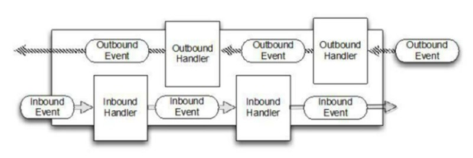

# Netty异步模型
## 基本概念
异步的概念和同步相对。当一个异步过程调用发出后，调用者**不能立刻得到结果**。实际处理这个调用的组件在完成后，**通过状态、通知和回调来通知** 调用者。

Netty  中的 I/O 操作是**异步**的，包括 `Bind`、`Write`、`Connect` 等操作会简单的返回一个 `ChannelFuture`。

调用者并不能立刻获得结果，而是通过 `Future-Listener` 机制，用户可以方便的主动获取或者通过通知机制获得 IO  操作结果

Netty 的异步模型是建立在 `future` 和 `callback` 的之上的。`callback` 就是**回调**。重点说 `Future`，它的核心思想是：假设一个方法 `fun()`，计算过程可能非常耗时，等待 `fun()` 返回显然不合适。那么可以在调用 `fun()` 的时候，立马返回一个 `Future`，后续可以通过 `Future` 去监控方法 `fun()`  的处理过程(即:`Future-Listener` 机制)

## ChannelFuture
表示**异步的执行结果**,  可以通过它提供的方法来检测执行是否完成，比如检索计算等等。

`ChannelFuture` 是一个接口 ： `public interface ChannelFuture extends Future<Void>` 。我们可以**添加监听器，当监听的事件发生时，就会通知到监听器**  案例说明。

                                          +---------------------------+
                                          | Completed successfully    |
                                          +---------------------------+
                                     +---->      isDone() = true      |
     +--------------------------+    |    |   isSuccess() = true      |
     |        Uncompleted       |    |    +===========================+
     +--------------------------+    |    | Completed with failure    |
     |      isDone() = false    |    |    +---------------------------+
     |   isSuccess() = false    |----+---->      isDone() = true      |
     | isCancelled() = false    |    |    |       cause() = non-null  |
     |       cause() = null     |    |    +===========================+
     +--------------------------+    |    | Completed by cancellation |
                                     |    +---------------------------+
                                     +---->      isDone() = true      |
                                          | isCancelled() = true      |
                                          +---------------------------+
## 工作原理


在使用 Netty 进行编程时，拦截操作和转换出入站数据只需要您提供 `callback` 或利用 `future` 即可。这使得链式操作简单、高效,  并有利于编写可重用的、通用的代码。

Netty 框架的目标就是让你的业务逻辑从网络基础应用编码中分离出来、解脱出来

## Future-Listener机制
当 `Future` 对象刚刚创建时，处于非完成状态，调用者可以通过返回的 `ChannelFuture`  来获取操作执行的状态，注册监听函数来执行完成后的操作。

常见有如下操作
* 通过 `isDone` 方法来判断当前操作是否完成；
* 通过 `isSuccess` 方法来判断已完成的当前操作是否成功；
* 通过 `getCause` 方法来获取已完成的当前操作失败的原因；
* 通过 `isCancelled` 方法来判断已完成的当前操作是否被取消；
* 通过 `addListener` 方法来注册监听器，当操作已完成(`isDone`方法返回完成)，将会通知指定的监听器；如果`Future` 对象已完成，则通知指定的监听器

示例：
```java
ChannelFuture channelFuture = serverBootstrap.bind(6666).sync();
channelFuture.addListener(new ChannelFutureListener() {
	@Override
	public void operationComplete(ChannelFuture future) throws Exception {
		// 操作已完成
		if (future.isSuccess()) {
			System.out.println("监听端口6666成功");
		} else {
			System.out.println("监听端口6666失败,原因是：" + future.cause());
		}
	}
});
```
