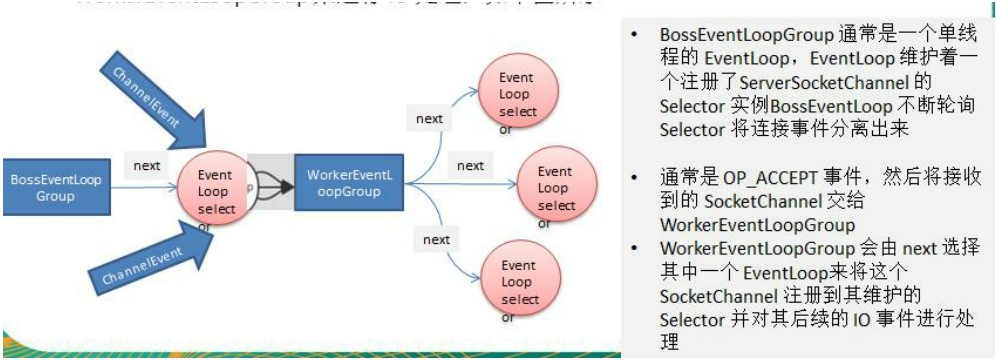

# NIOEventLoopGroup
`EventLoopGroup` 是一组 `EventLoop` 的抽象，Netty 为了更好的利用多核 CPU 资源，一般会有多个 `EventLoop`同时工作，每个 `EventLoop` 维护着一个 `Selector` 实例。

`EventLoopGroup` 提供 `next()` 接口，可以从组里面按照一定规则获取其中一个 `EventLoop` 来处理任务。在 Netty 服务器端编程中，我们一般都需要提供两个 `EventLoopGroup`，例如 ：`BossEventLoopGroup` 和 `WorkerEventLoopGroup`。

通常一个服务端口即一个 `ServerSocketChannel` 对应一个 `Selector` 和一个 `EventLoop` 线程。`BossEventLoop` 负责接收客户端的连接并将 `SocketChannel` 交给 `WorkerEventLoopGroup` 来进行 IO处理，如下图所示


## 常用API
```java
// 构造方法
public NioEventLoopGroup();

// 断开连接，关闭线程
public Future<?> shutdownGracefully();
```
