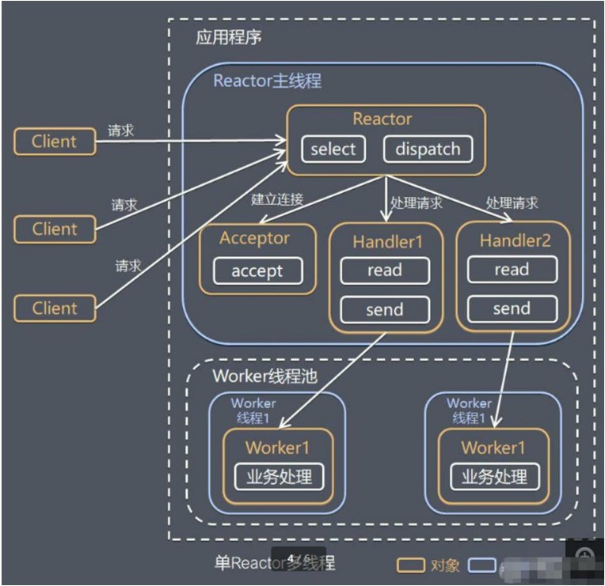

# 单Reactor多线程
## 原理图

Reactor 对象通过 select 监控客户端请求事件,收到事件后，通过 dispatch 进行分发

如果建立连接请求,则由 Acceptor 通过 accept 处理连接请求,  然后创建一个 Handler 对象处理完成连接后的各种事件

如果不是连接请求，则由 reactor 分发调用连接对应的 handler 来处理

handler 只负责响应事件，不做具体的业务处理, 通过 read 读取数据后，会分发给后面的 worker 线程池的某个线程处理业务

worker 线程池会分配独立线程完成真正的业务，并将结果返回给 handler

 handler 收到响应后，通过 send 将结果返回给 client

 ## 优点
可以充分的利用多喝CPU的处理能力

## 缺点
* 多线程数据共享和访问比较复杂
* reactor 处理所有的事件的监听和响应，在单线程运行，在高并发场景容易出现性能瓶颈
