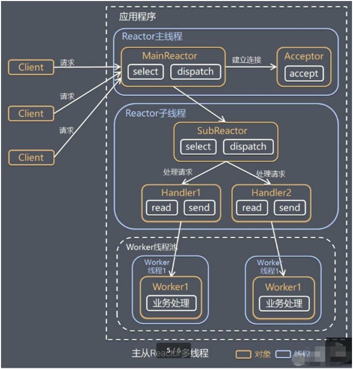
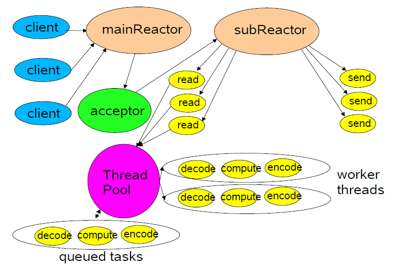

# 主从Reactor多线程
## 原理图

Reactor 主线程 MainReactor 对象通过 select  监听连接事件,  收到事件后，通过 Acceptor 处理连接事件

当 Acceptor处理连接事件后，MainReactor 将连接分配给 SubReactor

Subreactor 将连接加入到连接队列进行监听,并创建 handler 进行各种事件处理

当有新事件发生时， Subreactor 就会调用对应的 handler 处理

handler 通过 read 读取数据，分发给后面的 worker 线程处理

worker 线程池分配独立的 worker 线程进行业务处理，并返回结果

handler 收到响应的结果后，再通过 send 将结果返回给 client

Reactor 主线程可以对应多个 Reactor 子线程,  即MainRecator 可以关联多个 SubReactor

## scalable I/O

## 优点
* 父线程与子线程的数据交互简单职责明确，父线程只需要接收新连接，子线程完成后续的业务处理。
* 父线程与子线程的数据交互简单，Reactor  主线程只需要把新连接传给子线程，子线程无需返回数据。

## 缺点
编程复杂度高
