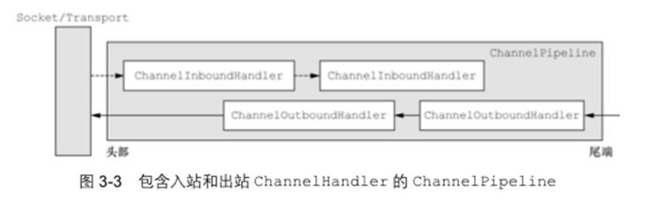

# Netty编解码器和Handler调用机制基本介绍
netty的组件设计：Netty 的主要组件有 `Channel`、`EventLoop`、`ChannelFuture`、`ChannelHandler`、`ChannelPipeline` 等

`ChannelHandler` 充当了处理**入站**和**出站**数据的应用程序逻辑的容器。例如，实现 `ChannelInboundHandler` 接口(或`ChannelInboundHandlerAdapter`)，你就可以**接收入站事件和数据**，这些数据会被业务逻辑处理。当要给客户端发送响应时， 也可以从 `ChannelInboundHandler`  冲刷数据 。 业务逻辑通常写在一个或者多个`ChannelInboundHandler` 中。`ChannelOutboundHandler` 原理一样，只不过它是**用来处理出站数据**的。

`ChannelPipeline` 提供了 `ChannelHandler` 链的容器。以客户端应用程序为例，如果事件的运动方向是从客户端到服务端的，那么我们称这些事件为出站的，即客户端发送给服务端的数据会通过 `pipeline` 中的一系列`ChannelOutboundHandler`，并被这些 `Handler` 处理，反之则称为入站的

