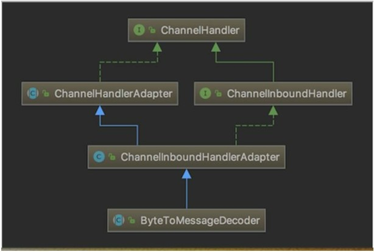

# 解码器-ByteToMessageDecoder


由于不可能知道远程节点**是否会一次性发送一个完整的信息**，tcp 有可能出现**粘包拆包**的问题，这个类会**对入站数据进行缓冲**，直到它准备好被处理。

## 实例分析
```java
public class MyByteToLongDecoder extends ByteToMessageDecoder {
    @Override
    protected void decode(ChannelHandlerContext ctx, ByteBuf in, List<Object> out) throws Exception {
        System.out.println(in.readableBytes());
        if (in.readableBytes() >= 8) {
            out.add(in.readLong());
        }
    }
}
```
每次入站从`ByteBuf`中读取8个字节，将其转换为一个long,然后将它添加到下一个`List`中。当没有更多元素可以被添加到`List`中时，它的内容将会被发送给下一个`ChannelInboundHandler`。`long`在被添加到`List`中时，会被自动装箱为`Long`。在调用`readLong()`方法前必须验证所输入的ByteBuf是否具有足够的数据。

