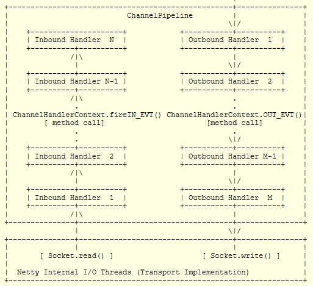

# Netty的handler链调用机制


## 示例
```java
public class MyByteToLongDecoder extends ByteToMessageDecoder {

    @Override
    protected void decode(ChannelHandlerContext ctx, ByteBuf in, List<Object> out) throws Exception {
        System.out.println("MyByteToLongDecoder decode invoked!");
    	System.out.println(in.readableBytes());
        if (in.readableBytes() >= 8) {
            out.add(in.readLong());
        }
    }
}

public class MyLongToByteEncoder extends MessageToByteEncoder<Long> {

    @Override
    protected void encode(ChannelHandlerContext ctx, Long msg, ByteBuf out) throws Exception {
        System.out.println("MyLongToByteEncoder encode invoked!");
        System.out.println(msg);

        out.writeLong(msg);
    }
}
```

## 结论
不论解码器 `handler` 还是编码器 `handler` 即**接收的消息类型必须与待处理的消息类型一致**，否则该 `handler` **不会被执行**

在解码器进行数据解码时，需要**判断缓存区(`ByteBuf`)的数据是否足够** ，否则接收到的结果会期望结果可能不一致
