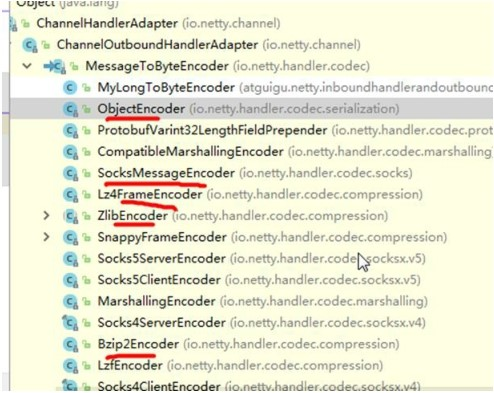

# 其它解码器
`LineBasedFrameDecoder`：这个类在 Netty 内部也有使用，它使用行尾控制字符（\n 或者\r\n）作为分隔符来解析数据。

`DelimiterBasedFrameDecoder`：使用自定义的特殊字符作为消息的分隔符。

HttpObjectDecoder`：一个 HTTP 数据的解码器

`LengthFieldBasedFrameDecoder`：通过指定长度来标识整包消息，这样就可以自动的处理黏包和半包消息。

