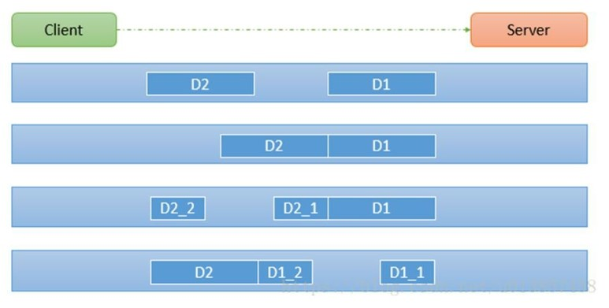
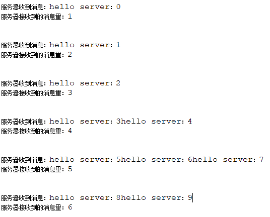

# TCP粘包拆包
TCP 是面向连接的，面向流的，提供高可靠性服务。收发两端（客户端和服务器端）都要有一一成对的 `socket`，因此，发送端为了将多个发给接收端的包，更有效的发给对方，使用了优化方法（Nagle 算法），**将多次间隔较小且数据量小的数据，合并成一个大的数据块，然后进行封包**。这样做虽然提高了效率，但是**接收端就难于分辨出完整的数据包了，因为面向流的通信是无消息保护边界的**。

由于 TCP 无消息保护边界, 需要在接收端处理消息边界问题，也就是我们所说的粘包、拆包问题

图解

假设客户端分别发送了两个数据包 D1 和 D2 给服务端，由于服务端一次读取到字节数是不确定的，故可能存在以下四种情况：
1) 服务端分两次读取到了两个独立的数据包，分别是 D1 和 D2，**没有粘包和拆包**

2) 服务端一次接受到了两个数据包，D1 和 D2 粘合在一起，称之为 **TCP 粘包**

3) 服务端分两次读取到了数据包，第一次读取到了完整的 D1 包和 D2 包的部分内容，第二次读取到了 D2 包的剩余内容，这称之为 **TCP 拆包**

4) 服务端分两次读取到了数据包，第一次读取到了 D1 包的部分内容 D1_1，第二次读取到了 D1 包的剩余部分内容 D1_2 和完整的 D2 包。

## 粘报拆包现象演示
```java
public class MyClientHandler extends SimpleChannelInboundHandler<ByteBuf> {
	private int count = 0;

	@Override
	protected void channelRead0(ChannelHandlerContext ctx, ByteBuf msg) throws Exception {
		// 读取消息
		byte[] msgData = new byte[msg.readableBytes()];
		msg.readBytes(msgData);

		String msgStr = new String(msgData, CharsetUtil.UTF_8);

		System.out.println();
		System.out.println();
		System.out.println("客户端收到消息：" + msgStr);
		System.out.println("客户端接收到的消息量：" + (++this.count));
	}

	@Override
	public void channelActive(ChannelHandlerContext ctx) throws Exception {
		super.channelActive(ctx);
		// 发送10条消息
		for (int i = 0; i < 10; i++) {
			ByteBuf sendMsgData = Unpooled.copiedBuffer("hello server：" + i,
					CharsetUtil.UTF_8);
			ctx.writeAndFlush(sendMsgData);
		}
	}
}

public class MyServerHandler extends SimpleChannelInboundHandler<ByteBuf> {
	private int count = 0;

	@Override
	protected void channelRead0(ChannelHandlerContext ctx, ByteBuf msg) throws Exception {
		// 读取消息
		byte[] msgData = new byte[msg.readableBytes()];
		msg.readBytes(msgData);

		String msgStr = new String(msgData, CharsetUtil.UTF_8);

		System.out.println();
		System.out.println();
		System.out.println("服务器收到消息：" + msgStr);
		System.out.println("服务器接收到的消息量：" + (++this.count));

		// 回送消息给客户端
		ByteBuf sendMsg = Unpooled.copiedBuffer(UUID.randomUUID().toString() + " ",
				CharsetUtil.UTF_8);
		ctx.writeAndFlush(sendMsg);
	}
}
```


## 解决粘包拆包问题
使用 **自定义协议 + 编解码器** 解决

关键就是要解决 **服务器端每次读取数据长度的问题**,  这个问题解决，就不会出现服务器多读或少读数据的问题，从而避免了 TCP 粘包、拆包 。

### 定义协议
```java
public class PersonProtocol {
    private int length;
    private byte[] content;

    public int getLength() {
        return length;
    }

    public void setLength(int length) {
        this.length = length;
    }

    public byte[] getContent() {
        return content;
    }

    public void setContent(byte[] content) {
        this.content = content;
    }
}
```

### 编码器
```java
public class MyPersonEncoder extends MessageToByteEncoder<PersonProtocol> {

	@Override
	protected void encode(ChannelHandlerContext ctx, PersonProtocol msg, ByteBuf out)
			throws Exception {
		System.out.println("MyPersonEncoder encode invoked!");

		out.writeInt(msg.getLength());
		out.writeBytes(msg.getContent());
	}
}
```

### 解码器
```java
public class MyPersonDecoder extends ReplayingDecoder<PersonProtocol> {

	@Override
	protected void decode(ChannelHandlerContext ctx, ByteBuf in, List<Object> out)
			throws Exception {

		System.out.println("MyPersonDecoder decode invoked!");

		int length = in.readInt();

		byte[] content = new byte[length];
		in.readBytes(content);

		PersonProtocol personProtocol = new PersonProtocol();
		personProtocol.setLength(length);
		personProtocol.setContent(content);
		out.add(personProtocol);
	}
}
```

### 分别在客户端和服务器端使用编解码器
```java
Bootstrap bootstrap = new Bootstrap();
      bootstrap.group(eventLoopGroup)
              .channel(NioSocketChannel.class)
              .handler(new ChannelInitializer<SocketChannel>() {
                  @Override
                  protected void initChannel(SocketChannel ch) throws Exception {
                      ChannelPipeline pipeline = ch.pipeline();

                      pipeline.addLast(new MyPersonDecoder());
                      pipeline.addLast(new MyPersonEncoder());
                      pipeline.addLast(new MyClientHandler());
                  }
              });


public class MyServerInitializer extends ChannelInitializer<SocketChannel> {
    @Override
    protected void initChannel(SocketChannel ch) throws Exception {
        ChannelPipeline pipeline = ch.pipeline();

        pipeline.addLast(new MyPersonDecoder());
        pipeline.addLast(new MyPersonEncoder());
        pipeline.addLast(new MyServerHandler());
    }
}
```
