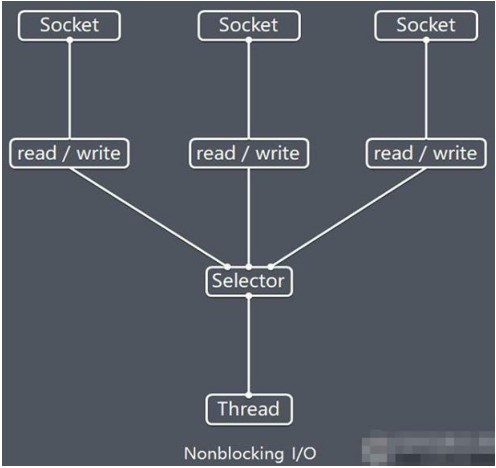
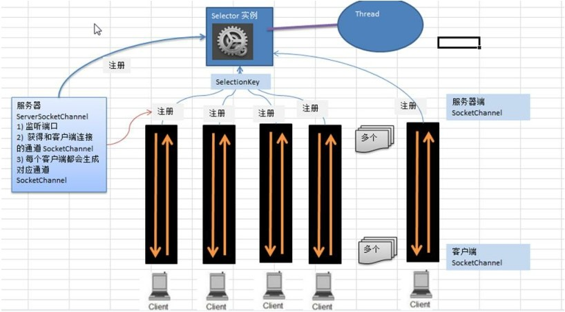
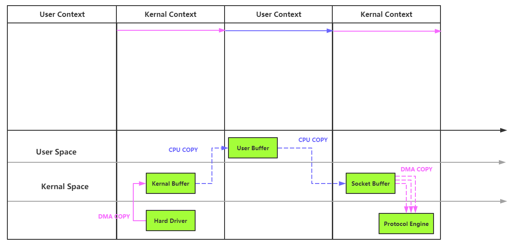
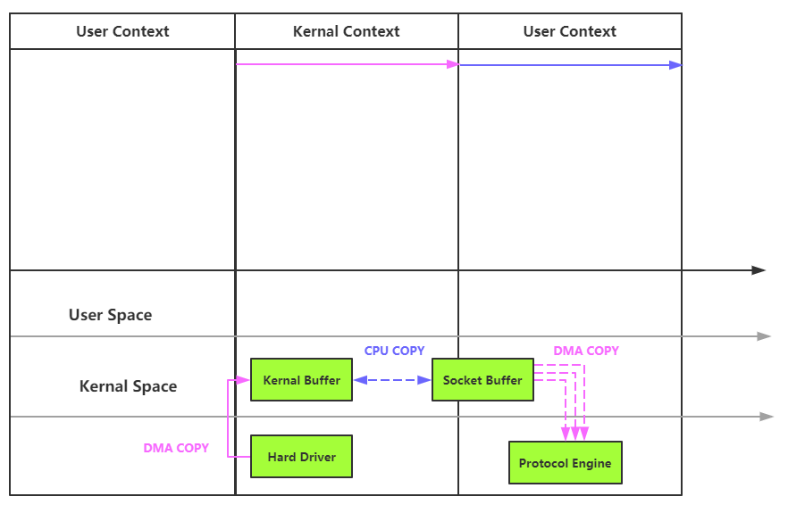
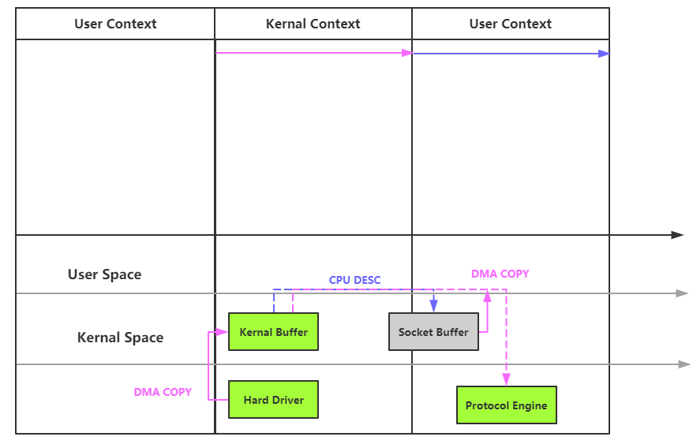

# IO模型
## I/O模型基本说明
I/O模型简单理解就是用什么样的**通道**进行数据的发送与接收,很大程度上决定了程序通信的性能。

Java支持3中网络编程模型I/O模式：BIO、NIO、AIO

## Java BIO
同步并阻塞(传统阻塞型)，服务器实现模式为**一个连接一个线程**，即客户端有连接请求时服务器端就需要启动一个线程进行处理，如果这个连接不做任何事情会造成不必要的线程开销。

示意图：


## Java NIO
同步非阻塞，服务器实现模式为**一个线程处理多个请求**(连接)，即客户端发送的连接请求都会注册到**多路复用器**上，多路复用器轮询到连接有I/O请求就进行处理。

示意图：


## Java AIO
异步非阻塞，AIO引入了异步通道的概念，采用了Proactor模式，简化了程序编写，**有效的请求才启动线程**，它的特点是先由操作系统完成后才通知服务器端程序启动线程去处理，一般适用于连接数较多且连接时间较长的应用。

# BIO、NIO、AIO适用场景
BIO 方式**适用于连接数目比较小且固定的架构**，这种方式对服务器资源要求比较高，并发局限于应用中，JDK1.4以前的唯一选择，但程序简单易理解。

NIO 方式**适用于连接数目多且连接比较短（轻操作）的架构**，比如聊天服务器，弹幕系统，服务器间通讯等。编程比较复杂，JDK1.4 开始支持。

AIO 方式**适用于连接数目多且连接比较长（重操作）的架构**，比如相册服务器，充分调用 OS 参与并发操作，编程比较复杂，JDK7 开始支持。

# Java BIO
## 基本介绍
Java BIO 就是传统的 java io 编程，其相关的类和接java.io下

BIO(blocking I/O) ： 同步阻塞，服务器实现模式为**一个连接一个线程**，即客户端有连接请求时服务器端就需要启动一个线程进行处理，如果这个连接不做任何事情会造成不必要的线程开销，可以通过线程池机制改善(实现多个客户连接服务器)。

BIO 方式**适用于连接数目比较小且固定的架构**，这种方式对服务器资源要求比较高，并发局限于应用中，JDK1.4以前的唯一选择，程序简单易理解

## 工作机制


## BIO应用实例
### Server
```java
public class TestServer {
	public static void main(String[] args) throws Exception {
		// 创建线程池
		ExecutorService threadPool = Executors.newCachedThreadPool();

		ServerSocket serverSocket = null;
		try {
			// 创建ServerSocket
			serverSocket = new ServerSocket(6666);
			System.out.println("Server start...");

			while (true) {
				// 与客户端建立连接
				Socket socket = serverSocket.accept();
				System.out.println("client connect..");

				threadPool.execute(() -> {
					handleClientTask(socket);
				});
			}
		} finally {
			if (serverSocket != null) {
				serverSocket.close();
			}
		}
	}

	/**
	 * 处理客户端的任务
	 *
	 * @param socket
	 *            套接字
	 */
	private static void handleClientTask(Socket socket) {
		InputStream inputStream = null;
		try {
			// 读取客户端发送的数据
			inputStream = socket.getInputStream();

			// 打印线程Id和Name
			Thread currentThread = Thread.currentThread();
			System.out.println("Thread ID：" + currentThread.getId() + "ThreadName："
					+ currentThread.getName());

			byte[] buffer = new byte[1024];
			while (true) {
				int read = inputStream.read(buffer);
				if (read != -1) {
					// 打印客户端发送的消息
					System.out.println("Client：" + new String(buffer, 0, read));
				} else {
					break;
				}
			}

			// 向客户端回执消息

		} catch (Exception e) {
			e.printStackTrace();
		} finally {
			// 释放资源
			try {
				socket.close();
				if (inputStream != null) {
					inputStream.close();
				}
			} catch (IOException e) {
				e.printStackTrace();
			}
		}
	}
}
```

### 结论
通过打印当前线程的Id和Name可以得出：**BIO为每一个客户端的连接都会分派一个线程**

# Java NIO基本理论
Java NIO  全称 `java non-blocking IO`，是指JDK提供的新 API。从JDK1.4  开始，Java  提供了一系列改进的输入/输出的新特性，被统称为 NIO(即 New IO)，是**同步非阻塞的**

NIO  相关类都被放在 `java.nio` 包及子包下，并且对原 `java.io` 包中的很多类进行改写。

NIO  有三大核心部分：**Channel(通道)，Buffer(缓冲区), Selector(选择器)**

NIO 是 **面向缓冲区 ，或者面向 块 编程**的。数据读取到一个它稍后处理的缓冲区，需要时可在缓冲区中前后移动，这就增加了处理过程中的灵活性，使用它可以提供非阻塞式的高伸缩性网络

Java NIO 的非阻塞模式，使一个线程从某通道发送请求或者读取数据，但是它仅能得到目前可用的数据，如果目前没有数据可用时，就什么都不会获取，而不是保持线程阻塞，所以直至数据变的可以读取之前，该线程可以继续做其他的事情。 非阻塞写也是如此，一个线程请求写入一些数据到某通道，但不需要等待它完全写入，这个线程同时可以去做别的事情。

通俗理解：NIO 是可以做到用一个线程来处理多个操作的。假设有 10000 个请求过来,根据实际情况，可以分配 50 或者 100 个线程来处理。不像之前的阻塞 IO 那样，非得分配 10000 个。

HTTP2.0 使用了多路复用的技术，做到同一个连接并发处理多个请求，而且并发请求的数量比 HTTP1.1 大了好几个数量级

# Buffer的基本使用
```java
IntBuffer buffer = IntBuffer.allocate(6);
// 向buffer中写入数据
for (int i = 0; i < buffer.capacity(); i++) {
	buffer.put(i * i);
}

// 从buffer中读取数据
buffer.flip(); // 转换模式，由写转换为读取
while (buffer.hasRemaining()) {
	System.out.println(buffer.get());
}
```

# NIO&BIO的比较
 BIO  以**流**的方式处理数据,而 NIO  以**块**的方式处理数据,**块 I/O  的效率比流 I/O  高很多**

 BIO  是**阻塞**的，NIO  则是**非阻塞**的

 BIO **基于字节流和字符流**进行操作，而 NIO **基于Channel(通道)和 Buffer(缓冲区)** 进行操作，数据总是从通道读取到缓冲区中，或者从缓冲区写入到通道中。Selector(选择器)用于监听多个通道的事件（比如：连接请求，数据到达等），因此使用单个线程就可以监听多个客户端通道

# Selector、Channel、Buffer之间的关系
 ## 关系图
 

 ## 结论
 每个 `channel`  都会对应一个 `Buffer`

 `Selector` 对应一个线程， 一个线程对应多个 `channel`(也可称之为连接)

 该图反应了有三个 `channel`  注册到 该 `selector`

 程序切换到哪个 `channel`  是由事件决定的, `Event`  就是一个重要的概念

 `Selector` 会根据不同的事件，在各个通道上切换

 `Buffer` 就是一个内存块 ， 底层是有一个数组

 数据的读取写入是通过 `Buffer`, 这个和 BIO有所不同 。**BIO 中要么是输入流，或者是输出流, 不能双向**，但是 **NIO 的 Buffer 是可以读也可以写**, 需要 flip 方法切换

 `channel`  是双向的, 可以返回底层操作系统的情况,  比如 Linux ， 底层的操作系统通道就是双向的.

# Buffer
 ## 基本介绍
 缓冲区（Buffer）：缓冲区本质上是一个可以读写数据的**内存块**，可以理解成是一个 **容器对象(含数组)**，该对象提供了一组方法，可以更轻松地使用内存块，缓冲区对象内置了一些机制，能够跟踪和记录缓冲区的状态变化情况。`Channel`  提供从文件、网络读取数据的渠道，但是读取或写入的数据都必须经由 `Buffer`。
 

 ## Buffer类及其子类
 在 NIO  中，`Buffer` 是一个顶层父类，它是一个抽象类

 Java中的8种原生数据类型(除`bollean`外的7种)都有各自对应的Buffer类型如`IntBuffer`,`LongBuffer`。

  `Buffer` 类定义了所有的缓冲区都具有的**四个属性**来提供关于其所包含的数据元素的信息:
  1. `capacity`：代表缓冲区的容量，在创建时就会指定，不可改变；
  2. `limit`：代表缓冲区的当前终点，不能对缓冲区超过`limit`的位置进行读写
  3. `position`：位置，代表下一个要被读/写的元素的索引，每次读/写缓冲区都会改变该值
  4. `mark`：标记

  **在任何时刻，都有如下关系成立：**
  ```
  0 <= mark <= position <= limit <= capacity
  ```

  ## Buffer类相关API
  ```java
 // 获取缓冲器的容量
 public final int capacity();

 // 获取缓冲区的当前位置(下一个读/写元素的索引)
 public final int position();

 // 设置缓冲区的位置
 public final Buffer position(int newPosition);

 // 获取缓冲区的限制
 public final int limit();

 // 设置缓冲区的限制
 public final Buffer limit(int newLimit);

 // 在缓冲区的当前位置设置标记
 public final Buffer mark();

 // 将缓冲区的位置重置为以前标记的位置
 public final Buffer reset();

 // 清空此缓冲区，将4个属性设置为初始值，实际上数据没有清空
 public final Buffer clear();

 // 反转此缓冲区(读-写/写-读)
 public final Buffer flip();

 // 倒放此缓冲区,position=0,清空mark
 public final Buffer rewind();

 // 获取limit-position
 public final int remaining();

 // 是否还可以继续读/写
 public final boolean hasRemaining();

 // 是否为只读缓冲区
 public abstract boolean isReadOnly();

 // 判断此缓冲区是否具有可访问的底层实现数组
 public abstract boolean hasArray();

 // 返回此缓冲区的底层实现数组
 public abstract Object array();

 // 获取此缓冲区的底层实现数组中的第一个缓冲区元素的偏移量
 public abstract int arrayOffset();

 // 判断此缓冲区是否为直接缓冲区
 public abstract boolean isDirect();
  ```

 ## ByteBuffer相关API
 ```java
 // 创建直接缓冲区
 public static ByteBuffer allocateDirect(int capacity);

 // 创建缓冲区
 public static ByteBuffer allocate(int capacity);

 // 将一个字节数组包装成一个缓冲区
 public static Byteuffer wrap(byte[] array);

 // 将一个字节数组的指定段包装为一个缓冲区
 public static ByteBuffer wrap(byte[] array,int offset, int length);

 // 获取当前位置的字节
 public abstract byte get();

 // 获取指定位置的字节
 public abstract byte get(int index);

 // put一个字节到缓冲区
 public abstract ByteBuffer put(byte b);

 // 向指定的位置put一个字节
 public abstract ByteBuffer put(int index, byte b);
 ```

# Channel
 ## 基本介绍
 1. NIO的`Channel`类似于流，但有如下区别：
     * 通道可以**同时进行读写**，而流只能读或者写；
     * 通道可以实现**异步读写数据**;
     * 通道可以从`Buffer`读数据，也可以写数据到`Buffer`
 2. BIO中的`Stream`是单向的，例如`FileInputStream`对象只能进行读取数据的操作，而NIO中的`Channel`是双向的，**既可以读，也可以写**
 3. `Channel`在NIO中是一个接口
     ```java
     public interface Channel extends Closeable{}
     ```
 4. 常用的 `Channel` 类有： `FileChannel` 、 `DatagramChannel` 、 `ServerSocketChannel`   和  `SocketChannel` 。
 【`ServerSocketChannel` 类似 `ServerSocket` , `SocketChannel`  类似 `Socket`】
 5. `FileChannel` 用于文件的数据读写，`DatagramChannel` 用于 UDP  的数据读写，`ServerSocketChannel`  和 `SocketChannel`  用于 TCP 的数据读写。

 ## FileChannel
 `FileChannel`主要用来对本地文件进行I/O操作，常见API如下：
 ```java
 // 从通道读取数据并放到缓冲区中
 public int read(ByteBuffer dst);

 // 把缓冲区的数据写到通道中
 public int write(ByteBuffer src);

 // 从目标通道中复制数据到当前通道
 public long transferFrom(ReadableByteChannel src, long position, long count);

 // 把数据从当前通道复制给目标通道
 public long transferTo(long position, long count, WritableByteChannel target);
 ```

 ### 实例1
 将"你好，NIO"写入文件testChannel1.txt
 ```java
 // 将"你好，NIO"写入文件testChannel1.txt
 String str = "你好，NIO";

 FileOutputStream fos = null;
 try {
 	fos = new FileOutputStream("testChannel1.txt");
 	FileChannel channel = fos.getChannel();

 	// 将str读入到ByteBuffer
 	ByteBuffer buffer = ByteBuffer.wrap(str.getBytes());

 	// 将buffer写入到channel
 	channel.write(buffer);
 } finally {
 	if (fos != null) {
 		fos.close();
 	}
 }
 ```

 ### 实例2
 将testChannel1.txt的内容读取到程序中，并输出到控制台
 ```java
 // 将testChannel1.txt的内容读取到程序中，并输出到控制台
 FileInputStream fis = null;
 try {
 	fis = new FileInputStream("testChannel1.txt");

 	// 从文件读取到buffer
 	FileChannel channel = fis.getChannel();
 	ByteBuffer buffer = ByteBuffer.allocate(fis.available());
 	channel.read(buffer);

 	System.out.println(new String(buffer.array()));
 } finally {
 	if (fis != null) {
 		fis.close();
 	}
 }
 ```

 ### 实例3
 完成文件的拷贝
 思路分析：
 
 ```java
 // 测试文件拷贝
 FileInputStream fis = null;
 FileOutputStream fos = null;
 try {
 	fis = new FileInputStream("input.txt");
 	fos = new FileOutputStream("output.txt");
 	FileChannel inputChannel = fis.getChannel();
 	FileChannel outputChannel = fos.getChannel();

 	ByteBuffer buffer = ByteBuffer.allocate(512);
 	while (true) {
 		// clear
 		buffer.clear();

 		// 循环读取,从inputChannel读取到buffer中
 		int read = inputChannel.read(buffer);
 		if (read == -1) {
 			// 读取结束
 			break;
 		}

 		// 切换模式
 		buffer.flip();
 		// 从buufer中写入到outputChannel
 		outputChannel.write(buffer);

 	}
 } finally {
 	if (fis != null) {
 		fis.close();
 	}
 	if (fos != null) {
 		fos.close();
 	}
 }
 ```

 ### 实例4
 使用`transferFrom`完成文件的拷贝
 ```java
 // 使用transferFrom完成文件的拷贝
 FileInputStream fis = null;
 FileOutputStream fos = null;
 FileChannel inputChannel = null;
 FileChannel outputChannel = null;
 try {
 	fis = new FileInputStream("D:\\test\\a.jpg");
 	fos = new FileOutputStream("D:\\test\\b.jpg");
 	inputChannel = fis.getChannel();
 	outputChannel =fos.getChannel();

 	outputChannel.transferFrom(inputChannel, 0, inputChannel.size());
 } finally {
 	if (fis != null) {
 		fis.close();
 	}
 	if (fos != null) {
 		fos.close();
 	}
 	if (inputChannel != null) {
 		inputChannel.close();
 	}
 	if (outputChannel != null) {
 		outputChannel.close();
 	}
 }
 ```

# ByteBuffer读写原生类型数据
 `ByteBuffer` 支持类型化的 `put`  和 `get`, `put` 放入的是什么数据类型，`get` 就应该使用相应的数据类型来取出，否则可能有 `BufferUnderflowException` 异常。

 ```java
 // 使用ByteBuffer读取原生类型数据
 ByteBuffer buffer = ByteBuffer.allocate(1024);

 buffer.putInt(5);
 buffer.putLong(2233344555L);
 buffer.putChar('a');
 buffer.putShort((short) 33);

 buffer.flip();
 System.out.println(buffer.getInt());
 System.out.println(buffer.getLong());
 System.out.println(buffer.getChar());
 System.out.println(buffer.getShort());
 ```

 # 只读Buffer
 ```java
 ByteBuffer buffer = ByteBuffer.allocate(512);

 buffer.put((byte) 0xFF);
 buffer.put((byte) 44);

 // 模式转换
 buffer.flip();
 ByteBuffer readOnlyBuffer = buffer.asReadOnlyBuffer();
 while (readOnlyBuffer.hasRemaining()) {
 	System.out.println(readOnlyBuffer.get());
 }

 readOnlyBuffer.put((byte) 3);// java.nio.ReadOnlyBufferException
 ```

 # Buffer的slice
 当执行`buffer2 = buffer1.slice()`后,`buffer2`将和`buffer1`共享`buffer`的内容。

 `buffer2`的起始位置`start`是`buffer1`当前的位置`position`
 `buffer2`的`capacity`是`buffer1.limit() - buffer1.position()`

 改变`buffer2`的内容，`buffer1`中对应的值也会改变,反之亦然

 `buffer1`如果是只读缓冲区，则`buffer2`也是，同样的，如果`buffer1`是直接缓冲区，`buffer2`也是。

 ## 示例
 ```java
 // buffer:0,1,2,3,4....9
 ByteBuffer buffer = ByteBuffer.allocate(10);
 for (int i = 0; i < buffer.capacity(); i++) {
 	buffer.put((byte) i);
 }

 // position：2,limit:6
 buffer.position(2);
 buffer.limit(6);
 ByteBuffer sliceBuffer = buffer.slice();

 // buffer:0,2,4,6...18
 for (int i = 0; i < sliceBuffer.capacity(); i++) {
 	byte b = sliceBuffer.get();
 	b *= 2;
 	sliceBuffer.put(i, b);
 }

 System.out.println("buffer:");
 buffer.position(0);
 buffer.limit(buffer.capacity());
 // 0,1,4,6,8,10,6,7..9
 while (buffer.hasRemaining()) {
 	System.out.println(buffer.get());
 }

 System.out.println("-------------");
 System.out.println("sliceBuffer：");
 sliceBuffer.position(0);
 sliceBuffer.limit(sliceBuffer.capacity());
 // 4,6,8,10
 while (sliceBuffer.hasRemaining()) {
 	System.out.println(sliceBuffer.get());
 }
 ```

 # DirectByteBuffer
 `DirectByteBuffer`指的是直接缓存，其数据(`byte[]`)会在**堆外分配**。
 `ByteBuffer`类的`address`属性指向了堆外的数据。

 图示：
 

 ## 创建DirectByteBuffer
 ```java
 ByteBuffer buffer = ByteBuffer.allocateDirect(512);
 ```

 # MappedByteBuffer
 NIO  提供了 `MappedByteBuffer`， 可以让文件直接在 **内存(堆外的内存)** 中进行修改， 而如何同步到文件由 NIO 来完成。

 ```java
 // MappedByteBuffer 可让文件直接在内存(堆外内存)修改,操作系统不需要拷贝一次
 RandomAccessFile randomAccessFile = new RandomAccessFile("mapperbuffer.txt","rw");

 FileChannel channel = randomAccessFile.getChannel();
 // 代表文件的第0-9个字节可以读写
 MappedByteBuffer mappedByteBuffer = channel.map(MapMode.READ_WRITE, 0, 10);

 mappedByteBuffer.put(1,(byte) 'J');
 mappedByteBuffer.put(2,(byte) 'A');
 mappedByteBuffer.put(3,(byte) 'V');
 mappedByteBuffer.put(4,(byte) 'A');

 channel.close();
 randomAccessFile.close();
 ```

 # scattering & gathering
 NIO  支持通过 **多个Buffer(即Buffer数组)** 完成读写操作，即 `Scattering`(分散)  和 `Gathering`(收集)
 ```java
 // 测试scattering(分散)和gathering(收集)
 ServerSocketChannel serverSocketChannel = ServerSocketChannel.open();
 InetSocketAddress socketAddress = new InetSocketAddress(6666);
 serverSocketChannel.bind(socketAddress);

 // 创建ByteBuffer[]
 ByteBuffer[] buffers = new ByteBuffer[3];
 buffers[0] = ByteBuffer.allocate(2);
 buffers[1] = ByteBuffer.allocate(3);
 buffers[2] = ByteBuffer.allocate(4);

 int messageLength = 2 + 3 + 4;
 SocketChannel socketChannel = serverSocketChannel.accept();
 System.out.println("client connect....");
 while (true) {
 	System.out.println("============read=============");
 	int byteRead = 0;
 	while (byteRead < messageLength) {
 		// 将数据从channel读取到buffers
 		long read = socketChannel.read(buffers);
 		byteRead += read;

 		// 打印byteRead和buffer中关键参数的值
 		System.out.println("byteRead：" + byteRead);
 		Stream.of(buffers).map(buffer -> {
 			return "position：" + buffer.position()
 					+ "  |  "
 					+ "limit："
 					+ buffer.limit();
 		});
 	}

 	// 读满了，将数据写回客户端
 	System.out.println("============write=============");
 	Stream.of(buffers).forEach(ByteBuffer::flip);
 	int byteWritten = 0;
 	while (byteWritten < messageLength) {
 		long write = socketChannel.write(buffers);
 		byteWritten += write;

 		// 打印byteWritten和buffer中的关键参数
 		System.out.println("byteWritten：" + byteWritten);
 		Stream.of(buffers).map(buffer -> {
 			return "position：" + buffer.position()
 					+ "  |  "
 					+ "limit："
 					+ buffer.limit();
 		});
 	}

 	// clear所有buffer
 	Stream.of(buffers).forEach(ByteBuffer::clear);
 	System.out.println("=============================");
 	System.out.println("byteRead：" + byteRead
 			+ "  |  "
 			+ "byteWritten："
 			+ byteWritten
 			+ "  |  "
 			+ "messageLength："
 			+ messageLength);
 }
 ```

 # slector(选择器)
 ## 基本介绍
 Java 的 `NIO`，用**非阻塞**的 IO  方式。可以用一个线程，处理多个的客户端连接，就会使用到 `Selector`(选择器)

 `Selector` 能够检测多个注册的通道上是否有事件发生(注意:多个 Channel 以事件的方式可以注册到同一个Selector)，如果有事件发生，便获取事件然后针对每个事件进行相应的处理。这样就可以只用一个单线程去管理多个通道，也就是管理多个连接和请求

 只有在 连接/通道 **真正有读写事件发生时，才会进行读写**，就大大地减少了系统开销，并且不必为每个连接都

 创建一个线程，不用去维护多个线程，避免了多线程之间的上下文切换导致的开销

 ## 3个set
 * key set
   代表当前`channel`注册的所有`key`
 * selected key
   `selected key`中的`key`满足如下条件：
   `key`所对应的`channel`至少已经有一个我们感兴趣的事件准备就绪
 * `cancelled key`
   一组已被取消，但其`channel`尚未注销的键

 ## Selector示意图
 

 ### 特点
 * `Netty` 的 IO 线程 `NioEventLoop`  聚合了 `Selector`(选择器，也叫多路复用器)，可以同时并发处理成百上千个客户端连接。
 * 当线程从某客户端 `Socket` 通道进行读写数据时，若没有数据可用时，该线程可以进行其他任务。
 * 线程通常将非阻塞 IO  的空闲时间用于在其他通道上执行 IO  操作，所以单独的线程可以管理多个输入和输出通道。
 * 由于读写操作都是非阻塞的，这就可以充分提升 IO  线程的运行效率，避免由于频繁 I/O  阻塞导致的线程挂起。
 * 一个 I/O  线程可以并发处理 N 个客户端连接和读写操作，这从根本上解决了传统同步阻塞 I/O 一连接一线程模型，架构的性能、弹性伸缩能力和可靠性都得到了极大的提升。

 ## slector 常用API
 ```java
 // 打开一个Selector
 public static Selector open() throws IOException ;

 // 返回注册到当前selector的所有SelectionKey的集合
 public abstract Set<SelectionKey> keys();

 // 返回当前selector上有事件发生的SelectionKey的集合
 public abstract Set<SelectionKey> selectedKeys();

 // 选择一组键，其对应的通道已准备好进行I/O操作
 public abstract int selectNow() throws IOException;
 public abstract int select(long timeout);
 public abstract int select() throws IOException;

 // 唤醒阻塞的select操作
 public abstract Selector wakeup();

 public abstract void close() throws IOException;
 ```

 ## 代码示例
 ```java
 // 测试使用selector
 // 创建5个ServerSocketChannel，将其注册到Selector上
 final int serverSize = 5;

 Selector selector = Selector.open();
 for (int i = 0; i < serverSize; i++) {
 	// 初始化ServerSocketChannel
 	ServerSocketChannel serverSocketChannel = ServerSocketChannel.open();
 	serverSocketChannel.configureBlocking(false);

 	// 创建5个socket
 	ServerSocket socket = serverSocketChannel.socket();
 	int port = 50000 + i;
 	socket.bind(new InetSocketAddress(port));

 	// 将ServerSocketChannel注册在selector上
 	serverSocketChannel.register(selector, SelectionKey.OP_ACCEPT);
 	System.out.println("listening at：" + port);
 }

 while (true) {
 	int selectCount = selector.select();
 	System.out.println("selectCount:" + selectCount);
 	if (selectCount <= 0) {
 		continue;
 	}

 	// 有事件发生
 	Set<SelectionKey> selectedKeys = selector.selectedKeys();
 	Iterator<SelectionKey> iterator = selectedKeys.iterator();
 	while (iterator.hasNext()) {
 		SelectionKey selectionKey = iterator.next();
 		if (selectionKey.isAcceptable()) {
 			// 已连接
 			ServerSocketChannel serverSocketChannel =
 					(ServerSocketChannel) selectionKey.channel();
 			SocketChannel socketChannel = serverSocketChannel.accept();
 			socketChannel.configureBlocking(false);
 			// 注册读事件
 			socketChannel.register(selector, SelectionKey.OP_READ);

 			iterator.remove();
 			System.out.println("connect as " + socketChannel);
 		} else if (selectionKey.isReadable()) {
 			// 已有可读取的数据
 			SocketChannel socketChannel = (SocketChannel)selectionKey.channel();

 			// 从socketChannel中读取数据并打印
 			int byteRead = 0;
 			ByteBuffer buffer = ByteBuffer.allocate(512);
 			while (true) {
 				buffer.clear();
 				int read = socketChannel.read(buffer);
 				if (read <= 0) {
 					break;
 				}

 				byteRead += read;
 			}
 			iterator.remove();
 			System.out.println("read: " + byteRead + "byte,from " + socketChannel);
 		}
 	}
 }
 ```

 # NIO非阻塞原理
 NIO  非阻塞 网络编程相关的(`Selector`、`SelectionKey`、`ServerScoketChannel` 和 `SocketChannel`) 关系梳理图
 
 1. 当客户端连接时，会通过 `ServerSocketChannel` 得到 `SocketChannel`
 2. `Selector` 进行监听，调用  `select`  方法,  返回有事件发生的通道的个数.
 3. 将 `socketChannel` 注册到 `Selector` 上(`register(Selector sel, int ops)`),  一个 `selector` 上可以注册多个 `SocketChannel`
 4. 注册后返回一个 `SelectionKey`, 会和该 `Selector` 关联(集合)
 5. 进一步得到各个 `SelectionKey` (有事件发生`selected key`)
 6. 再通过 `SelectionKey`	反向获取 `SocketChannel` ,  方法 `channel()`
 7. 可以通过得到的 `channel`	, 完成业务处理

 # SelectionKey
 表示 Selector 和网络通道的注册关系,  共四种:
 1. `int OP_ACCEPT`：有新的网络连接可以 accept，值为 16
 2. `int OP_CONNECT`：代表连接已经建立，值为 8
 3. `int OP_READ`：代表读操作，值为 1
 4. `int OP_WRITE`：代表写操作，值为 4
 ```java
 // 源码中：
 public static final int OP_READ = 1 << 0;
 public static final int OP_WRITE = 1 << 2;
 public static final int OP_CONNECT = 1 << 3;
 public static final int OP_ACCEPT = 1 << 4;
 ```

 ## 常用API
 ```java
 // 获取与之关联的channel
 public abstract SelectableChannel channel();

 // 获取与之关联的selector
 public abstract Selector selector();

 // 设置感兴趣的事件
 public abstract SelectionKey interestOps(int ops);

 // 是否可读
 public final boolean isReadable();

 // 是否可写
 public final boolean isWritable();

 // 是否可连接
 public final boolean isConnectable();

 // 是否可以接受请求
 public final boolean isAcceptable();
 ```

 # ServerScoketChannel
 在服务器端监听新的客户端`socket`的连接

 ## 常用API
 ```java
 // 获取一个ServerSocketChannel通道
 public static ServerSocketChannel open() throws IOException ;

 // 设置服务器端端口号
 public final ServerSocketChannel bind(SocketAddress local);

 // 设置阻塞模式
 public final SelectableChannel configureBlocking(boolean block);

 // 接受一个连接，返回这个连接的通道
 public abstract SocketChannel accept() throws IOException;

 // 注册一个选择器并设置监听事件
 public final SelectionKey register(Selector sel, int ops, Object att);
 ```

 # SocketChannel
 网络 IO 通道，具体**负责进行读写操作**

 ## 常用API
 ```java
 // 获取一个SocketChannel
 public static SocketChannel open() throws IOException;

 // 连接服务器，此函数调用后必须调用finishConnect来完成连接
 public abstract boolean connect(SocketAddress remote) throws IOException;

 // 完成连接操作
 public abstract boolean finishConnect() throws IOException;

 // 设置阻塞模式
 public final SelectableChannel configureBlocking(boolean block);

 // 向通道中写数据
 public abstract int write(ByteBuffer src) throws IOException;

 // 从通道中读取数据
 public abstract int read(ByteBuffer dst) throws IOException;

 // 注册一个选择器并设置监听事件
 public final SelectionKey register(Selector sel, int ops, Object att);
 ```

 # 群聊系统

 ## 服务器端
 基本思路：
 1. 监听一个端口
 2. 当有**连接事件**时，接受连接，注册**读事件**
 3. 当有**读事件**时，读取消息，将消失转发给其他`channel`

 代码实现：
 * `GroupChatServer`基本结构
 ```java
 public class GroupChatServer {
 	// 监听端口
 	private static final int PORT = 6666;

 	// 选择器
 	private Selector selector;

 	// 监听的ServerSocketChannel
 	private ServerSocketChannel listenChannel;

 	private ServerHandler serverHandler;

 	// 初始化
 	public GroupChatServer(ServerHandler handler) {
 		this.serverHandler = handler;
 		try {
 			// 初始化监听的ServerSocketChannel
 			listenChannel = ServerSocketChannel.open();
 			listenChannel.bind(new InetSocketAddress(PORT));
 			listenChannel.configureBlocking(false);

 			// 注册到selector
 			selector = Selector.open();
 			listenChannel.register(selector, SelectionKey.OP_ACCEPT);
 		} catch (Exception e) {
 			e.printStackTrace();
 		}
 	}
 }
 ```

 * `start`方法
 ```java
 public void start() throws Exception {
 	// 启动成功
 	System.out.println(
 			"started successful... listening on " + GroupChatServer.PORT);
 	while (true) {
 		int selectedCount = selector.select();

 		if (selectedCount <= 0) {
 			continue;
 		} else {
 			// 由准备好的channel
 			Set<SelectionKey> selectedKeys = selector.selectedKeys();
 			selectedKeys.forEach(selectedKey -> {
 				try {
 					if (selectedKey.isAcceptable()) {
 						// 有连接
 						ServerSocketChannel channel = (ServerSocketChannel) selectedKey
 								.channel();
 						SocketChannel acceptChannel = channel.accept();
 						acceptChannel.configureBlocking(false);
 						// 注册读事件
 						acceptChannel.register(selector, SelectionKey.OP_READ);

 						System.out.println(
 								acceptChannel.getRemoteAddress() + " is online.....");
 					} else if (selectedKey.isReadable()) {
 						// 有读事件
 						SocketChannel readChannel = (SocketChannel) selectedKey
 								.channel();
 						String msg = serverHandler.read(readChannel);
 						// 转发消息到其他通道
 						Set<SelectionKey> keys = selector.keys();
 						Set<SocketChannel> otherChannels = keys.stream()
 								.filter(key -> key != selectedKey
 										&& key.channel() instanceof SocketChannel)
 								.map(key -> (SocketChannel) key.channel())
 								.collect(Collectors.toSet());
 						if (msg != null) {
 							System.out.println("forward msg：" + msg);
 							serverHandler.forwardMsg(msg, otherChannels);
 						} else {
 							System.out.println("消息为null");
 						}
 					}
 				} catch (Exception e) {
 					try {
 						SelectableChannel offlineChannel = selectedKey.channel();
 						if (offlineChannel instanceof SocketChannel) {
 							System.out.println(((SocketChannel)offlineChannel).getRemoteAddress() + " is offline...");
 						} else {
 							System.out.println("connetct failed...");
 						}
 		                //取消注册
 						selectedKey.cancel();
 		                //关闭通道
 						offlineChannel.close();
 		            }catch (IOException ex) {
 		            	ex.printStackTrace();;
 		            }
 				}
 			});

 			// 处理完所有SelectionKey，清空selectedKeys
 			selectedKeys.clear();
 		}
 	}
 }
 ```
 * 启动服务器代码
 ```java
 public static void main(String[] args) throws Exception {
 	GroupChatServer server = new GroupChatServer(new ServerHandler());
 	server.start();
 }
 ```

 * `ServerHandler`
 ```java
 public class ServerHandler {

 	/**
 	 * 从channel中读取数据,返回数据
 	 *
 	 * @param readChannel  通道
 	 * @return             读取到的消息
 	 * @throws Exception
 	 */
 	public String read(SocketChannel readChannel) throws Exception {
 		ByteBuffer buffer = ByteBuffer.allocate(1024);
 		int read = readChannel.read(buffer);
 		if (read > 0) {
 			return new String(buffer.array(), 0, buffer.limit()).trim();
 		} else {
 			return null;
 		}
 	}

 	/**
 	 * 转发消息到其他通道
 	 *
 	 * @param msg           消息
 	 * @param otherChannels 其他通道
 	 */
 	public void forwardMsg(String msg, Set<SocketChannel> otherChannels) {
 		otherChannels.forEach(channel -> {
 			ByteBuffer buffer = ByteBuffer.wrap(msg.getBytes());
 			try {
 				channel.write(buffer);
 			} catch (IOException e) {
 				e.printStackTrace();
 			}
 		});
 	}

 }
 ```

 ## 客户端
 基本思路：
 1. 先从标准输入获取用户名
 2. 连接服务器
 3. 起一个独立的线程接收服务器端的消息
 4. 接收标准输入，发送消息

 代码实现：
 * `GroupChatClient`基本结构
 ```java
 public class GroupChatClient {
 	private static final String REMOTE_IP = "127.0.0.1";
 	private static final int REMOTE_PORT = 6666;

 	private Selector selector;
 	private SocketChannel socketChannel;
 	private String username;

 	public GroupChatClient(String userName) {
 		this.username = userName;
 		try {
 			socketChannel = SocketChannel.open();
 			socketChannel.configureBlocking(false);

 			// 注册读事件
 			selector = Selector.open();
 			socketChannel.register(selector, SelectionKey.OP_CONNECT);
 		} catch (Exception e) {
 			e.printStackTrace();
 		}
 	}
 }
 ```

 * `connect`方法
 ```java
 private void connect() throws Exception {
 	// 连接服务器
 	this.socketChannel.connect(new InetSocketAddress(REMOTE_IP, REMOTE_PORT));
 	while (true) {
 		int selectedCount = selector.select();
 		if (selectedCount <= 0) {
 			continue;
 		} else {
 			Set<SelectionKey> selectedKeys = selector.selectedKeys();
 			selectedKeys.forEach(currentKey -> {
 				try {
 					// 已经可以连接
 					if (currentKey.isConnectable()) {
 						if (this.socketChannel.isConnectionPending()) {
 							// 必须调用此方法来完成连接
 							this.socketChannel.finishConnect();
 						}
 						SocketChannel connectChannel = (SocketChannel) currentKey
 								.channel();
 						connectChannel.register(this.selector, SelectionKey.OP_READ);
 						System.out.println("connect successful, your username is "
 								+ this.username);
 					}
 				} catch (Exception e) {
 					e.printStackTrace();
 				}
 			});
 			selectedKeys.clear();
 			break;
 		}
 	}
 }
 ```

 * `readMsg`方法
 ```java
 private String readMsg() throws Exception {
 	int selectedCount = selector.select();
 	if (selectedCount <= 0) {
 		return null;
 	} else {
 		String msg = null;
 		Set<SelectionKey> selectedKeys = selector.selectedKeys();
 		for (SelectionKey currentKey : selectedKeys) {
 			// 有读事件
 			if (currentKey.isReadable()) {
 				SocketChannel channel = (SocketChannel) currentKey.channel();
 				ByteBuffer buffer = ByteBuffer.allocate(1024);
 				channel.read(buffer);
 				msg = new String(buffer.array(), 0, buffer.limit());
 			}
 		}
 		selectedKeys.clear();
 		return msg;
 	}
 }
 ```

 * `sendMsg`方法
 ```java
 private void sendMsg(String sendMsg) throws Exception {
 	this.socketChannel.write(ByteBuffer.wrap((this.username + "：" + sendMsg).getBytes()));
 }
 ```

 * 启动客户端代码
 ```java
 public static void main(String[] args) throws Exception {
 	// 输入用户名
 	Scanner scanner = null;
 	try {
 		scanner = new Scanner(System.in);
 		System.out.println("please input your username");
 		String username = scanner.nextLine();
 		GroupChatClient client = new GroupChatClient(username);

 		// 连接
 		client.connect();

 		// 启动一个线程,每三秒读取一次消息
 		new Thread(() -> {
 			try {
 				String readMsg = client.readMsg();
 				if (readMsg != null) {
 					System.out.println(readMsg);
 				}
 				Thread.sleep(3000);
 			} catch (Exception e) {
 				e.printStackTrace();
 			}
 		}).start();

 		while (true) {
 			// 读取用户要发送的消息
 			if (scanner.hasNextLine()) {
 				String sendMsg = scanner.nextLine();
 				client.sendMsg(sendMsg);
 			}
 		}
 	} finally {
 		scanner.close();
 	}

 }
 ```

 # zero-copy(零拷贝)
 ## 基本介绍
 零拷贝是网络编程的关键，很多性能优化都离不开。

 在 Java 程序中，常用的零拷贝有 **mmap(内存映射)** 和 **sendFile**。

 ## 传统I/O模型
 

 **总共有3次上下文的切换，4次拷贝**

 ## mmap
 
 mmap 通过**内存映射**，将**文件映射到内核缓冲区**，同时，**用户空间可以共享内核空间的数据**。这样，在进行网络传输时，就可以减少内核空间到用户空间的拷贝次数。

 **总共有3次上下文的切换，3次拷贝**

 ## sendFile
 ### Linux2.1
 
 Linux 2.1 版本提供了 **sendFile函数**，其基本原理如下：**数据根本不经过用户态，直接从内核缓冲区进入到`Socket Buffer`**，同时，由于和用户态完全无关，就减少了一次上下文切换

 **总共有2次上下文的切换，3次拷贝**

 ### Linux2.4
 
 Linux 在 2.4 版本中，做了一些修改，**避免了从内核缓冲区拷贝到`Socket buffer` 的操作**，直接拷贝到协议栈，从而再一次减少了数据拷贝。

 这里其实有 一次 cpu  拷贝 ，**kernel buffer -> socket buffer**，**但是，拷贝的信息很少，比如 lenght , offset**,  消耗低，可以忽略

 **总共有2次上下文的切换，2次拷贝**

 ## 总结
 * 零拷贝指的是**没有CPU拷贝这一过程**，而非真正的不进行任何拷贝
 * mmap 需要 3 次上下文切换，3 次数据拷贝；sendFile 需要 2 次上下文切换，最少 2 次数据拷贝。

 ## 零拷贝案例
 ### NIO
 * Server
 ```java
 public class NewIOServer {
   public static void main(String[] args) throws Exception {
       InetSocketAddress address = new InetSocketAddress(8899);

       ServerSocketChannel serverSocketChannel = ServerSocketChannel.open();
       ServerSocket serverSocket = serverSocketChannel.socket();

       // 超时可重用
       serverSocket.setReuseAddress(true);
       serverSocket.bind(address);

       ByteBuffer buffer = ByteBuffer.allocate(4096);
       while (true) {
           SocketChannel socketChannel = serverSocketChannel.accept();
           socketChannel.configureBlocking(true);

           int readCount = 0;

           while (-1 != readCount) {
               try {
                   readCount = socketChannel.read(buffer);
               } catch (Exception e) {
                   e.printStackTrace();
               }
               buffer.rewind();
           }
       }
   }
 }
 ```
 * Clinet
 ```java
 public class NewIOClient {
 	public static void main(String[] args) throws Exception {
 		SocketChannel socketChannel = SocketChannel.open();
 		socketChannel.connect(new InetSocketAddress("localhost", 8899));
 		socketChannel.configureBlocking(true);

 		String fileName = "D:\\test\\data.zip";
 		FileInputStream fis = new FileInputStream(fileName);
 		FileChannel fileChannel = fis.getChannel();

 		long startTime = System.currentTimeMillis();
 		long transferCount = fileChannel.transferTo(0, fileChannel.size(), socketChannel);

 		fis.close();
 		fileChannel.close();
 		System.out.println("发送总字节数：" + transferCount + "，耗时："
 				+ (System.currentTimeMillis() - startTime));
 	}

 }
 ```

 ### Old IO
 * Server
 ```java
 public class OldServer {
 	public static void main(String[] args) throws Exception {
 		ServerSocket serverSocket = null;
 		try {
 			serverSocket = new ServerSocket(8899);
 			while (true) {
 				Socket socket = serverSocket.accept();
 				DataInputStream dataInputStream = new DataInputStream(
 						socket.getInputStream());

 				try {
 					byte[] byteArray = new byte[4096];

 					while (true) {
 						int readCount = dataInputStream.read(byteArray, 0,
 								byteArray.length);
 						if (-1 == readCount) {
 							break;
 						}
 					}

 				} catch (Exception e) {
 					e.printStackTrace();
 				}
 			}
 		} finally {
 			if (serverSocket != null) {
 				serverSocket.close();
 			}
 		}
 	}
 }
 ```

 * Clinet
 ```java
 public class OldClient {
 	public static void main(String[] args) throws Exception {
 		Socket socket = new Socket("localhost", 8899);

 		String fileName = "D:\\test\\data.zip";
 		InputStream inputStream = new FileInputStream(fileName);

 		DataOutputStream dataOutputStream = new DataOutputStream(
 				socket.getOutputStream());

 		byte[] buffer = new byte[4096];
 		long readCount;
 		long total = 0;

 		long startTime = System.currentTimeMillis();
 		while ((readCount = inputStream.read(buffer)) >= 0) {
 			total += readCount;
 			dataOutputStream.write(buffer);
 		}

 		System.out.println(
 				"发送总字节数：" + total + "，耗时" + (System.currentTimeMillis() - startTime));

 		dataOutputStream.close();
 		inputStream.close();
 		socket.close();
 	}
 }
 ```
