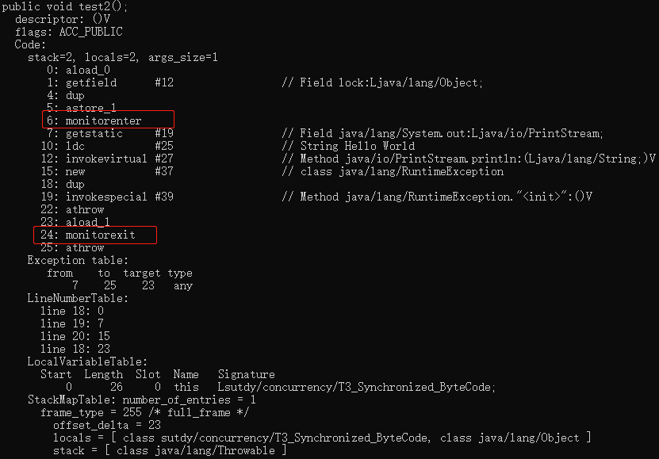

# synchronized字节码分析
## `synchronized`修饰代码块时的字节码分析
### 源代码
```java
public Object lock = new Object();
public void test() {
  synchronized (lock) {
    System.out.println("Hello World");
  }
}
```

### 字节码


**为什么会有两个`monitorexit`?**
答：因为`System.out.println("Hello World");`有可能抛出异常，在抛出异常时需要释放锁。

### 总结
当我们使用`synchronized`关键字来修饰代码块时，字节码层面上是通过`monitorenter`与`monitorexit`指令来实现的锁的获取与释放动作。

---

## 在代码中`throw RuntimeException()`时的字节码分析
### 源代码
```java
public Object lock = new Object();
public void test2() {
  synchronized (lock) {
    System.out.println("Hello World");
    throw new RuntimeException();
  }
}
```
### 字节码


**为什么只有一个`monitorexit`?**
答：因为此函数不可能`return`，只可能以`throw Exception()`的方式结束。

---

## `synchronized`修饰方法时
### 源代码
```java
public synchronized void test3() {
  System.out.println("Hello World");
}
```

### 字节码


### 结论
`synchronized`修饰方法时，反应在字节码上是通过在`flags`中标识此方法是同步方法。

---

## `synchronized`修饰`static`方法时
### 源代码
```java
public static synchronized void test4() {
  System.out.println("Hello World");
}
```

### 字节码


### 结论
`synchronized`修饰`static`方法时，反应在字节码上同样是通过在`flags`中标识此方法是同步方法。
