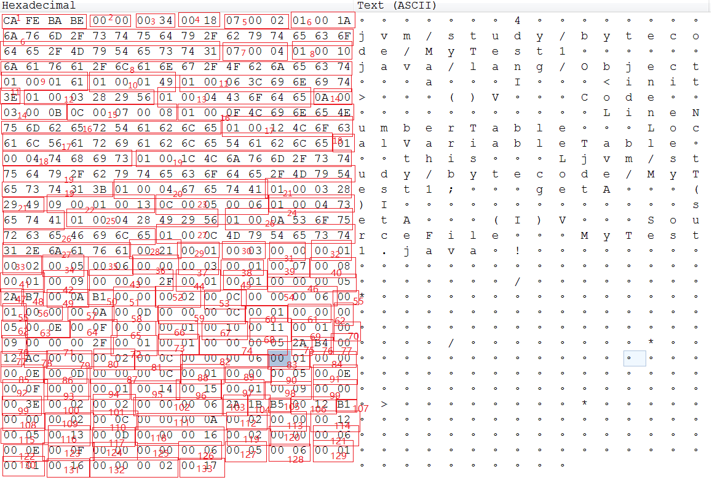

# 字节码文件分析实例
## 源代码
```java
/*
 * 模块编号
 * 功能描述
 * 文件名 MyTest1.java
 * 作者 王磊
 * 编写日期 2019年6月11日
 */
package jvm.study.bytecode;

public class MyTest1 {
	private int a;

	public int getA() {
		return a;
	}

	public void setA(int a) {
		this.a = a;
	}
}
```

## 字节码内容


```
1、魔数:CAFEBABE
2、次版本号:0
3、主版本号:52 代表1.8
4、常量池数量:24 实际常量池数量24-1=23
5、#1: 7 Class_Info 指向#2
6、#2：1 UTF8_Info 长度26 jvm/study/bytecode/MyTest1
7、#3: 7 Class_Info 指向#4
8、#4: 1 UTF8_Info 长度16 java/lang/Object
9、#5: 1 UTF8_Info 长度1 a
10、#6: 1 UTF8_Info 长度1 I
11、#7: 1 UTF8_Info 长度6 <init>
12、#8: 1 UTF8_Info 长度3 ()V
13、#9：1 UTF8_Info 长度4 Code
14、#10: 10 Methodref_Info 声明方法的类的索引:#3,Name_And_Type的索引:#11
15、#11: 12 NameAndType_Info Name索引:#7,Type索引:#8
16、#12: 1 UTF8_Info 长度15 LineNumberTable
17、#13: 1 UTF8_Info 长度18 LocalVariableTable
18、#14: 1 UTF8_Info 长度4 this
19、#15: 1 UTF8_Info 长度28 Ljvm/study/bytecode/MyTest1;
20、#16: 1 UTF8_Info 长度4 getA
21、#17: 1 UTF8_Info 长度3 ()I
22、#18: 9 Fieldref_Info 类型:指向#1 NameAndType：指向19
23、#19: 12 NameAndType_Info Name索引:#5,Type索引:#6
24、#20: 1 UTF8_Info 长度4 setA
25、#21: 1 UTF8_Info 长度4 (I)V
26、#22: 1 UTF8_Info 长度10 SourceFile
27、#23: 1 UTF8_Info 长度12 MyTest1.java
28、访问控制符；0x21 ACC_Super + ACC_Public
29、当前类名字； 指向#1 jvm/study/bytecode/MyTest1
30、父类名字: 指向#3 java/lang/Object
31、实现接口数量；0
32、成员变量个数；1
33、成员变量访问控制符；0x0002 private
34、成员变量name索引: 指向#5 a
35、成员变量描述信息索引: 指向#6 I
36、成员变量附加属性个数: 0
37、方法个数:3
38、方法访问控制符:1 public
39、方法名字索引:#7 <init>
40、方法描述符索引: #8 ()V
41、方法属性数量:1
42、属性名索引:#9 Code
43、属性长度:47
44、最大栈深度: 1
45、局部变量个数:1
46、code_length(执行指令“也叫助记符”的长度):5
47、aload_0 指令，指的是从局部变量表加载引用
48、invokespecial指令,指的是调用实例方法,后边的两个字节代表调用的方法的索引
49、调用方法的索引:#10 java/lang/Object.<init>
50、return 指令，表示返回值为void
51、异常表长度:0
52、附加属性个数:2
53、附加属性名字索引:#12 LineNumberTable
54、属性长度:6
55、行号表长度:1
56、start_pc：0
57、line_number:10
58、第二个附加属性的名字索引:#13 LocalVariableTable
59、第二个附加属性的属性长度:12
60、局部变量表长度:1
61、start_pc:0
62、长度:5
63、name_index:#14 this
64、description_index: #15 Ljvm/study/bytecode/MyTest1;
65、index:0
66、第二个方法的访问控制符:1 public
67、第二个方法的名字索引:#16 getA
68、第二个方法的描述符索引:#17 ()I
69、方法属性数量:1
70、属性名索引:#9 Code
71、属性长度:47
72、最大栈深度:1
73、局部变量个数:1
74、code_length(执行指令“也叫助记符”的长度):5
75、aload_0 指令，指的是从局部变量表加载引用
76、getfield指令,指的是从对象获取一个字段，后面两个字节代表字段信息的索引
77、#18 指向jvm/study/bytecode/MyTest1.a
78、ireturn指令,指的是返回一个int值
79、异常表长度:0
80、附加属性个数:2
81、附加属性名字索引:#12 LineNumberTable
82、属性长度:6
83、行号表长度:1
84、start_pc：0
85、line_number:14
86、第二个附加属性的名字索引:#13 LocalVariableTable
87、第二个附加属性的属性长度:12
88、局部变量表长度:1
89、start_pc:0
90、长度:5
91、name_index:#14 this
92、description_index: #15 Ljvm/study/bytecode/MyTest1;
93、index:0
94、第三个方法的访问控制符:1 public
95、第三个方法的名字索引:#20 setA
96、第三个方法的描述符索引:#21 (I)V
97、方法属性数量:1
98、属性名索引:#9 Code
99、属性长度:62
100、最大栈深度:2
101、局部变量个数:2
102、code_length(执行指令“也叫助记符”的长度):6
103、aload_0 指令，指的是从局部变量表加载引用
104、iload指令,指的是从局部变量表加载int值
105、putfield指令，指的是为对象的属性赋值，后两个字节为索要赋值的字段信息的引用
106、赋值的字段信息:#18 jvm/study/bytecode/MyTest1.a
107、return 指令，表示返回值为void
108、异常表长度:0
109、附加属性个数:2
110、附加属性名字索引:#12 LineNumberTable
111、属性长度:10
112、行号表长度:2
113、start_pc:0
114、line_number:18
115、start_pc:5
116、line_number:19
117、附加属性名字索引:#13 LocalVariableTable
118、附加属性的属性长度:22
119、局部变量表长度:2
120、start_pc:0
121、长度:6
122、name_index:#14 this
123、description_index: #15 Ljvm/study/bytecode/MyTest1;
124、index:0
125、start_pc:0
126、长度:6
127、name_index:#5 a
128、description_index: #6 I
129、index:1
130、字节码附加属性个数:1
131、附加属性名字索引:#22 SourceFile
132、属性长度:2
133、源文件索引:#23 MyTest1.java
```