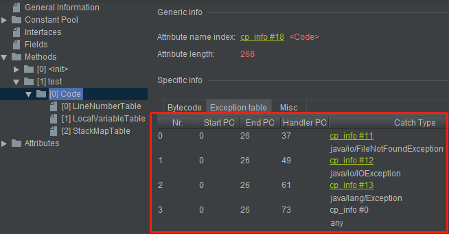
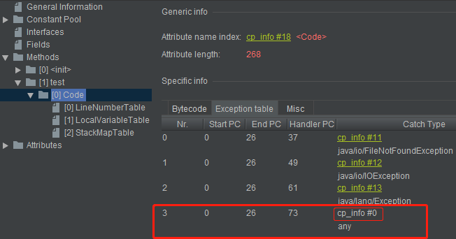
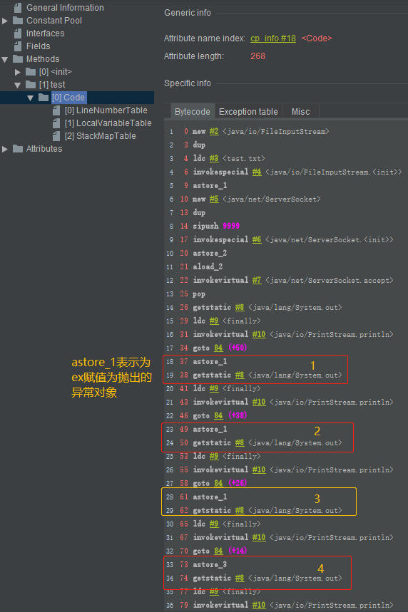
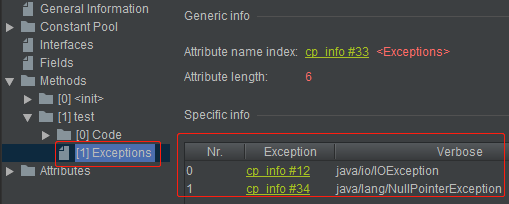

# Exception字节码分析实例
## 基本概念
* 统一采用异常表的方式来对异常进行处理
  ```
  // 异常表结构
  {
    u2 start_pc;
    u2 end_pc;
    u2 handler_pc;
    u2 catch_type;
    // start_pc和end_pc表示在code数组中的从start_pc到end_pc(包含start_pc,不包含
    end_pc)的指令抛出的异常会由这个表项来处理
    // handler_pc表示处理异常的代码的开始处
    // catch_type表示会被处理的异常类型,它指向常量池里的一个异常类。当catch_type为0时,
    表示处理所有的异常
  }
  ```

* 在JDK1.4.2之前的版本中，并不是使用异常表的方式来对异常进行处理的，而是采用特定的指令方式

## 一些结论
* 当异常处理存在`finally`语句块时，现代化的JVM采取的处理方式是将`finally`语句块的字节码拼接到每一个`catch`块后面，换句话说，程序中存在多少个`catch`块，就会在每一个`catch`块后面重复多少个`finally`语句块的字节码
### 源代码
```java
public class MyTest3 {
    public void test() {
        try {
            InputStream is = new FileInputStream("test.txt");

            ServerSocket serverSocket = new ServerSocket(9999);
            serverSocket.accept();
        } catch (FileNotFoundException ex) {

        } catch (IOException ex) {

        } catch (Exception ex) {

        } finally {
            System.out.println("finally");
        }
    }
}
```
### 异常表结构


**注意：** catch_type为0时,表示处理所有异常，字节码中自动生成的



每一个catch块后都会重复finally代码块的执行指令



方法声明中thows的Exception是**定义在附加信息Exceptions中的**而不是在**附加属性Code**中的

```java
public void test() throws IOException, NullPointerException {}
```


