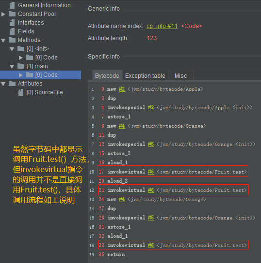
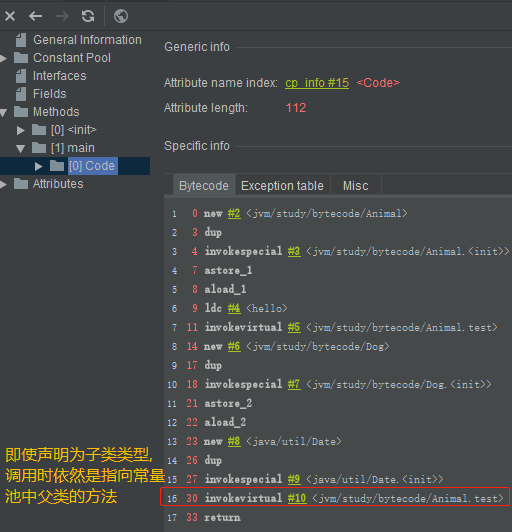
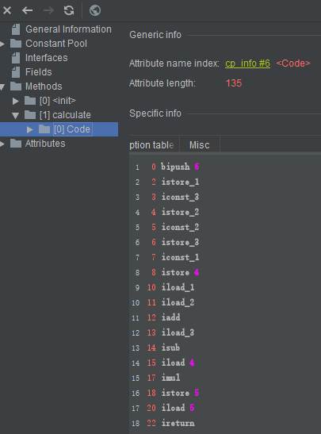

# 方法调用相关指令的介绍
`invokeinterface`: 调用接口中的方法，实际上是在运行期决定的，决定到底调用实现该接口的哪个对象的特定方法

`invokestatic`:调用静态方法

`invokespecial`: 调用自己的私有方法，构造方法(<init>)以及父类的方法

`invokevirtual`:调用虚方法，运行期动态查找的过程

`invokedynamic`: 动态调用方法(执行一些动态语言,如JavaScript)

## 静态解析的4中情形
静态方法

父类方法

构造方法

私有方法(无法被重写)

以上4类方法称作非虚方法，他们是在类加载阶段就可以将符号引用转换为直接引用的。

## 静态分派
  ```java
  public class MyTest5 {
      public void test(Grandpa grandpa){
          System.out.println("grandpa");
      }

      public void test(Father father){
          System.out.println("father");
      }

      public void test(Son son){
          System.out.println("son");
      }

      public static void main(String[] args) {
          Grandpa father = new Father();
          Grandpa son = new Son();

          MyTest5 myTest5 = new MyTest5();
          myTest5.test(father); // grandpa
          myTest5.test(son); // grandpa
      }
  }

  class Grandpa {
  }

  class Father extends Grandpa {
  }

  class Son extends Father {
  }
  // Grandpa father = new Father();
  // 以上代码，father的静态类型是Grandpa，而实际类型是Father
  ```

## 动态分派
invokevirtual指令执行流程：
1. 找到操作数栈栈顶的第一个元素；
2. 在找到的第一个元素中找到了与常量池方法描述符以及方法名称等都完全匹配的方法，
  如果找到并且具有方法权限，则返回方法的直接引用, **如果未找到完全匹配的方法，则从
  子类向上一直查找，找到方法的直接引用并返回;**
3. 调用找到的方法。
```java
public class MyTest6 {
    public static void main(String[] args) {
        Fruit apple = new Apple();
        Fruit orange = new Orange();

        apple.test(); // apple
        orange.test(); // orange

        apple = new Orange();
        apple.test(); // orange
    }
}

class Fruit {
    public void test() {
        System.out.println("Fruit");
    }
}

class Apple extends Fruit {
    @Override
    public void test() {
        System.out.println("Apple");
    }
}

class Orange extends Fruit {
    @Override
    public void test() {
        System.out.println("Orange");
    }
}
```


## 虚方法表
1. 针对**于方法调用动态分派的过程**，虚拟机会在类的方法区建立一个**虚方法表的数据结构**(virtual method table,vtable)子类继承父类如果没有重写父类的方法时，**子类中不会copy父类的方法**，而是在调用时指向父类的方法与**子类中方法描述信息对应在常量池中的索引与父类是相同的**，这样可以加快在父类中检索方法的效率
2. 针对于`invokeinterface`指令来说，虚拟机会建立一个叫做**接口方法表的数据结构**(interface method table，itable)
    ```java
    Animal animal = new Animal();
    //animal.test(null); 编译报错
    animal.test("hello");

    Dog dog = new Dog();
    dog.test(new Date());
    ```
    

## 基于**栈的指令集**和基于**寄存器的指令集**
现代JVM在执行Java代码的时候，通常都会**将解释执行与编译执行二者结合起来进行**。所谓解释执行，就是通过解释器来读取字节码，遇到相应的指令就去执行该指令。所谓编译执行，就是**通过及时编译器(Just In Time,JIT)将字节码转换为本地机器码来执行**；现代JVM会根据代码热点来生成相应的本地机器码。

### 两种指令集的关系:
1. JVM执行指令时所采取的方式是基于栈的指令集。
2. 基于栈的指令集主要的操作有入栈和出栈两种。
3. 基于栈的指令集的优势在于它可以在不同平台之间移植，而基于寄存器的指令集是与硬件架构紧密关联的，无法做到可移植。
4. 基于栈的指令集的缺点在于完成相同的操作，指令数量通常要比寄存器的指令集数量要多；基于栈的指令集是在内存中完成操作的，而基于寄存器的指令集是直接由CPU来执行的，它是在高速缓冲区中进行执行的，速度要快很多。虽然虚拟机可以采用一些优化手段，但总体来说，基于栈的指令集的执行速度要慢一些。

### 基于栈的指令集实例分析
```java
public int calculate() {
    int a = 6;
    int b = 3;
    int c = 2;
    int d = 1;

    int result = (a + b - c) * d;

    return result;
}
```

```
0 bipush 6 将int类型的6压入操作数栈顶
2 istore_1 将操作数栈顶的第一个数(6)放置局部变量表的第1个位置
3 iconst_3 将int类型的3压入操作数栈顶
4 istore_2 将操作数栈顶的第一个数(3)放置局部变量表的第2个位置
5 iconst_2 将int类型的2压入操作数栈顶
6 istore_3 将操作数栈顶的第一个数(2)放置局部变量表的第3个位置
7 iconst_1 将int类型的1压入操作数栈顶
8 istore 4 将操作数栈顶的第一个数(1)放置局部变量表的第4个位置
10 iload_1 将局部变量表中第1个位置索引的数(6)压入操作数栈
11 iload_2 将局部变量表中第2个位置索引的数(3)压入操作数栈
12 iadd    将操作数栈顶中的两个数相加并将结果(9)压入至操作数栈
13 iload_3 将局部变量表中第3个位置索引的数(2)压入操作数栈
14 isub    弹出操作数栈顶的两个元素，用第二个减去第一个并将结果(7)压入操作数栈
15 iload 4 将局部变量表中第4个位置索引的数(1)压入操作数栈
17 imul    将操作数栈顶的两个元素相乘，并将结果(7)压入至操作数栈
18 istore 5将操作数栈顶的元素(7)放置局部变量表的第5个位置
20 iload 5 将局部变量表中第5个位置索引的数(7)压入操作数栈
22 ireturn 返回操作数栈顶的元素(7)
```

