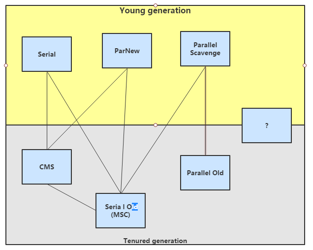

# 常见的垃圾回收器(Garbage Collector)

## 基本概念
* 分代模型：GC的宏观愿景
* 垃圾回收器：GC的具体实现
* Hotspot JVM提供多种垃圾回收器，我们需要根据具体应用的需要采用不同的垃圾回收器
* 没有万能的垃圾回收器，每种垃圾回收器都有自己的适用场景

### “并行”和“并发”
* 并行
指多个收集器的线程同时工作，但是用户线程处于等待状态
* 并发
指收集器在工作的同时，可以允许用户线程工作。
并发并不代表解决了GC停顿的问题，在关键的步骤还是要停顿。比如在收集器标记垃圾的时候。但在清除垃圾的时候，用户线程可以和GC线程并发执行。

## Serial收集器
单线程收集器，收集时会暂停所有工作线程（Stop The World,简称STW），使用复制收集算法，虚拟机运行在Client模式时的默认新生代收集器。
* 最早的收集器，单线程进行GC
* 新生代、老年代都可以使用
* 在新生代，采用复制算法；在老年代，采用标记-整理算法
* 由于是单线程GC，所以没有多线程切换的开销，简单实用
* Hotspot Client模式缺省的收集器

## Serial Old收集器
Serial Old是单线程收集器，使用标记整理算法，是老年代的收集器。

## ParNew收集器
ParNew收集器就是Serial收集器的多线程版，除了使用多线程外，其余行为包括算法、STW、对象分配规则、回收策略等都与Serial收集器一模一样。
对应的这种收集器是虚拟机运行在Server模式的默认新生代收集器，在单CPU的环境中，ParNew收集器并不会比Serial收集器有更好的效果。
* 使用复制算法(因为针对新生代)
* **只有在多CPU环境下，效率才会比Serial收集器高。**
* 可以通过-XX:ParallelGCThread来控制GC线程数的多少。需要结合具体CPU的个数
* Server模式下新生代的缺省收集器

## Parallel Scavenge收集器
Parallel Scavenge收集器也是一个多线程收集器，也是使用复制算法，但它的对象分配规则与回收策略都与ParNew收集器有所不同，它是以 **吞吐量最大化(即GC时间占总运行时间最小)** 为目标的收集器实现，它 **允许较长时间的STW换取总吞吐量最大化**

## Parallel Old收集器
老年代版本吞吐量优先收集器，使用多线程和标记整理算法，JVM1.6提供，在此之前，新生代使用了Parallel Scavenge收集器的话，老年代除Serial Old外别无选择，因为Parallel Scavenge收集器无法与CMS收集器配合工作。
* Parallel Scavenge在老年代的实现
* 在JVM1.6才出现Parallel Old
* 采用多线程，Mark-Compact算法
* 更注重吞吐量
* Parallel Scavenge + Parallel Old = 高吞吐量，但GC停顿可能不理想

## CMS(Concurrent Mark Sweep) 收集器
CMS是一种以最短停顿时间为目标的收集器，使用CMS并不能达到GC效率最高(总体GC时间最小)，但它能尽可能降低GC时服务的停顿事件，CMS收集器使用的是标记-清除算法
* 追求最短停顿事件，非常适合Web应用
* 只针对老年区，一般结合ParNew使用
* Concurrent,GC线程和用户线程并发工作(尽量并发)
* Mark-Sweep
* 只有在多CPU环境下才有意义
* 使用-XX:+UseConcMarkSweepGC打开

### 缺点
* CMS以牺牲CPU资源的代价来减少用户线程的停顿。当CPU个数少于4的时候，有可能对吞吐量影响非常大
* CMS在并发清理的过程中，用户线程还在跑。这时候需要预留一部分空间给用户线程
* CMS使用Mark-Sweep，会带来碎片问题。碎片过多的时候会容易频繁触发Full GC