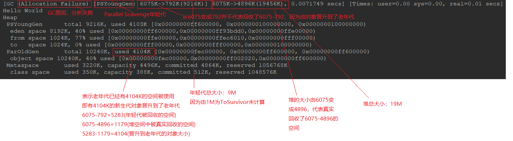
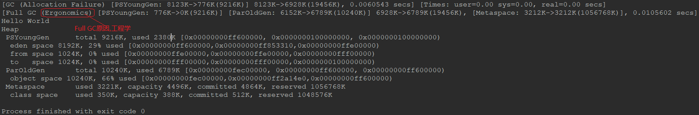
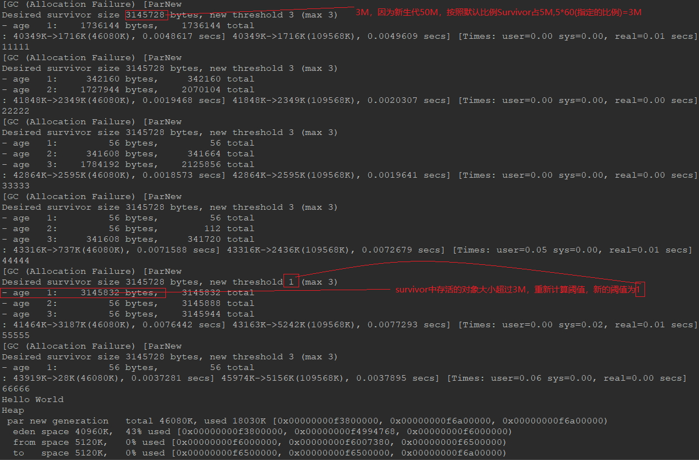

# GC实例分析
## 基本的GC参数
```
-verbose:gc // 显示gc的信息
-Xms20M // 设置堆的初始大小值为20M
-Xmx20M // 设置堆的最大值为20
-Xmn10M // 设置新生代的大小为10m
-XX:+PrintGCDetails // 打印GC的详细信息
-XX:SurvivorRatio=8 // 设置eden:survivor=8:1，即eden=8 from survivor=1 to survivor =1
```

## Minor GC分析
```java
/*
    1. 设置参数:
    -verbose:gc -Xms20M -Xmx20M -Xmn10M -XX:+PrintGCDetails -XX:SurvivorRatio=8

    2. 使用7M大小的空间，出现Minor GC
        分析GC日志
*/
int size = 1024 * 1024; // 1M

byte[] myAlloc1 = new byte[2 * size];
byte[] myAlloc2 = new byte[2 * size];
byte[] myAlloc3 = new byte[3 * size];

System.out.println("Hello World");
```


## Full GC分析
```java
/*
    1. 设置参数:
    -verbose:gc -Xms20M -Xmx20M -Xmn10M -XX:+PrintGCDetails -XX:SurvivorRatio=8

    2. 使用7M(2 + 2 + 3)大小的空间，出现Minor GC
        分析GC日志

    3. 分配8M大小(2 + 2 + 2 + 2)出现Full GC
*/
int size = 1024 * 1024; // 1M

byte[] myAlloc1 = new byte[2 * size];
byte[] myAlloc2 = new byte[2 * size];
byte[] myAlloc3 = new byte[2 * size];
byte[] myAlloc4 = new byte[2 * size];

System.out.println("Hello World");
```


## 为什么创建更大的对象反而没有Full GC呢?
```java
/*
    1. 设置参数:
    -verbose:gc -Xms20M -Xmx20M -Xmn10M -XX:+PrintGCDetails -XX:SurvivorRatio=8

    2. 使用7M(2 + 2 + 3)大小的空间，出现Minor GC
        分析GC日志

    3. 分配8M大小(2 + 2 + 2 + 2)出现Full GC

    4. 分配10M大小(2 + 2 + 3 + 3)未出现Full GC
*/
int size = 1024 * 1024; // 1M

byte[] myAlloc1 = new byte[2 * size];
byte[] myAlloc2 = new byte[2 * size];
byte[] myAlloc3 = new byte[3 * size];
byte[] myAlloc4 = new byte[3 * size];

System.out.println("Hello World");
```
原因在于JDK8所使用的垃圾回收期的机制是:当**新创建的对象**大小大于**新生代可用内存**大小时，新创建的对象会**直接在老年代创建**

### 结论：JDK8 默认垃圾收集器
* 年轻代 Parallel Scavenge
* 老年代 Parallel Old
* 特点是吞吐量大，但有可能STW时间久

## 不同GC(垃圾收集器)参数分析
### 打印JVM启动命令参数
`java -XX:+PrintCommandLineFlags -version`
```bash
C:\Users\Administrator>java -XX:+PrintCommandLineFlags -version
-XX:InitialHeapSize=116755136 -XX:MaxHeapSize=1868082176 -XX:+PrintCommandLineFlags
// 使用压缩类指针 使用压缩选项 默认使用ParallelGC
-XX:+UseCompressedClassPointers -XX:+UseCompressedOops -XX:-UseLargePagesIndividualAllocation -XX:+UseParallelGC
java version "1.8.0_211"
Java(TM) SE Runtime Environment (build 1.8.0_211-b12)
Java HotSpot(TM) 64-Bit Server VM (build 25.211-b12, mixed mode)
```

### `-XX:PretenureSizeThreshold=xx`
**创建的对象大小**如果超过这个**阈值**就会直接在**老年代**分配(单位是字节)
注意：**此参数必须搭配Serial(串行)GC使用**
```java
/*
    1. 添加JVM启动参数：-verbose:gc -Xms20M -Xmx20M -Xmn10M -XX:+PrintGCDetails
        -XX:SurvivorRatio=8 -XX:PretenureSizeThreshold=5242880(5m)
    2. 创建一个6M的对象，发现对象依然在年轻代
    3. 添加参数 -XX:+UserSerialGC 发现对象直接在老年代分配
    4. 创建一个10M的对象，OOM
    5. 创建一个4M的对象，使用jvisualvm 和jmc观察eden区变化和控制台的垃圾回收日志
*/
int size = 1024 * 1024;
byte[] myAlloc1 = new byte[4 * size];

TimeUnit.MINUTES.sleep(30);

System.out.println("Hello World");
```

### `-XX:MaxTenuringThreshold=xx`
调节对象晋升(Promote)到老年代年龄的**最大阈值**
该参数的默认值为15，**CMS** 中默认值为6，**G1** 中默认为15(在JVM中，该数值是由4个bit来表示，所以最大值 1111,即15)
经历了多次GC后，存活的对象会在From Survivor与To Survivor之间来回存放，而这里面的一个前提则是两个空间有足够大小来存放这些数据，在GC算法中，会计算每个对象年龄的大小，如果达到某个年龄后发现总大小已经大于了Survivor空间的50%，那么这时就需要调整阈值，不能再继续等到默认的15次GC后才完成晋升，因为这样会导致Survivor空间不足，所以需要调整阈值，让这些对象尽快完成晋升。

```java
/*
    -verbose:gc
    -Xms20M
    -Xmx20M
    -Xmn10M
    -XX:+PrintGCDetails
    -XX:+PrintCommandLineFlags
    -XX:SurvivorRatio=8
    -XX:MaxTenuringThreshold=5
    -XX:+PrintTenuringDistribution // 打印存活对象的年龄
*/
int size = 1024 * 1024;

byte[] myAlloc1 = new byte[2 * size];
byte[] myAlloc2 = new byte[2 * size];
byte[] myAlloc3 = new byte[2 * size];
byte[] myAlloc4 = new byte[2 * size];

System.out.println("Hello World");


// GC日志
GC (Allocation Failure)
Desired survivor size 1048576 bytes, new threshold 5 (max 5)
// new threshold 5 表示计算出来的可以到达老年代的对象年龄的阈值为5
```

### `-XX:TargetSurvivorRatio=xx`
当survivor空间中 **存活的对象** 占据的内存超过survivor空间 **总大小** 的xx%，JVM将会重新计算survivor空间对象移动到老年代的年龄的阈值，而不再使用显示定义的阈值
```java
public static void main(String[] args) throws InterruptedException {
    /*
        -verbose:gc
        -Xmx200M
        -Xmn50M
        -XX:TargetSurvivorRatio=60
        -XX:+PrintTenuringDistribution
        -XX:+PrintGCDetails
        -XX:+UseConcMarkSweepGC
        -XX:+UseParNewGC
        -XX:MaxTenuringThreshold=3
        */
    byte[] byte_1 = new byte[512 * 1024];
    byte[] byte_2 = new byte[512 * 1024];

    myGc();
    Thread.sleep(1000);

    System.out.println("11111");

    myGc();
    Thread.sleep(1000);

    System.out.println("22222");

    myGc();
    Thread.sleep(1000);

    System.out.println("33333");

    myGc();
    Thread.sleep(1000);

    System.out.println("44444");

    byte[] byte_3 = new byte[1024 * 1024];
    byte[] byte_4 = new byte[1024 * 1024];
    byte[] byte_5 = new byte[1024 * 1024];

    myGc();
    Thread.sleep(1000);

    System.out.println("55555");

    myGc();
    Thread.sleep(1000);

    System.out.println("66666");

    System.out.println("Hello World");
}

private static void myGc() {
    // 创建40个1M的对象
    for (int i = 0; i < 40; i++) {
        int size = 1024 * 1024;
        byte[] byteArray = new byte[size];
    }
}
```
GC日志分析

