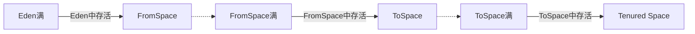

# 1. 类加载器
在JAVA代码中，类型的加载、连接与初始化过程都是在 **程序运行期间** 完成的。
提供了更大的灵活性，增加了更多的可能性。
## java虚拟机与程序的生命周期
  * 在以下几种情况下，java虚拟机将结束生命周期
    * 执行力`System.exit()`方法
    * 程序正常执行结束
    * 程序在执行过程中遇到了异常或错误而 **异常终止**
    * 由于操作系统出现错误而导致 **java虚拟机进程终止**

## 类的生命周期
  ```mermaid
  graph LR
  A[加载] --> B[验证]
  B --> C[准备]
  C --> D[解析]
  D --> E[初始化]
  E --> F[类实例化]
  F --> G[垃圾回收和对象终结]
  ```
### 加载
查找并加载类的二进制数据

### 连接
  * **验证：** 确保被加载的类的正确性
  * **准备：** 为类的**静态变量**分配内存，并将其初始化为**默认值**
  	```java
  	class Test {
  		public static int a = 1;
  	}
  	// 在准备阶段会给a赋值为0
  	```
  * **解析：** **把类中的符号引用转换为直接引用**

### 初始化
为类的**静态变量**赋予正确的**初始值**
```java
class Test {
	public static int a = 1;
}
// 在初始化阶段会给a赋值为1
```

#### 类的初始化步骤
  * 假如这个类还没有被加载和连接，那么就先进行加载和连接
  * 假如类存在直接父类，并且这个父类还没有被初始化，那就先初始化直接父类
  * 假如类中存在初始化语句，那么就依次执行这些初始化语句

#### Java程序对类的使用方式分为两种
  * 主动使用
  * 被动使用
  所有的Java虚拟机实现必须在每个类或接口被Java程序”**首次主动使用**“时才**初始化**他们

##### 主动使用(7种)
  * 创建类的实例
  * 访问某个类或接口的静态变量，或者对该静态变量赋值 `getstatic` `putstatic`
  * 调用类的静态方法	`invokestatic`
  * 反射
  * 初始化一个类的子类
  * JAVA虚拟机启动时被标明为启动类的类 (main()方法的类)
  * JDK1.7开始提供动态语言支持:`java.lang.invoke.MethodHandle`实例的解析结果
`REF_getStatic`,`REF_putStatic`,`EF_invokeStatic`句柄对应的类没有初始化，则初始化

##### 示例
* `子类.父类静态变量`不会导致子类的初始化,`子类.子类静态变量`会导致子类和父类都初始化，并且先初始化父类
```java
public class MyTest1 {
      public static void main(String[] args) {
          // System.out.println(MyChild1.str); // MyChild1不初始化静态代码块不执行 MyParent1初始化，静态代码块执行

          System.out.println(MyChild1.str2); // MyChild初始化，所有的父类也都初始化
      }
  }

  class MyParent1 {
      public static String str = "hello world";

      static {
          System.out.println("MyParent1 static block");
      }
  }

  class MyChild1 extends MyParent1 {
      public static String str2 = "welcome";

      static {
          System.out.println("MyChild1 static block");
      }
  }
```

* 调用`类A.常量`不会导致**A类**的初始化
```java
public class MyTest2 {
      public static void main(String[] args) {
          /**
           * 助记符：
           *  ldc表示将int,float或是String类型的常量值从常量池中推送至栈顶
           *  bipush表示将单字节（-128-127）的常量值推送至栈顶byte int push
           *  sipush表示将一个短整形常量值(-32768 - 32767)推送至栈顶 short int push
           *  iconst_1表示将int类型1推送至栈顶 (iconst_m1(-1) - iconst_5)
           */
          System.out.println(MyParent2.str);
      }
  }

  class MyParent2 {
      /**
       * 常量在编译阶段会存存入到调用这个常量的方法所在的类的常量池中
       * 本质上，调用类并没有直接引用到定义常量的类，因此并不会触发定义常量类的初始化
       * 注意：这里指的是将常量存放到了MyTest2的常量池中，之后MyTest2与MyParent2就没有任何关系了
       * 甚至，我们可以将MyParent2的class文件删除
       */
      public static final String str = "hello world";

      public static final short s = 7;

      public static final int i = 128;

      public static final int m = 5;

      static {
          System.out.println("Myparent2 static block");
      }
  }
```

* 调用`A类.常量`，如果**常量**在编译期不可以确定，则会导致**A类初始化**
```java
public class MyTest3 {
      public static void main(String[] args) {
          /**
           * 当一个常量的值并非编译期间可以确定的，那么其值就不会被放到调用类的常量池中，
           * 这时在程序运行时，会导致主动使用这个常量所在的类，显然会导致这个类被初始化
           */
          System.out.println(MyParent3.str); // MyParent3静态代码块执行
      }
  }

  class MyParent3 {
      public static final String str = UUID.randomUUID().toString();

      static {
          System.out.println("MyParent3 static block");
      }
  }
```

* `new A[1]`的方式**不会导致类A的初始化**
```java
public class MyTest4 {
      public static void main(String[] args) {
          /**
           * 对于数组实例来说，其类型是由JVM在运行期动态生成的，表示为[Lxx.xx.xx.xx这种形式。
           * 动态生成的类型，其父类就是Object
           *
           * 对于数组来说，JavaDoc经常讲构成数组的元素称为Component，实际上是将数组降低一个维度后的类型。
           *
           * 助记符：
           *  anewarray:表示创建一个引用类型的(如类、接口、数组)数组，并将其引用值压入栈顶
           *  newarray:表示创建一个指定的原始类型(如int、float、char等)的数组，并将其引用值压入栈顶
           */
          MyParent4 myParent4 = new MyParent4(); // 静态代码执行

          MyParent4[] myParent4s = new MyParent4[1]; // 静态代码块不执行
          System.out.println(myParent4s.getClass());
          System.out.println(myParent4.getClass().getSuperclass());

          MyParent4[][] myParent4s1 = new MyParent4[1][1]; // 静态代码块不执行
          System.out.println(myParent4s1.getClass());
          System.out.println(myParent4s1.getClass().getSuperclass());

          System.out.println("====================");
          int[] ints = new int[1];
          System.out.println(ints.getClass());
      }
  }

  class MyParent4 {
      static {
          System.out.println("MyParent4 static block");
      }
  }
```

* **子接口**或**子类**的初始化都**不会导致父接口的初始化**
```java
public class MyTest5 {
      public static void main(String[] args) {
          /*
              当一个接口在初始化时，并不要求其父接口都完成了初始化
              只有在真正使用到父接口的时候（如引用接口中所定义的常量时），才会初始化
           */
          System.out.println(MyChild5.b); // 不会导致MyParent5的初始化

          /*
              当一个类在初始化时，也不要求其父接口都完成初始化
           */
          System.out.println(MyChild5_c.c); // 不会导致MyParent5的初始化
      }
  }

  interface MyParent5 {
      public static final Thread thread = new Thread() {
          {
              System.out.println("MyParent5 invoked");
          }
      };
  }

  interface MyChild5 extends MyParent5 {
      public static final int b = 5;
  }

  class MyChild5_c implements MyParent5 {
      public static int c = 10;
  }
```

* 类的初始化为静态变量赋值是从上到下一行行执行的，如果静态变量定义在构造函数
下，则构造函数会先执行，为静态变量赋值会后执行
```java
public class MyTest6 {
      public static void main(String[] args) {
          Singleton singleton = Singleton.getInstance();

          System.out.println("counter1:" + Singleton.counter1); // 1
          System.out.println("counter2:" + Singleton.counter2); // 0
      }
  }
  class Singleton {
      public static int counter1;

      private static Singleton singleton = new Singleton();

      private Singleton() {
          counter1++;
          counter2++; // 准备阶段的重要意义

          System.out.println(counter1); // 1
          System.out.println(counter2); // 1
      }

      public static int counter2 = 0;

      public static Singleton getInstance() {
          return singleton;
      }
  }
```

* 调用`A.静态常量`不会导致类A的初始化
```java
class FinalTest {
      public static final int x = 3;

      static {
          System.out.println("Final Test static block");
      }
  }

  public class MyTest8 {
      public static void main(String[] args) {
          System.out.println(FinalTest.x); // 3 不会导致FinalTest类的初始化
      }
  }
```

* 初始化子类时会先初始化父类
```java
class Parent {
      static int a = 3;

      static {
          System.out.println("Parent static block");
      }
  }

  class Child extends Parent {
      static int b = 4;

      static {
          System.out.println("Child static block");
      }
  }

  public class MyTest9 {

      static {
          System.out.println("MyTest9 static block");
      }

      public static void main(String[] args) {
          System.out.println(Child.b);
          /*
              MyTest9
              Parent
              Child
              4
           */
      }
  }
```

* 只声明而未实例化的类是不初始化的
```java
class Parent2 {
      static int a = 3;

      static {
          System.out.println("Parent2 static block");
      }
  }

  class Child2 extends Parent2 {
      static int b = 4;

      static {
          System.out.println("Child2 static block");
      }
  }
  public class MyTest10 {
      static  {
          System.out.println("MyTest10 static block");
      }

      public static void main(String[] args) {
          Parent2 parent2;

          System.out.println("----------------");

          parent2 = new Parent2();

          System.out.println("-------------");

          System.out.println(parent2.a);

          System.out.println("---------------");

          System.out.println(Child2.b);

          /*
              MyTest10

              Parent2
              3

              Child2
              4
           */
      }
  }
```

* 子类引用父类的静态变量子类不会初始化
```java
public class MyTest11 {
      public static void main(String[] args) {
          System.out.println(Child3.a);//子类不会初始化
          Child3.doSomething();

          /*
              Parent3
              3
              do something
           */
      }
  }

  class Parent3 {
      static int a = 3;

      static {
          System.out.println("Parent3 static block");
      }

      static void doSomething() {
          System.out.println("do something");
      }
  }

  class Child3 extends Parent3 {
      static {
          System.out.println("Child3 static block");
      }
  }
```

* 类加载不会导致类初始化，只有反射才会导致类初始化
```java
class CL {
      static {
          System.out.println("CL static block");
      }
  }

  public class MyTest12 {
      public static void main(String[] args) throws Exception {
          ClassLoader loader = ClassLoader.getSystemClassLoader();

          Class<?> clazz = loader.loadClass("jvm.study.classloader.CL");

          System.out.println(clazz);

          System.out.println("---------------------");

          clazz = Class.forName("jvm.study.classloader.CL");

          System.out.println(clazz);

          /*
              clazz
              -------------
              CL static block
              clazz
           */
      }
  }
```

### 类的加载
类的加载指的是将.class文件中的二进制数据读入到内存中，将其放进方法区中，
然后在内存中创建一个java.lang.Class对象(**规范并未说明Class对象位于哪里，
HotSpot虚拟机将其放在了方法区中**)用来封装类在方法区内的数据结构。

#### 加载方式
* 从本地系统中直接加载
* 通过网络下载.class文件
* 从zip，jar等归档文件中加载.class文件
* 从专有数据库中提取.class文件
* **将Java源文件动态编译为.class文件**

#### 类加载器分类
* **Java虚拟机自带的加载器**
* 根类加载器（Bootstrap）
* 扩展类加载器（Extension）
* 系统（应用）类加载器（System/App）

#### 用户自定义的类加载器
* java.lang.ClassLoader的子类
* 用户可以定制类的加载方式

#### 类加载时机
* 类加载器并不需要等到某个类被“首次主动使用”时再加载它。
* JVM规范允许类加载器在预料某个类将要被使用时就预先加载它，
    如果在预先加载的过程中遇到了.class文件缺失或不存在的错误，
    类加载器必须在程序首次主动使用该类时才报告错误(**LinkageError错**误)。
    如果这个类一直没有被程序主动使用，那么**类加载器就不会报告错误**

#### 获得ClassLoader的途径
* 获得当前类的ClassLoader
	`clazz.getClassLoader();`
* 获得当前线程上下文的ClassLoader
  `Thread.currentThred().getContextClassLoader();`
* 获得系统的ClassLoader
  `ClassLoader.getSystemClassLoader();`
* 获取调用者的ClassLoader
  `DriverManager.getCallerClassLoader();`

#### 双亲委托机制
类加载用来把类加载到java虚拟机中。从JDK1.2版本开始，类的加载过程采用双亲委托
  机制，这种机制能更好地保证java平台的安全。在此委托机制中，除了java虚拟机自带的根类加载器以外，其余的类加载器都有且只有一个父类加载器。当java程序请求加载器loader1加载Sample类时，loader1首先委托自己的父加载器去加载Sample类，若父加载器能加载，
  则由父加载器完成加载任务，否则才由加载器loader1本身加载Sample类。

##### 命名空间
* 每个类加载器都有自己的命名空间；**命名空间由该加载器及所有的父加载器所加载的类组成**。
* 在同一个命名空间中，不会出现类的完整名字（包括类的包名）相同的两个类。
* 在不同的命名空间中，有可能会出现类的完整名字（包括类的包名）相同的两个类。
* 同一个命名空间内的类是相互可见的。
* 子加载器的命名空间包含所有父加载器的命名空间。因此由子加载器加载的类能看见父加载器加载
      的类。例如系统类加载器加载的类能看见根类加载器加载的类。
* 由父加载器加载的类不能看见子加载器加载的类。
* 如果类加载器之间没有直接或间接的父子关系，那么他们各自加载的类相互不可见。

##### 示例
* JDK库的类由BootStrapClassLoader加载，程序员编写的类由AppClassLoader加载
```java
public class MyTest7 {
    public static void main(String[] args) throws Exception {
        Class<?> class1 = Class.forName("java.lang.String");
        System.out.println(class1.getClassLoader()); // null 由BootstrapClassLoader加载

        Class<?> class2 = Class.forName("jvm.study.classloader.C");
        System.out.println(class2.getClassLoader());// sun.misc.Launcher$AppClassLoader@18b4aac2
    }
}

class C {

}
```


* 类加载器的结构
```java
public class MyTest13 {
    public static void main(String[] args) {
        ClassLoader classLoader = ClassLoader.getSystemClassLoader();
        System.out.println(classLoader);
        // sun.misc.Launcher$AppClassLoader@18b4aac2

        while (classLoader != null) {
            classLoader = classLoader.getParent();

            System.out.println(classLoader);
        }
        /*
            sun.misc.Launcher$ExtClassLoader@1b6d3586
            null
         */
    }
}
```

* 获取类文件所在硬盘上位置
```java
public class MyTest14 {
    public static void main(String[] args) throws IOException {
        ClassLoader classLoader = Thread.currentThread().getContextClassLoader();

        String resourceName = "jvm/study/classloader/MyTest13.class";

        Enumeration<URL> urls = classLoader.getResources(resourceName);
        while (urls.hasMoreElements()) {
            URL url = urls.nextElement();
            System.out.println(url);
        }

        System.out.println("-----------------");
    }
}
```

* 加载数组的类加载器是加载对应的数组元素的类加载器
```java
public class MyTest15 {
    public static void main(String[] args) {
        String[] strings = new String[2];
        System.out.println(strings.getClass().getClassLoader()); // null BootstrapClassLoader

        System.out.println("--------------------");

        MyChild5[] myChild5s = new MyChild5[2];
        System.out.println(myChild5s.getClass().getClassLoader()); // AppClassLoader

        System.out.println("---------------------");

        int[] ints = new int[2];
        System.out.println(ints.getClass().getClassLoader()); // null
    }
}
```

* 自定义类加载器
```java
public class MyTest16 extends ClassLoader {

    private String classLoaderName;

    private String path;

    public void setPath(String path) {
        this.path = path;
    }

    private static final String fileExtension = ".class";

    public MyTest16(String classLoaderName) {
        super(); // 将系统类加载器当做该类加载的父类加载器
        this.classLoaderName = classLoaderName;
    }

    public MyTest16(ClassLoader parent, String classLoaderName) {
        super(parent); // 显示指定该类加载器的父类加载器
        this.classLoaderName = classLoaderName;
    }

    public MyTest16(ClassLoader parent) {
        super(parent);
    }

    @Override
    public String toString() {
        return "[" + this.classLoaderName + "]";
    }

    @Override
    protected Class<?> findClass(String className) {
        System.out.println("findClass invoked!");
        byte[] data = loadClassData(className);
        return defineClass(className, data, 0, data.length);

    }

    private byte[] loadClassData(String className) {
        byte[] data = null;
        InputStream is = null;
        ByteArrayOutputStream baos = null;

        className = className.replace(".", "/");
        try {
            is = new FileInputStream(new File(this.path + className + fileExtension));
            baos = new ByteArrayOutputStream();

            int ch = 0;
            while (-1 != (ch = is.read())) {
                baos.write(ch);
            }

            data = baos.toByteArray();

        } catch (Exception e) {
            e.printStackTrace();
        } finally {
            try {
                is.close();
                baos.close();
            } catch (Exception e) {
                e.printStackTrace();
            }
        }

        return data;
    }

    public static void test(ClassLoader classLoader) throws Exception {
        Class<?> clazz = classLoader.loadClass("jvm.study.classloader.MyTest1");
        Object object = clazz.newInstance();
        System.out.println(object);
    }

    public static void main(String[] args) throws Exception {
        MyTest16 loader1 = new MyTest16("loader1");
        loader1.setPath("C:\\Users\\Administrator\\Desktop\\");

        Class<?> clazz1 = loader1.loadClass("jvm.study.classloader.MyTest1");
        Object object1 = clazz1.newInstance();
        System.out.println(clazz1.hashCode());
        System.out.println(object1);
        System.out.println();

        // 测试类的卸载
        loader1 = null;
        clazz1 = null;
        object1 = null;
        System.gc();

        //MyTest16 loader2 = new MyTest16("loader2");
        //loader2.setPath("C:\\Users\\Administrator\\Desktop\\");
        //Class<?> clazz2 = loader2.loadClass("jvm.study.classloader.MyTest1");
        //Object object2 = clazz2.newInstance();
        //System.out.println(clazz2.hashCode());
        //System.out.println(object2);

    }
}
```

* 如果classpath中存在类A的字节码文件，那么自定义类加载器不会加载类A，而是由AppClassLoader加载类A
```java
public class MyTest17 {
    public static void main(String[] args) throws Exception {
        MyTest16 loader1 = new MyTest16("loader1");

        Class<?> clazz = loader1.loadClass("jvm.study.classloader.MySample");
        System.out.println("class: " + clazz.hashCode());

        // 如果注释掉该行，那么并不会实例化MySample对象，即MySample构造方法不会被调用
        // 因此不会实例化MyCat对象，即没有对MyCat进行主动使用，这里就不会初始化MyCat类
        Object object = clazz.newInstance();
    }
}
public class MySample {
    public MySample() {
        System.out.println("MySample is loaded by: " + this.getClass().getClassLoader());

        new MyCat();
    }
}
public class MyCat {
    public MyCat() {
        System.out.println("MyCat is loaded by: " + this.getClass().getClassLoader());
    }
}
```

* 当classpath中不存在类A的字节码文件，就可以使用自定义的类加载器加载类A
```java
public class MyTest17_1 {
    public static void main(String[] args) throws Exception {
        MyTest16 loader1 = new MyTest16("loader1");
        loader1.setPath("C:\\Users\\Administrator\\Desktop\\");

        Class<?> clazz = loader1.loadClass("jvm.study.classloader.MySample");
        System.out.println("class: " + clazz.hashCode());

        // 如果注释掉该行，那么并不会实例化MySample对象，即MySample构造方法不会被调用
        // 因此不会实例化MyCat对象，即没有对MyCat进行主动使用，这里就不会初始化MyCat类
        Object object = clazz.newInstance();
    }
}
```

* 打印JVM自带的3个类加载器加载类的路径
```java
public class MyTest18 {
    public static void main(String[] args) {
        System.out.println(System.getProperty("sun.boot.class.path"));
        System.out.println(System.getProperty("java.ext.dirs"));
        // 我们所写的代码会被ide自动设置到classpath中
        System.out.println(System.getProperty("java.class.path"));
    }
}
```

* 将自定义类加载器设置为系统(应用)类加载器
```java
public class MyTest23 {
    public static void main(String[] args) {
        System.out.println(System.getProperty("sun.boot.class.path"));
        System.out.println(System.getProperty("java.ext.dirs"));
        System.out.println(System.getProperty("java.class.path"));

        /*
            内建于JVM中的启动类加载器会加载java.lang.ClassLoader以及他的Java平台类，
            当JVM启动时，一块特殊的机器码会运行，它会加载扩展类加载器与系统类加载器，
            这块特殊的机器码叫做启动类加载器(Bootstrap ClassLoader)

            启动类加载器并不是Java类，而其他的加载器则都是Java类，
            启动类加载器是特定于平台的机器指令，它负责开启整个加载过程。

            所有类加载器（除了启动类加载器）都被实现为Java类。不过，总归要有一个组件来加载第一个Java类加载器，
            从而整个加载过程才能够被顺利进行下去，加载第一个纯Java类加载器就是启动类加载器的职责。

            启动类加载器还会负责加载供JRE正常运行所需要的基本组件，这包括java.util与java.lang包中的类等等。

            要将自定义的类加载器作为系统类加载器的条件
                1.设置系统属性java.system.class.loader=com.xx.xx.A
                2.自定义类加载器必须有一个构造函数为A(ClassLoader parent)，这个构造函数将被系统调用
               注意:自定义类加载器作为系统类加载器时，其父委托加载器是AppClassLoader
         */

        System.out.println(ClassLoader.class.getClassLoader()); // null 因为由启动类加载器加载

        // ExtClassloader和AppClassloader也是由BootstrapClassloader所加载的
        System.out.println(Launcher.class.getClassLoader()); // null 因为由启动类加载器加载

        System.out.println("---------------");
        System.out.println(System.getProperty("java.system.class.loader"));// null

        System.out.println(MyTest23.class.getClassLoader());// AppClassLoder
        System.out.println(MyTest16.class.getClassLoader());// AppClassLoder

        // java -Djava.system.class.loader=jvm.study.classloader.MyTest16 jvm.study.classloader.MyTest23
        System.out.println(ClassLoader.getSystemClassLoader()); // jvm.study.classloader.MyTest16
    }
}
```

* 线程上下文类加载器的作用
当高层(SPI)提供了统一接口让低层(厂商的实现)去实现，同时又要是**在高层加载（或实例化）低层的类**时，必须通过线程上下文类加载器来帮助高层的ClassLoader找到并加载该类。因为SPI由BootStrapClassLoader加载,而BootStrapClassLoader无法加载classpath下的类
```java
public class MyTest24 {

    public static void main(String[] args) {
        /*
            当前类加载器(Current Classloader)
                每个类都会使用自己的类加载器(即加载自身的类加载器)去加载自己所依赖的类，
                如果ClassX引用了ClassY,那么ClassX的类加载器就会去加载ClassY(前提是ClassY尚未被加载)
            线程上下文类加载器(Context Classloader)
                线程上下文类加载器是从JDK1.2开始引入的，类Thread中的getContextClassLoader()与setContextClassLoader(ClassLoader cl)
                分别用来获取和设置线程上下文类加载器

            如果没有通过setContextClassLoader(ClassLoadr cl)进行设置的话，线程将继承其父线程的上下文类加载器
            Java应用运行时的初始线程的上下文类加载器是系统类加载器。在线程中运行的代码可以通过该类加载器来加载类与资源。

            线程上下文类加载器的重要性：
                SPI(Service Provider Interface)

                父ClassLoader可以使用当前线程上下文类加载器(Thread.currentThread().getContextClassloader())所指定的classLoader来加载自己无法加载的类。
                这就改变了父Classloader不能使用子Classloader或是与其没有直接父子关系的ClassLoader加载的类的情况，即改变了双亲委托模型。

                线程上下文类加载器就是当前线程的Current ClassLoader。

                在双亲委托模型下，类加载是由上至下的，即下层的类加载器会委托上层进行加载。但是对于SPI来说，有些接口是Java核心库所提供的，
                而Java核心库是由启动类加载器来加载的，而这些接口的实现却来自于不同的jar包(厂商提供)，Java的启动类加载器是不会加载其他来源
                的jar包，这样传统的双亲委托模型就无法满足SPI的要求。而通过给当前线程设置上下文类加载器，就可以由设置的上下文类加载器来实现对于
                接口实现类的加载。

         */
        System.out.println(Thread.currentThread().getContextClassLoader()); // APPClassLoader
        System.out.println(Thread.class.getClassLoader()); // null BootstrapClassloader
    }
}
```

* 线程上下文类加载器默认是系统类加载器
```java
public class MyTest25 implements Runnable {
    private Thread thread;

    public MyTest25(){
        this.thread = new Thread(this);
        thread.start();
    }

    @Override
    public void run() {
        ClassLoader classLoader = this.thread.getContextClassLoader();

        this.thread.setContextClassLoader(classLoader);

        System.out.println("Class: " + classLoader.getClass()); // APPClassLoader
        System.out.println("Parent: " + classLoader.getParent().getClass()); // ExtClassLoader
    }

    public static void main(String[] args) {
        new MyTest25();
    }
}
```

* ServiceLoader使用
```java
public class MyTest26 {
    /*
        线程上下文类加载器的一般使用模式(获取 - 使用 - 还原)

        ClassLoader targetTccl = null; // new MyClassLoader();

        ClassLoader classLoader = Thread.currentThread().getContextClassLoader();

        try {
            Thread.currentThread().setContextClassLoader(targetTccl);
            myMethod();
        } finally {
            Thread.currentThread().setContextClassLoader(classLoader);
        }

        myMethod里面则调用了Thread.currentThread().getContextClassLoader()，获取当前线程的上下文类加载器做某些事情。

        如果一个类由类加载器A加载，那么这个类的依赖类也是由相同的类加载器加载的 (如果该依赖类之前没有被加载过的话)

        ContextClassLoader的作用是为了破坏Java的类加载委托机制。

        当高层提供了统一的接口让低层去实现，同时又要在高层加载 (或实例化) 低层的类时，就必须要通过线程上下文类加载器来
        帮助高层的ClassLoader找到并加载该类。
     */
    public static void main(String[] args) {

        /*
            ServiceLoader主要用于加载 META-INF/services/ 目录下的文件名(如:java.sql.Driver)所对应的的服务实现者
            (实现者位于文件中,如java.sql.Driver文件中的com.mysql.jdbc.Driver)
         */
        ServiceLoader<Driver> serviceLoader = ServiceLoader.load(Driver.class);
        Iterator<Driver> iterator = serviceLoader.iterator();

        while (iterator.hasNext()) {
            Driver driver = iterator.next();
            System.out.println("driver: " + driver.getClass() + ",loader: " + driver.getClass().getClassLoader());
        }

        System.out.println("当前线程上下文类加载器: " + Thread.currentThread().getContextClassLoader()); // APPClassLoader

        System.out.println("serviceLoader的类加载器: " + ServiceLoader.class.getClassLoader()); // null BootstrapClassLoader

    }
}
```
* SPI-JDBC-MySql示例
```java
public class MyTest27 {
    public static void main(String[] args) throws Exception {
        /*
            注册JDBC的驱动(使用ServiceLoader加载驱动)
                Class.forName加载并实例化Driver导致Driver静态代码块执行，进而导致DriverManager静态代码块执行，最终由ServiceLoader加载驱动
         */
        Class.forName("com.mysql.jdbc.Driver");

        /*
            遍历所有加载的驱动尝试连接数据库，哪一个连接成功了就返回哪一个的连接。
                使用Driver获取connection前，会判断加载Driver的类加载器和当前调用getConnection方法的类对应的类加载器是否为同一个类加载器(类加载器命名空间相同)，
                如果不是一个类加载器就会产生问题，因为不同类加载器加载同一个类，jvm会认为是不同的类。

         */
        DriverManager.getConnection("jdbc:mysql://localhost:3306/test", "root", "1234");
    }
}
```

##### 类加载器的双亲委派模型的好处
* 可以确保Java核心库的类型安全：所有的Java应用都至少会引用`Java.lang.Object`类，也就是说在运行期，java.lang.Object这个类会被加载到Java虚拟机中；如果这个加载过程是由Java应用自己的类加载器所完成的，那么很可能会在JVM中存在多个版本的`java.lang.Object`类，而且这些类之间还是不兼容的，相互不可见的(正是命名空间在发挥着作用)。借助于双亲委派机制，Java核心类库中的类的加载工作都是由启动类加载器来统一完成，从而确保了Java应用所使用的都是同一个版本的Java核心类库，他们之间是相互兼容的。
* 可以确保Java核心类库所提供的类不会被自定义的类所替代。
* 不同的类加载器可以为相同名称(binary name)的类创建额外的命名空间。相同名称的类可以并存在Java虚拟机中，只需要用不同的类加载器来加载他们即可。不同类加载器所加载的类之间是不兼容的，这就相当于在Java虚拟机内部创建了一个又一个相互隔离的Java类空间，这类技术在很多框架中都得到了实际应用。

### 类的卸载
当MySample类被加载、连接和初始化后，它的生命周期就开始了。当代表MySample类的Class对象不再被引用，即不可触及时，Class对象就会结束生命周期，MySample类在方法区内的数据也会被卸载，从而结束MySample类的生命周期。
一个类何时结束生命周期，取决于代表它的Class对象何时结束生命周期
由Java虚拟机自带的类加载器所加载的类，在虚拟机的生命周期中，始终不会被卸载(**因为JVM使用持有类加载器的引用**)。
由用户自己定义的类加载器所加载的类时可以被卸载的。

## 类的生命周期详述
* **加载:** 就是把二进制形式的java类型读入到Java虚拟机中
* **验证:**
* **准备:** 为类变量(静态变量)分配内存，设置默认值。但是在到达初始化之前，类变量都没有初始化为真正的初始值
* **解析:** 解析过程就是在类型的常量池中寻找类、接口、字段和方法的符号引用，把这些符号引用替换成直接引用的过程
* **初始化:** 为类变量赋予正确的初始值
* **类实例化:**
    * 为新的对象分配内存
    * 为实例变量赋默认值
    * 为实例变量赋正确的初始值
    * java编译器为它编译的每一个类都至少生成一个实例初始化方法，在java的class文件中，
    这个实例初始化方法被称为“<init>”。针对源代码中每一个类的构造方法，java编译器都产生一个<init>方法
* **垃圾回收和对象终结**
* **结束**
* **类的验证**
  * 类的验证的内容
    * 类文件的结构检查
    * 语义检查(abstract class 不能用final修饰等)
    * 字节码验证(魔数的验证等)
    * 二进制兼容性的验证(老版本编译器编译的字节码可以由新版本的JVM执行，反之则不行)

## 虚拟机参数
```
-XX:+TraceClassLoading
-XX:+<option>：表示开启option选项
-XX:-<option>：表示关闭option选项
-XX:<option>=<value>：表示将option选项的值设置为value
```
---

# 2. Java字节码文件结构
## 查看字节码文件内容
* `javap`
* `javap -c`
* `javap -verbose`
* `javap -verbose -p` 可以查看私有的方法
使用`javap -verbose`命令分析一个字节码文件时，将会分析该字节码文件的**魔数**、**版本号**、**常量池**、**类信息**、**类的构造方法**、**类中的方法信息**、
**类变量** 与 **成员变量**等信息。

## 字节码结构
```
ClassFile {
	u4						magic;
	u2						minor—version;
	u2						major_version;
	u2						constant_pool_count;
	cp_info				contant_pool[constant_pool_count - 1];
	u2						access_flags;
	u2						this_class;
	u2						super class;
	u2						interfaces_count;
	interface_info			interfaces(interfaces_count];
	u2						fields_count;
	field_info				fields[fields_count];
	u2						methods_count;
	method_info				methods[methods_count];
	u2						attributes_count;
	attribute_info			attributes[attributes_count];
}
```
### 魔数(4个字节)
* 所有的.class字节码文件的前4个字节都是魔数
* 魔数值为固定值:`0xCAFEBABE`

### 版本号(2+2个字节)
* 魔数之后的4个字节为版本信息
* 前两个字节表示**minor version(次版本号)**
* 后两个字节表示**major version(主版本号)**
        这里的版本号为`00 00 00 34`换算成十进制，表示次版本号为0，主版本号为52。
        所以，该文件的版本号为1.8.0。可以用`java -version`命令来验证这一点。

### 常量池(constant pool )(2+n个字节)
* 紧接着主版本号之后的就是常量池入口，前两个字节为常量池中的**常量数量**。
* **值得注意的是：**
  ```
  常量池数组中元素的个数 = 常量池数 - 1
  ```
  **其中0暂时不使用**目的是满足某些常量池索引值的数据在特定情况下需要**表达不引用任何一个常量池的含义**；根本原因在于，索引为0也是一个常量(保留常量)，只不过它不位于常量表中，这个常量就对应**null**值；所以，常量池的索引从1而非0开始。
* 一个java类中定义的很多信息都是由常量池来维护和描述的，可以将常量池看做是**class文件的资源仓库**，比如说java类中定义的**方法**与**变量信息**，都是存储在常量池中。
* 常量池中主要存储两类常量：
  * 字面量
      字面量如文本字符串，java中声明为final的常量值等
  * 符号引用
      符号引用如类和接口的全局限定名，字段的名称和描述符，方法的名称和描述符等等。

#### 常量池的总体结构:
java类所对应的常量池主要由**常量池数量**与**常量池数组**(常量表)这两部分组成
* **常量池数量：** 紧跟在主版本号后面，占据2个字节
* **常量池数组：** 紧跟在常量池数量之后。常量池数组与一般的数组不同的是，**常量池数组中的元素类型并不相同**、结构都是不同的，长度当然也就不同；但是，每一种元素的第一个数据都是u1类型，该字节是个标志位，占据1个字节。JVM在解析常量池时，**会根据这个u1类型来获取元素的具体类型**。

#### 常量池中数据类型的结构表
<table>
    <thead>
        <tr>
            <th>常量</th>
            <th>项目</th>
            <th>类型</th>
            <th>描述</th>
        </tr>
    </thead>
    <tbody>
        <tr>
            <td rowspan="3">CONSTANT_Utf8_info</td>
            <td>tag</td>
            <td>u1</td>
            <td>值为1</td>
        </tr>
        <tr>
            <td>length</td>
            <td>u2</td>
            <td>UTF-8编码的字符串长度</td>
        </tr>
        <tr>
            <td>bytes</td>
            <td>u1</td>
            <td>长度为length的UTF-8编码的字符串</td>
        </tr>
        <tr>
            <td rowspan="2">CONSTANT_Integer_info</td>
            <td>tag</td>
            <td>u1</td>
            <td>值为3</td>
        </tr>
        <tr>
            <td>bytes</td>
            <td>u4</td>
            <td>按照高位在前存储的int值</td>
        </tr>
        <tr>
            <td rowspan="2">CONSTANT_Float_info</td>
            <td>tag</td>
            <td>u1</td>
            <td>值为4</td>
        </tr>
        <tr>
            <td>bytes</td>
            <td>u4</td>
            <td>按照高位在前存储的float值</td>
        </tr>
        <tr>
            <td rowspan="2">CONSTANT_Long_info</td>
            <td>tag</td>
            <td>u1</td>
            <td>值为5</td>
        </tr>
        <tr>
            <td>bytes</td>
            <td>u8</td>
            <td>按照高位在前存储的long值</td>
        </tr>
        <tr>
            <td rowspan="2">CONSTANT_Double_info</td>
            <td>tag</td>
            <td>u1</td>
            <td>值为6</td>
        </tr>
        <tr>
            <td>bytes</td>
            <td>u8</td>
            <td>按照高位在前存储的double值</td>
        </tr>
        <tr>
            <td rowspan="2">CONSTANT_Class_info</td>
            <td>tag</td>
            <td>u1</td>
            <td>值为7</td>
        </tr>
        <tr>
            <td>index</td>
            <td>u2</td>
            <td>指向全限定名常量项的索引</td>
        </tr>
        <tr>
            <td rowspan="2">CONSTANT_String_info</td>
            <td>tag</td>
            <td>u1</td>
            <td>值为8</td>
        </tr>
        <tr>
            <td>index</td>
            <td>u2</td>
            <td>指向字符串字面量的索引</td>
        </tr>
        <tr>
            <td rowspan="3">CONSTANT_Fieldref_info</td>
            <td>tag</td>
            <td>u1</td>
            <td>值为9</td>
        </tr>
        <tr>
            <td>index</td>
            <td>u2</td>
            <td>指向字段的类或接口的描述符CONSTANT_Class_info的索引项</td>
        </tr>
        <tr>
            <td>index</td>
            <td>u2</td>
            <td>指向字段描述符CONSTANT_NameAndType_info的索引项</td>
        </tr>
        <tr>
            <td rowspan="3">CONSTANT_Methodref_info</td>
            <td>tag</td>
            <td>u1</td>
            <td>值为10</td>
        </tr>
        <tr>
            <td>index</td>
            <td>u2</td>
            <td>指向声明方法的类描述符CONSTANT_Class_info的索引项</td>
        </tr>
        <tr>
            <td>index</td>
            <td>u2</td>
            <td>指向名称及类型描述符CONSTANT_NameAndType_info的索引项</td>
        </tr>
        <tr>
            <td rowspan="3">CONSTANT_InterfaceMethodref_info</td>
            <td>tag</td>
            <td>u1</td>
            <td>值为11</td>
        </tr>
        <tr>
            <td>index</td>
            <td>u2</td>
            <td>指向声明方法的接口描述符CONSTANT_Class_info的索引项</td>
        </tr>
        <tr>
            <td>index</td>
            <td>u2</td>
            <td>指向名称及类型描述符CONSTANT_NameAndType_info的索引项</td>
        </tr>
         <tr>
            <td rowspan="3">CONSTANT_NameAndType_info</td>
            <td>tag</td>
            <td>u1</td>
            <td>值为12</td>
        </tr>
        <tr>
            <td>index</td>
            <td>u2</td>
            <td>指向该字段或方法名称常量项的索引</td>
        </tr>
        <tr>
            <td>index</td>
            <td>u2</td>
            <td>指向该字段或方法描述符常量项的索引</td>
        </tr>
    </tbody>
</table>

* 在JVM规范中，每个变量/字段都有描述信息，描述信息主要的作用是描述字段的数据类型、方法的参数列表(包括数量、类型与顺序)与返回值。根据描述符规则，基本数据类型和代表无返回值的void类型都用一个大写字符来表示，对象类型则使用字符L加对象的全限定名称来表示。为了压缩字节码文件的体积，对于基本数据类型，JVM都只使用一个大写字母来表示，如下所示:
  ```
    B - byte
    C - char
    D - double
    F - float
    I - int
    J - long
    S - short
    z - boolean
    V - void
    L - 对象类型，如Ljava/lang/String;
  ```
* 对于数组类型来说，每一个维度使用一个前置的`[`来表示，如`int[]`被记录为`[I`,`String[][]`被记录为`[[Ljava/lang/String`;
* 用描述符描述方法时，按照先参数列表，后返回值的顺序来描述。参数列表按照参数的严格顺序放在一组()之内。具体示例如下:
  ```java
  // 描述符为:(I ,Ljava/lang/String)Ljava/lang/String;
  String getRealNameByIdAndNickname(int id,String name)

  // 描述符为:a:I
  private int a;

  // 描述符为<init>:()V
  public MyTest(){

  }
  ```

### 访问标志(Access Flags)2个字节
<table>
    <thead>
        <tr>
            <th>标志名称</th>
            <th>值</th>
        </tr>
    </thead>
    <tbody>
        <tr>
            <td>ACC-PRIVATE</td>
            <td>0X0002</td>
        </tr>
        <tr>
            <td>ACC-PUBLIC</td>
            <td>0X0001</td>
        </tr>
        <tr>
            <td>ACC-FINAL</td>
            <td>0X0010</td>
        </tr>
        <tr>
            <td>ACC-SUPER</td>
            <td>0X0020</td>
        </tr>
        <tr>
            <td>ACC-INTERFACE</td>
            <td>0X0200</td>
        </tr>
        <tr>
            <td>ACC-ABSTRACT</td>
            <td>0X0400</td>
        </tr>
        <tr>
            <td>ACC-synthetic(合成的,源代码中没有此关键字)</td>
            <td>0X1000</td>
        </tr>
        <tr>
            <td>ACC-annotation</td>
            <td>0X2000</td>
        </tr>
        <tr>
            <td>ACC-ENUM</td>
            <td>0X4000</td>
        </tr>
    </tbody>
</table>
```
访问标志在字节码中的值 = 对应的被修饰对象(类、方法、或属性)的所有访问控制符相加的值
```

### 当前类名字(This Class Name)2个字节
指向常量池中的索引

### 父类名字(Super Class Name)2个字节
指向常量池中的索引

### 实现的接口(Interfaces) 2+n个字节
前两个字节:实现的接口数
n:n个接口的名字

### 成员变量(Fields) 2+n个字节
* **包含静态变量**
* 字段信息结构
  ```
  field_info {
  	u2 agcess_flags;
  	u2 name_index;
  	u2 descriptor_index;
  	u2 attributes_count;
  	attribute_info attributes[attributes_count];
  }
  ```

### 方法(Methods) 2+n个字节
```
method_info {
  u2 agcess_flags;
  u2 name_index;
  u2 descriptor_index;
  u2 attributes_count;
  attribute_info attributes[attributes_count];
}
attribute_info {
  u2 attribute_name_index
  u4 attribute_length
  u1 info[attribute_length]
}
```
* JVM预定义了部分attribute，但是编译器自己也可以实现自己的attribute写入class文件里，
  供运行时使用
* 不同的attribute通过attribute_name_index来区分
* 访问控制符
<table>
      <thead>
          <tr>
              <th>标志名称</th>
              <th>值</th>
          </tr>
      </thead>
      <tbody>
          <tr>
              <td>ACC-PRIVATE</td>
              <td>0X0002</td>
          </tr>
          <tr>
              <td>ACC-PUBLIC</td>
              <td>0X0001</td>
          </tr>
          <tr>
              <td>ACC-FINAL</td>
              <td>0X0010</td>
          </tr>
          <tr>
              <td>ACC-SUPER</td>
              <td>0X0020</td>
          </tr>
          <tr>
              <td>ACC-INTERFACE</td>
              <td>0X0200</td>
          </tr>
          <tr>
              <td>ACC-ABSTRACT</td>
              <td>0X0400</td>
          </tr>
          <tr>
              <td>ACC-synthetic(合成的,源代码中没有此关键字)</td>
              <td>0X1000</td>
          </tr>
          <tr>
              <td>ACC-annotation</td>
              <td>0X2000</td>
          </tr>
          <tr>
              <td>ACC-ENUM</td>
              <td>0X4000</td>
          </tr>
      </tbody>
  </table>

* Code attribute的作用是保存该方法的结构，如所对应的字节码
  ```
  Code_attribute {
    u2 attribute_name_index;
    u4 attribute_length;
    u2 max_stack;
    u2 max_locals;
    u4 code_length;
    u1 code[code_length];
    u2 exception_table_length;
    {
      u2 start_pc;
      u2 end_pc;
      u2 handler_pc;
      u2 catch_type;
    } exception_table[exception_table_length];
    u2 attributes_count;
    attribute_info attributes[attributes_count]
  }
  ```
  * attribute_length表示attribute所包含的字节数，不包含attribute_name_index和attribute_length字段
  * max_stack表示这个方法运行的任何时刻所能达到的操作数栈的最大深度
  * max_locals表示方法执行期间创建的局部变量的数目，包含用来表示传入的参数的局部变量
  * code_length表示该方法所包含的字节码的字节数以及具体的指令码
  * 具体字节码即是该方法被调用时，虚拟机所执行的字节码
  * exception_table，这里存放的是处理异常的信息
  * 每个exception_table表项由start_pc，end_pc,handler_pc,catch_type组成
  * start_pc和end_pc表示在code数组中的从start_pc到end_pc(包含start_pc，不包含
    end_pc)的指令抛出的异常会由这个表项来处理
  * handler_pc表示处理异常的代码的开始处。catch_type表示会被处理的异常类型，它指向常量池
    的一个异常类。当catch_type为0时，表示处理所有的异常
  * 附件属性-LineNumberTable:这个属性用来表示code数组中字节码和java代码行数之间的
    关系。这个属性可以用来在调试的时候定位代码执行的行数
    ```
    LineNumberTable_attribute {
      u2 attribute_name_index;
      u4 attribute_length;
      u2 line_number_table_length;
      {
        u2 start_pc;
        u2 line_number;
      } line_number_table[line_number_table_length]
    }
    ```
  * LocalVariableTable(局部变量表)表示方法的局部变量信息
    ```
    LocalVariableTable{
      u2 attribute_name_index;
      u4 attribute_length;
      U2 local_variable_table_length;
      local_variable_info[local_variable_table_length]
    }
    local_variable_info{
      u2 start_pc;
      u2 length;
      u2 name_index;
      u2 description_index;
      u2 index;
    }
    ```

### 附加属性(Attributes) 2+n个字节
```
{
  u2 attribute_length;
  u1 attribute_info[attribute_length]
}
attribute_info {
  u2 attribute_name_index
  u4 attribute_length
  u1 info[attribute_length]
}
```

## 字节码文件分析实例
```java
/*
 * 模块编号
 * 功能描述
 * 文件名 MyTest1.java
 * 作者 王磊
 * 编写日期 2019年6月11日
 */
package jvm.study.bytecode;

public class MyTest1 {
	private int a;

	public int getA() {
		return a;
	}

	public void setA(int a) {
		this.a = a;
	}
}
```

```
1、魔数:CAFEBABE
2、次版本号:0
3、主版本号:52 代表1.8
4、常量池数量:24 实际常量池数量24-1=23
5、#1: 7 Class_Info 指向#2
6、#2：1 UTF8_Info 长度26 jvm/study/bytecode/MyTest1
7、#3: 7 Class_Info 指向#4
8、#4: 1 UTF8_Info 长度16 java/lang/Object
9、#5: 1 UTF8_Info 长度1 a
10、#6: 1 UTF8_Info 长度1 I
11、#7: 1 UTF8_Info 长度6 <init>
12、#8: 1 UTF8_Info 长度3 ()V
13、#9：1 UTF8_Info 长度4 Code
14、#10: 10 Methodref_Info 声明方法的类的索引:#3,Name_And_Type的索引:#11
15、#11: 12 NameAndType_Info Name索引:#7,Type索引:#8
16、#12: 1 UTF8_Info 长度15 LineNumberTable
17、#13: 1 UTF8_Info 长度18 LocalVariableTable
18、#14: 1 UTF8_Info 长度4 this
19、#15: 1 UTF8_Info 长度28 Ljvm/study/bytecode/MyTest1;
20、#16: 1 UTF8_Info 长度4 getA
21、#17: 1 UTF8_Info 长度3 ()I
22、#18: 9 Fieldref_Info 类型:指向#1 NameAndType：指向19
23、#19: 12 NameAndType_Info Name索引:#5,Type索引:#6
24、#20: 1 UTF8_Info 长度4 setA
25、#21: 1 UTF8_Info 长度4 (I)V
26、#22: 1 UTF8_Info 长度10 SourceFile
27、#23: 1 UTF8_Info 长度12 MyTest1.java
28、访问控制符；0x21 ACC_Super + ACC_Public
29、当前类名字； 指向#1 jvm/study/bytecode/MyTest1
30、父类名字: 指向#3 java/lang/Object
31、实现接口数量；0
32、成员变量个数；1
33、成员变量访问控制符；0x0002 private
34、成员变量name索引: 指向#5 a
35、成员变量描述信息索引: 指向#6 I
36、成员变量附加属性个数: 0
37、方法个数:3
38、方法访问控制符:1 public
39、方法名字索引:#7 <init>
40、方法描述符索引: #8 ()V
41、方法属性数量:1
42、属性名索引:#9 Code
43、属性长度:47
44、最大栈深度: 1
45、局部变量个数:1
46、code_length(执行指令“也叫助记符”的长度):5
47、aload_0 指令，指的是从局部变量表加载引用
48、invokespecial指令,指的是调用实例方法,后边的两个字节代表调用的方法的索引
49、调用方法的索引:#10 java/lang/Object.<init>
50、return 指令，表示返回值为void
51、异常表长度:0
52、附加属性个数:2
53、附加属性名字索引:#12 LineNumberTable
54、属性长度:6
55、行号表长度:1
56、start_pc：0
57、line_number:10
58、第二个附加属性的名字索引:#13 LocalVariableTable
59、第二个附加属性的属性长度:12
60、局部变量表长度:1
61、start_pc:0
62、长度:5
63、name_index:#14 this
64、description_index: #15 Ljvm/study/bytecode/MyTest1;
65、index:0
66、第二个方法的访问控制符:1 public
67、第二个方法的名字索引:#16 getA
68、第二个方法的描述符索引:#17 ()I
69、方法属性数量:1
70、属性名索引:#9 Code
71、属性长度:47
72、最大栈深度:1
73、局部变量个数:1
74、code_length(执行指令“也叫助记符”的长度):5
75、aload_0 指令，指的是从局部变量表加载引用
76、getfield指令,指的是从对象获取一个字段，后面两个字节代表字段信息的索引
77、#18 指向jvm/study/bytecode/MyTest1.a
78、ireturn指令,指的是返回一个int值
79、异常表长度:0
80、附加属性个数:2
81、附加属性名字索引:#12 LineNumberTable
82、属性长度:6
83、行号表长度:1
84、start_pc：0
85、line_number:14
86、第二个附加属性的名字索引:#13 LocalVariableTable
87、第二个附加属性的属性长度:12
88、局部变量表长度:1
89、start_pc:0
90、长度:5
91、name_index:#14 this
92、description_index: #15 Ljvm/study/bytecode/MyTest1;
93、index:0
94、第三个方法的访问控制符:1 public
95、第三个方法的名字索引:#20 setA
96、第三个方法的描述符索引:#21 (I)V
97、方法属性数量:1
98、属性名索引:#9 Code
99、属性长度:62
100、最大栈深度:2
101、局部变量个数:2
102、code_length(执行指令“也叫助记符”的长度):6
103、aload_0 指令，指的是从局部变量表加载引用
104、iload指令,指的是从局部变量表加载int值
105、putfield指令，指的是为对象的属性赋值，后两个字节为索要赋值的字段信息的引用
106、赋值的字段信息:#18 jvm/study/bytecode/MyTest1.a
107、return 指令，表示返回值为void
108、异常表长度:0
109、附加属性个数:2
110、附加属性名字索引:#12 LineNumberTable
111、属性长度:10
112、行号表长度:2
113、start_pc:0
114、line_number:18
115、start_pc:5
116、line_number:19
117、附加属性名字索引:#13 LocalVariableTable
118、附加属性的属性长度:22
119、局部变量表长度:2
120、start_pc:0
121、长度:6
122、name_index:#14 this
123、description_index: #15 Ljvm/study/bytecode/MyTest1;
124、index:0
125、start_pc:0
126、长度:6
127、name_index:#5 a
128、description_index: #6 I
129、index:1
130、字节码附加属性个数:1
131、附加属性名字索引:#22 SourceFile
132、属性长度:2
133、源文件索引:#23 MyTest1.java
```

### synchronized关键字生成的字节码分析
* 给方法添加synchronized关键字只会改变方法的访问修饰符，不会改变方法的Code属性
  ```java
  private void setX(int x) {
      this.x = x;
  }
  ```
  ```
  private void setX(int);
  descriptor: (I)V
  flags: ACC_PRIVATE
  Code:
    stack=2, locals=2, args_size=2
       0: aload_0
       1: iload_1
       2: putfield      #4                  // Field x:I
       5: return
    LineNumberTable:
      line 29: 0
      line 30: 5
    LocalVariableTable:
      Start  Length  Slot  Name   Signature
          0       6     0  this   Ljvm/study/bytecode/MyTest2;
          0       6     1     x   I
  ```
  ```java
  private synchronized void setX(int x) {
      this.x = x;
  }
  ```
  ```
  private synchronized void setX(int);
  descriptor: (I)V
  flags: ACC_PRIVATE, ACC_SYNCHRONIZED
  Code:
    stack=2, locals=2, args_size=2
       0: aload_0
       1: iload_1
       2: putfield      #4                  // Field x:I
       5: return
    LineNumberTable:
      line 29: 0
      line 30: 5
    LocalVariableTable:
      Start  Length  Slot  Name   Signature
          0       6     0  this   Ljvm/study/bytecode/MyTest2;
          0       6     1     x   I
  ```
* 给方法中添加synchronized代码块会改变方法的Code属性
  ```java
  private void test(){
      synchronized (lock){
          System.out.println("Hello World");
      }
  }
  ```
  ```
  private void test();
  descriptor: ()V
  flags: ACC_PRIVATE
  Code:
    stack=2, locals=3, args_size=1
       0: aload_0
       1: getfield      #6                  // Field lock:Ljava/lang/Object;
       4: dup
       5: astore_1
       6: monitorenter
       7: getstatic     #12                 // Field java/lang/System.out:Ljava/io/PrintStream;
      10: ldc           #13                 // String Hello World
      12: invokevirtual #14                 // Method java/io/PrintStream.println:(Ljava/lang/String;)V
      15: aload_1
      16: monitorexit
      17: goto          25
      20: astore_2
      21: aload_1
      22: monitorexit
      23: aload_2
      24: athrow
      25: return
    Exception table:
       from    to  target type
           7    17    20   any
          20    23    20   any
    LineNumberTable:
      line 34: 0
      line 35: 7
      line 36: 15
      line 37: 25
    LocalVariableTable:
      Start  Length  Slot  Name   Signature
          0      26     0  this   Ljvm/study/bytecode/MyTest2;
    StackMapTable: number_of_entries = 2
      frame_type = 255 /* full_frame */
        offset_delta = 20
        locals = [ class jvm/study/bytecode/MyTest2, class java/lang/Object ]
        stack = [ class java/lang/Throwable ]
      frame_type = 250 /* chop */
        offset_delta = 4
  ```
* 对class加synchronized字节码分析
  ```java
  private void test2() {
      synchronized (MyTest2.class) {
          System.out.println("Hello World");
      }
  }
  ```
  ```
  private void test2();
  descriptor: ()V
  flags: ACC_PRIVATE
  Code:
    stack=2, locals=3, args_size=1
       0: ldc           #7                  // class jvm/study/bytecode/MyTest2
       2: dup
       3: astore_1
       4: monitorenter
       5: getstatic     #12                 // Field java/lang/System.out:Ljava/io/PrintStream;
       8: ldc           #13                 // String Hello World
      10: invokevirtual #14                 // Method java/io/PrintStream.println:(Ljava/lang/String;)V
      13: aload_1
      14: monitorexit
      15: goto          23
      18: astore_2
      19: aload_1
      20: monitorexit
      21: aload_2
      22: athrow
      23: return
    Exception table:
       from    to  target type
           5    15    18   any
          18    21    18   any
    LineNumberTable:
      line 41: 0
      line 42: 5
      line 43: 13
      line 44: 23
    LocalVariableTable:
      Start  Length  Slot  Name   Signature
          0      24     0  this   Ljvm/study/bytecode/MyTest2;
    StackMapTable: number_of_entries = 2
      frame_type = 255 /* full_frame */
        offset_delta = 18
        locals = [ class jvm/study/bytecode/MyTest2, class java/lang/Object ]
        stack = [ class java/lang/Throwable ]
      frame_type = 250 /* chop */
        offset_delta = 4
  ```

### 构造函数(`<init>`)与静态代码块(`<clinit>`)
* **实例成员变量**会在构造函数中被赋予程序员指定初始值
  ```java
  String str = "Welcome";

  private int x = 5;

  public static Integer i = 10;
  // 无构造函数，编译器会自动生成一个默认的构造函数
  ```
  
* **实例成员变量**会在**所有的**构造函数中被赋予程序员指定初始值
  
  
* **实例成员变量**的赋值会最先被执行，其次才会执行程序员在构造函数中所写的代码
  ```java
  public MyTest2(){
      System.out.println("ni hao");
  }
  ```
  
* **实例成员变量**的赋值与在代码行中的位置无关(无论写在哪里都会在构造函数中赋值)代码中的位置仅能决定赋值的顺序
  ```java
  String str = "Welcome";

  public static Integer i = 10;

  public MyTest2(){
      System.out.println("ni hao");
  }

  public MyTest2(int i){

  }

  private int x = 5;
  ```
  

* **静态成员变量**会在静态代码块中被赋予程序员指定的初始值
  
  * 当程序中存在静态变量时，即使程序中未写static{}代码块，编译器也会为程序生成静态代码块
  * **静态成员变量**的赋值会最先被执行，其次才会执行程序员在静态代码块中所写的代码
    ```java
    static {
        System.out.println("hahaha");
    }
    ```
    

### 对**异常**字节码的分析
* 统一采用异常表的方式来对异常进行处理
  ```
  // 异常表结构
  {
    u2 start_pc;
    u2 end_pc;
    u2 handler_pc;
    u2 catch_type;
    // start_pc和end_pc表示在code数组中的从start_pc到end_pc(包含start_pc,不包含
    end_pc)的指令抛出的异常会由这个表项来处理
    // handler_pc表示处理异常的代码的开始处
    // catch_type表示会被处理的异常类型,它指向常量池里的一个异常类。当catch_type为0时,
    表示处理所有的异常
  }
  ```
* 在JDK1.4.2之前的版本中，并不是使用异常表的方式来对异常进行处理的，而是采用特定的指令方式
* 当异常处理存在finally语句块时，现代化的JVM采取的处理方式是将finally语句块的字节码拼接到每一个catch块后面，换句话说，程序中存在多少个catch块，就会在每一个catch块后面重复多少个finally语句块的字节码
 * 实例分析
  ```java
  public class MyTest3 {
      public void test() {
          try {
              InputStream is = new FileInputStream("test.txt");

              ServerSocket serverSocket = new ServerSocket(9999);
              serverSocket.accept();
          } catch (FileNotFoundException ex) {

          } catch (IOException ex) {

          } catch (Exception ex) {

          } finally {
              System.out.println("finally");
          }
      }
  }
  ```
  异常表结构
  
  catch_type为0时,表示处理所有异常，字节码中自动生成的
  
  每一个catch块后都会重复finally代码块的执行指令
  
  方法声明中thows的Exception是**定义在附加信息Exceptions中的**而不是在**附加属性Code**中的
  ```java
  public void test() throws IOException, NullPointerException {}
  ```
  

### 栈帧
* 栈帧是一种用于帮助**虚拟机执行方法调用与方法执行**的数据结构。
* 栈帧本身是一种数据结构，封装了方法的**局部变量表**、**动态链接信息**、**方法的返回地址** 及 **操作数栈**等信息。

### 局部变量表的说明
局部变量表的容量以变量槽（Variable Slot，也称Slot）为最小单位，其中Slot的大小在虚拟机规范中并没有说明，意味着如果一个Slot占32位，那么double,long等类型的变量就需要存储在连续的Slot中，值得注意的是:**所有的局部变量所占的Slot的个数并不一定等于实际的Slot的个数，因为Slot是可以复用的**，
如下代码:
  ```java
  // c和d在if语句中才有效，因此在if代码块执行完时，c和d变量的Slot可能被e和f复用
  public void test() {
      int a = 2;
      float b = 3.0f;

      if (a < b) {
          int c = 1;
          int d = 4;
      }
      int e = 3;
      int f = 6;
  }
  ```
### 特殊的指令
* 符号引用
  符号引用指的是类似常量池中类的全限定名方式的引用
* 直接引用
  直接引用指的是引用内存中的地址，类似指针
* 有些符号引用是在类加载阶段或是第一次使用时就会转换为直接引用，这种转换叫做静态解析；另外一些符号引用则是在每次运行期转换为直接引用，这种转换叫做动态链接，这体现为Java的多态性。
#### 方法调用的介绍
* `invokeinterface`: 调用接口中的方法，实际上是在运行期决定的，决定到底调用实现该接口的哪个对象的特定方法
* `invokestatic`:调用静态方法
* `invokespecial`: 调用自己的私有方法，构造方法(<init>)以及父类的方法
* `invokevirtual`:调用虚方法，运行期动态查找的过程
* `invokedynamic`: 动态调用方法(执行一些动态语言,如JavaScript)
* 静态解析的4中情形
  * 静态方法
  * 父类方法
  * 构造方法
  * 私有方法(无法被重写)
以上4类方法称作非虚方法，他们是在类加载阶段就可以将符号引用转换为直接引用的。
* 静态分派
  ```java
  public class MyTest5 {
      public void test(Grandpa grandpa){
          System.out.println("grandpa");
      }

      public void test(Father father){
          System.out.println("father");
      }

      public void test(Son son){
          System.out.println("son");
      }

      public static void main(String[] args) {
          Grandpa father = new Father();
          Grandpa son = new Son();

          MyTest5 myTest5 = new MyTest5();
          myTest5.test(father); // grandpa
          myTest5.test(son); // grandpa
      }
  }

  class Grandpa {
  }

  class Father extends Grandpa {
  }

  class Son extends Father {
  }
  // Grandpa father = new Father();
  // 以上代码，father的静态类型是Grandpa，而实际类型是Father
  ```
* 动态分派
  invokevirtual指令执行流程
  1. 找到操作数栈栈顶的第一个元素；
  2. 在找到的第一个元素中找到了与常量池方法描述符以及方法名称等都完全匹配的方法，
  如果找到并且具有方法权限，则返回方法的直接引用，如果未找到完全匹配的方法，则从
  子类向上一直查找，找到方法的直接引用并返回；
  3. 调用找到的方法。
  ```java
   public class MyTest6 {
        public static void main(String[] args) {
            Fruit apple = new Apple();
            Fruit orange = new Orange();

            apple.test(); // apple
            orange.test(); // orange

            apple = new Orange();
            apple.test(); // orange
        }
    }

    class Fruit {
        public void test() {
            System.out.println("Fruit");
        }
    }

    class Apple extends Fruit {
        @Override
        public void test() {
            System.out.println("Apple");
        }
    }

    class Orange extends Fruit {
        @Override
        public void test() {
            System.out.println("Orange");
        }
    }
  ```
  
  * 虚方法表
    1. 针对**于方法调用动态分派的过程**，虚拟机会在类的方法区建立一个**虚方法表的数据结构**(virtual method table,vtable)子类继承父类如果没有重写父类的方法时，**子类中不会copy父类的方法**，而是在调用时指向父类的方法**子类中方法描述信息对应在常量池中的索引与父类是相同的**，这样可以加快在父类中检索方法的效率
    2. 针对于`invokeinterface`指令来说，虚拟机会建立一个叫做**接口方法表的数据结构**(interface method table，itable)
    ```java
    Animal animal = new Animal();
    //animal.test(null); 编译报错
    animal.test("hello");

    Dog dog = new Dog();
    dog.test(new Date());
    ```
    
  * 基于**栈的指令集**和基于**寄存器的指令集**
    * 现代JVM在执行Java代码的时候，通常都会将解释执行与编译执行二者结合起来进行。所谓解释执行，就是通过解释器来读取字节码，遇到相应的指令就去执行该指令。所谓编译执行，就是通过及时编译器(Just In Time,JIT)将字节码转换为本地机器码来执行；现代JVM会根据代码热点来生成相应的本地机器码。
    * 两种指令集的关系:
      1. JVM执行指令时所采取的方式是基于栈的指令集。
      2. 基于栈的指令集主要的操作有入栈和出栈两种。
      3. 基于栈的指令集的优势在于它可以在不同平台之间移植，而基于寄存器的指令集是与硬件架构紧密关联的，无法做到可移植。
      4. 基于栈的指令集的缺点在于完成相同的操作，指令数量通常要比寄存器的指令集数量要多；基于栈的指令集是在内存中完成
      操作的，而基于寄存器的指令集是直接由CPU来执行的，它是在高速缓冲区中进行执行的，速度要快很多。虽然虚拟机可以采用一些优化手段，但总体来说，基于栈的指令集的执行速度要慢一些。
    * 基于**栈的指令集**实例分析
      ```java
      public int calculate() {
          int a = 6;
          int b = 3;
          int c = 2;
          int d = 1;

          int result = (a + b - c) * d;

          return result;
      }
      ```
      
      ```
      0 bipush 6 将int类型的6压入操作数栈顶
      2 istore_1 将操作数栈顶的第一个数(6)放置局部变量表的第1个位置
      3 iconst_3 将int类型的3压入操作数栈顶
      4 istore_2 将操作数栈顶的第一个数(3)放置局部变量表的第2个位置
      5 iconst_2 将int类型的2压入操作数栈顶
      6 istore_3 将操作数栈顶的第一个数(2)放置局部变量表的第3个位置
      7 iconst_1 将int类型的1压入操作数栈顶
      8 istore 4 将操作数栈顶的第一个数(1)放置局部变量表的第4个位置
      10 iload_1 将局部变量表中第1个位置索引的数(6)压入操作数栈
      11 iload_2 将局部变量表中第2个位置索引的数(3)压入操作数栈
      12 iadd    将操作数栈顶中的两个数相加并将结果(9)压入至操作数栈
      13 iload_3 将局部变量表中第3个位置索引的数(2)压入操作数栈
      14 isub    弹出操作数栈顶的两个元素，用第二个减去第一个并将结果(7)压入操作数栈
      15 iload 4 将局部变量表中第4个位置索引的数(1)压入操作数栈
      17 imul    将操作数栈顶的两个元素相乘，并将结果(7)压入至操作数栈
      18 istore 5将操作数栈顶的元素(7)放置局部变量表的第5个位置
      20 iload 5 将局部变量表中第5个位置索引的数(7)压入操作数栈
      22 ireturn 返回操作数栈顶的元素(7)
      ```
### 动态代理字节码分析
* 动态代理代码
  ```java
  public interface Subject {
      void request();
  }
  public class RealSubject implements Subject {

  public void request() {
        System.out.println("From Real Subject");
      }
  }
  public class DynamicSubject implements InvocationHandler {
      private Object obj;

      public DynamicSubject(Object obj) {
          this.obj = obj;
      }

      public Object invoke(Object proxy, Method method, Object[] args) throws Throwable {
          System.out.println("begin invoke" + method);

          method.invoke(obj, args);

          System.out.println("end invoke" + method);

          return null;
      }
  }
  public class Client {
      public static void main(String[] args) {
          System.getProperties().put("sun.misc.ProxyGenerator.saveGeneratedFiles", "true");
          RealSubject realSubject = new RealSubject();
          DynamicSubject dynamicSubject = new DynamicSubject(realSubject);

          Class<? extends RealSubject> clazz = realSubject.getClass();

          Subject subject = (Subject) Proxy.newProxyInstance(clazz.getClassLoader(), clazz.getInterfaces(), dynamicSubject);
          subject.request();

          System.out.println(subject.getClass()); //com.sun.proxy.$Proxy0
          System.out.println(subject.getClass().getSuperclass()); // java.lang.reflect.Proxy
      }
  }
  ```
* 指定系统属性生成动态代理字节码文件
  ```java
  // sun.misc.ProxyGenerator类
  // 生成字节码的方法
  public static byte[] generateProxyClass(final String var0, Class<?>[] var1, int var2) {
      ProxyGenerator var3 = new ProxyGenerator(var0, var1, var2);
      final byte[] var4 = var3.generateClassFile();
      // saveGeneratedFiles保存生成的class文件，对应该类第91行
      // private static final boolean saveGeneratedFiles = (Boolean)AccessController.doPrivileged(new GetBooleanAction("sun.misc.ProxyGenerator.saveGeneratedFiles"));
      if (saveGeneratedFiles) {
          AccessController.doPrivileged(new PrivilegedAction<Void>() {
              public Void run() {
                  try {
                      int var1 = var0.lastIndexOf(46);
                      Path var2;
                      if (var1 > 0) {
                          Path var3 = Paths.get(var0.substring(0, var1).replace('.', File.separatorChar));
                          Files.createDirectories(var3);
                          var2 = var3.resolve(var0.substring(var1 + 1, var0.length()) + ".class");
                      } else {
                          var2 = Paths.get(var0 + ".class");
                      }

                      Files.write(var2, var4, new OpenOption[0]);
                      return null;
                  } catch (IOException var4x) {
                      throw new InternalError("I/O exception saving generated file: " + var4x);
                  }
              }
          });
      }

      return var4;
  }
  ```
* 生成的字节码文件分析
  ```java
  public final class $Proxy0 extends Proxy implements Subject {
      private static Method m1; // Object类中的equals方法
      private static Method m2; // Object类中的toString方法
      private static Method m3; // 自定义的Subject的request方法(被代理的方法)
      private static Method m0; // Object类中的hashCode方法

      // 队成员变量进行赋值，实际上是程序员编写的功能增强类
      public $Proxy0(InvocationHandler var1) throws  {
          super(var1);
      }

      // 会对equals toString hashCode方法进行增强
      public final boolean equals(Object var1) throws  {
          try {
              return (Boolean)super.h.invoke(this, m1, new Object[]{var1});
          } catch (RuntimeException | Error var3) {
              throw var3;
          } catch (Throwable var4) {
              throw new UndeclaredThrowableException(var4);
          }
      }

      public final String toString() throws  {
          try {
              return (String)super.h.invoke(this, m2, (Object[])null);
          } catch (RuntimeException | Error var2) {
              throw var2;
          } catch (Throwable var3) {
              throw new UndeclaredThrowableException(var3);
          }
      }

      public final void request() throws  {
          try {
              super.h.invoke(this, m3, (Object[])null);
          } catch (RuntimeException | Error var2) {
              throw var2;
          } catch (Throwable var3) {
              throw new UndeclaredThrowableException(var3);
          }
      }

      public final int hashCode() throws  {
          try {
              return (Integer)super.h.invoke(this, m0, (Object[])null);
          } catch (RuntimeException | Error var2) {
              throw var2;
          } catch (Throwable var3) {
              throw new UndeclaredThrowableException(var3);
          }
      }

      static {
          try {
              m1 = Class.forName("java.lang.Object").getMethod("equals", Class.forName("java.lang.Object"));
              m2 = Class.forName("java.lang.Object").getMethod("toString");
              m3 = Class.forName("jvm.study.bytecode.proxy.Subject").getMethod("request");
              m0 = Class.forName("java.lang.Object").getMethod("hashCode");
          } catch (NoSuchMethodException var2) {
              throw new NoSuchMethodError(var2.getMessage());
          } catch (ClassNotFoundException var3) {
              throw new NoClassDefFoundError(var3.getMessage());
          }
      }
  }
  ```

---

# 3. JVM内存区域划分
## 线程私有区域
* 虚拟机栈:Stack Frame 栈帧
* 程序计数器(program Counter)
* 本地方法栈:主要用于处理本地方法

## 线程共享区域
* 堆(Heap)：JVM管理的最大一块内存区域
* 方法区(Method Area):存储元信息。永久代(permanent generation)，从JDK1.8开始，已经彻底废弃了永久代，使用元空间(Metaspace)，**运行时常量池为方法区的一部分内容**

## 非JVM管理区域
* 直接内存:Direct Memory

## Java对象的创建过程
* new 关键字创建对象的3个步骤
  1. 在堆内存中创建出对象的实例；
  2. 为对象的实例成员变量赋初值；
  3. 将对象的引用返回

## JVM分配内存的几种方式
* 指针碰撞：将指针向后移动(**指针碰撞** 的前提是堆中的空间通过一个指针进行分割，一侧是已经被占用的空间，另一侧是未被占用的空间)
* 空闲列表：(**空闲列表** 的前提是堆内存中已被使用与未被使用的空间是交织在一起的，这时，虚拟机就需要通过一个列表来记录哪些空间是可以使用的，哪些空间是已被使用的，接下来找出可以容纳下新创建对象的且未被使用的空间，在此空间存放该对象，同时还要修改列表上的记录)

## 对象在内存中的布局：
1. 对象头
2. 实例数据(即我们在一个类中所声明的各项信息)
3. 对齐填充(可选)

## 引用对象的方式
* 句柄：即引用r -> 句柄h -> 实例+类的元数据
  句柄的优势：(当实例对象的位置移动时,指针r不需要移动)**当使用垃圾回收算法为标记整理等算法时,实例位置会移动**
* 直接指针

## 模拟堆内存溢出
```java
/*
    设置vm options -Xms5m -Xmx5m -XX:+HeapDumpOnOutOfMemoryError
    使用jvisualvm查看dump文件
 */
List<Object> list = new ArrayList<Object>();
for (; ; ) {
    Object obj = new Object();
    list.add(obj);

    // 调用gc后进行监控
    System.gc();
}
```

## 模拟栈内存溢出
```java
public class TestStackOverFlow {
    private int length;

    public int getLength() {
        return length;
    }

    public void test() {
        this.length++;

        /*
            睡眠300ms，使用jvisualvm 进行监视
         */
        try {
            Thread.sleep(300);
        } catch (InterruptedException e) {
            e.printStackTrace();
        }

        test();
    }

    public static void main(String[] args) {
        /*
            1.设置vm options -Xss100K
            2.运行程序,观察栈溢出现象
         */

        TestStackOverFlow test = new TestStackOverFlow();
        try {
            test.test();

        } catch (Throwable throwable) {
            System.out.println(test.length);
            throwable.printStackTrace();
        }

    }
}
```

## 模拟死锁
```java
public class TestDeadLock {
    private Object lock1 = new Object();
    private Object lock2 = new Object();

    public void test1() {
        // 使用lock1
        synchronized (lock1) {
            System.out.println("test1 use lock1");
            try {
                Thread.sleep(300);
            } catch (InterruptedException e) {
                e.printStackTrace();
            }

            // 使用lock2
            synchronized (lock2) {
                System.out.println("test1 use lock2");
            }
        }
    }

    public void test2() {
        synchronized (lock2) {
            System.out.println("test2 use lock2");
            try {
                Thread.sleep(300);
            } catch (InterruptedException e) {
                e.printStackTrace();
            }

            // 使用lock1
            synchronized (lock1) {
                System.out.println("test2 use lock1");
            }
        }
    }

    public static void main(String[] args) {
        final TestDeadLock testDeadLock = new TestDeadLock();

        new Thread(testDeadLock::test1).start();
        new Thread(testDeadLock::test2).start();
    }
}
```

## 模拟元空间(MetaSpace)内存溢出
```java
public class TestMetaSpaceOOM {
    public static void main(String[] args) {
        /*
            1.编写使用cglib生成字节码文件的代码
            2.调整VM Options -XX:MaxMetaspaceSize=10m 观察元空间内存溢出情况
            3.调整VM Options -XX:MaxMetaspaceSize=200m
                并使用jvisualvm查看类加载个数和元空间大小的变化情况
         */
        for (; ; ) {
            Enhancer enhancer = new Enhancer();
            enhancer.setSuperclass(TestMetaSpaceOOM.class);
            enhancer.setUseCache(false);
            enhancer.setCallback((MethodInterceptor) (obj, method, args1, proxy) ->
                    proxy.invokeSuper(obj, args1));

            System.out.println("hello world");
            enhancer.create();
        }
    }
}
```
[元空间介绍](https://www.infoq.cn/article/java-permgen-Removed)

## 虚拟机自带分析调优命令
### jps(JVM Process Status Tools)
查看JAVA进程的列表

### jmap(JVM Memory Map for Java)
* jmap是一个多功能的命令。
  1. 生成 java 程序的 dump 文件；
    ```bash
    jmap -dump:file=C:\Users\Administrator\Desktop\test1.hprof pid
    ```
  2. 查看堆内对象示例的统计信息
    ```bash
    jmap -heap pid
    ```
  3. 查看 ClassLoader 的信息
    ```bash
    jmap -clstats pid
    // class_loader    classes  bytes   parent_loader   alive?  type
    // <bootstrap>     419      805040  null            live    <internal>
    ```
  4. 查看 finalizer 队列。
    ```bash
    jmap -finalizerinfo pid
    ```

### jstat(JVM Statistics Monitoring Tools)
* 查看统计信息
```bash
// 查看jstat命令的选项
jstat -options
-class
-compiler
-gc
-gccapacity
-gccause
-gcmetacapacity
-gcnew
-gcnewcapacity
-gcold
-gcoldcapacity
-gcutil
-printcompilation

// 示例1
jstat -gc pid //查看进程的gc统计信息
```

### jcmd
1. `jcmd pid VM.flags` 查看JVM的启动参数
2. `jcmd pid help` 列出当前运行的Java进程可以执行的操作
3. `jcmd pid help 某个具体的option(JFR.dump)` 查看具体命令的选项
4. `jcmd pid PerfCounter.print` 查看JVM性能相关的参数
5. `jcmd pid VM.uptime` 查看JVM的启动时长
6. `jcmd pid GC.class_histogram` 查看系统中类的统计信息
7. `jcmd pid Thread.print` 查看线程堆栈信息
8. `jcmd pid GC.help_dump filename` 导出Heap dump文件，导出的文件可以通过jvisualvm查看
9. `jcmd pid VM.system_properties` 查看JVM的属性信息
10. `jcmd pid VM.version` 查看目标JVM进程的版本信息
11. `jcmd pid VM.command_line` 查看JVM启动的命令行参数信息

### jstack
查看或是导出Java应用程序中线程的堆栈信息
 ```bash
 jstack -l pid
 ```

### jmc(Java Mission Control)
一款集大成者的JVM监控分析界面工具

### jhat(JVM Heap Analysis Tool)
分析虚拟机堆转储快照
[各种虚拟机命令介绍](http://outofmemory.cn/java/jvm/jvm-tools-jps-jstat-jinfo-jmap-jhat-jstack)

# 4. 垃圾回收
## JVM运行时数据区域

备注：在Hotspot中本地方法栈和JVM方法栈是同一个，因此也可以用-Xss控制。
### 程序计数器

### 本地方法栈

### JAVA虚拟机栈
* JAVA虚拟机栈描述的是Java方法的执行模型：每个方法执行的时候都会创建一个帧(Frame)栈用于存放局部变量表，操作栈，动态链接，方法出口等信息。一个方法的执行过程，就是这个方法对于帧栈的入栈出栈过程
* 线程独享

### 堆(Heap)
* 堆里存放的是对象的实例
* 是Java虚拟机管理内存中最大的一块
* GC **主要** 的工作区域，为了高效的GC，会把堆细分更多的子区域
* 线程共享

### 方法区域
* 存放了每个Class的结构信息，包括常量池、字段描述、方法描述
* GC的 **非** 主要工作区域

## JVM垃圾回收(GC)模型
### 垃圾判断算法
#### 引用计数法(Reference Counting)
* 无法解决循环引用问题

#### 根搜索算法(Root Tracing)
从GCROOT 向下搜索，如果一个对象到任何的GCROOT都没有引用链，则证明此对象应该被回收
* GCRoot包括
  * 在VM栈(帧中的本地变量)中的引用
  * 方法区中的静态引用
  * JNI(即一般说的Native方法)中的引用
* 对于方法区的垃圾回收
  当前的商业JVM对于方法区的回收主要包含两部分内容：废弃常量与无用类

### GC算法
#### 标记-清除算法(Mark-Sweep)
算法分为 **标记** 和 **清除** 两个阶段，首先标记出所有需要回收的对象，然后回收所有需要回收的对象。
* 缺点
  * 效率问题：标记和清理两个过程效率都不高(堆越大，GC越慢)
  * 空间问题：标记清理之后会产生大量不连续的内存碎片，空间碎片太多可能会导致后续使用中无法找到足够的连续内存而提前出发另一次的垃圾搜集动作(GC次数越多，碎片越严重)

#### 标记-整理算法(Mark-Compact)
标记过程等同于 **标记-清除** 算法，但后续的步骤不再是直接清理，而是令所有存货的对象向一端移动，然后直接清理掉这端边界以外的内存。
* 优点
  没有内存碎片
* 缺点
  比 **标记-清除** 算法耗费更多的时间进行compact(压缩整理)

#### 复制算法(Copying)
将可用内存划分为两块，每次只使用其中的一块，当半区内存用完了，仅将还存活的对象复制到另一块上面，然后就把原来整块内存空间一次性清理掉
* 优点
  实现简单，运行高效，不存在内存碎片化
  复制收集算法在对象存活率高的时候，效率有所下降
* 缺点
  将内存缩小为原来的一半，代价高昂
* 应用实例
  应用于 **新生代** 的垃圾收集

#### 分代算法(Generational)
根据对象的不同存活周期将内存划分为几块，对每块采用不同的的算法进行垃圾回收

一般将Java堆分为 **新生代** 和 **老年代**。
* 新生代
  采用复制收集算法
* 老年代
  采用标记清除算法或标记整理算法
* Hotspot JVM6中划分为三个代：**年轻代**(Young Genration)、**老年代**(Old Genration)和**永久代**(Permanent Generation)。


* 永久代
并 **不属于堆**,但是GC会涉及到这个区域

#### 内存分配
1. 堆上分配
   大多数情况下再eden上分配，偶尔会直接在old上分配，细节取决于GC的实现
2. 栈上分配
   原子类型的局部变量直接在栈上分配

#### 内存回收
GC的工作就是回收dead的对象
* Hotspot认为没有引用的对象就是dead的
 * HotSpot将引用分为4种：
   * Strong：通过Object o = new Object();这种方式赋值的引用
   * Soft
   * Weak
   * Phantom
   * 以上3种都是继承Reference

在Full GC时会对Reference类型的引用进行特殊处理
  * Soft：内存不够时一定会被回收、长期不用也会被GC
  * Weak：一定会被GC，当被Mark为dead，会在ReferenceQueue中通知
  * Phantom：本来就没有引用，当从JVM Heap中释放时会通知

#### GC算法


#### GC的时机
在分代模型的基础上，GC从时机上分为两种：Scavenge GC和Full GC

* Scavenge GC (Minor GC)
  * 触发时机：新对象生成时，eden区满了
  * 理论上eden区大多数对象会在Scavenge GC时被回收，复制算法执行的效率会很高，Scavenge GC时间比较短

* Full GC
  * 对整个JVM进行整理，包括Young，Old和Perm
  * 主要的触发时机：
    1. Old满了
    2. Perm满了
    3. 调用了`System.gc();`
  * 效率很低，尽量减少Full GC

### 垃圾回收器的实现和选择
#### 垃圾回收器(Garbage Collector)
* 分代模型：GC的宏观愿景
* 垃圾回收器：GC的具体实现
* Hotspot JVM提供多种垃圾回收器，我们需要根据具体应用的需要采用不同的回收器
* 没有万能的垃圾回收器，每种垃圾回收器都有自己的适用场景

#### 垃圾收集器的“并行”和“并发”
* 并行
指多个收集器的线程同时工作，但是用户线程处于等待状态
* 并发
指收集器在工作的同时，可以允许用户线程工作。
并发并不代表解决了GC停顿的问题，在关键的步骤还是要停顿。比如在收集器标记垃圾的时候。但在清除垃圾的时候，用户线程可以和GC线程并发执行。

#### Serial收集器
单线程收集器，收集时会暂停所有工作线程（Stop The World,简称STW），使用复制收集算法，虚拟机运行在Client模式时的默认新生代收集器。
* 最早的收集器，单线程进行GC
* 新生代、老年代都可以使用
* 在新生代，采用复制算法；在老年代，采用标记-整理算法
* 由于是单线程GC，所以没有多线程切换的开销，简单实用
* Hotspot Client模式缺省的收集器

#### ParNew收集器
ParNew收集器就是Serial收集器的多线程版，除了使用多线程外，其余行为包括算法、STW、对象分配规则、回收策略等都与Serial收集器一模一样。
对应的这种收集器是虚拟机运行在Server模式的默认新生代收集器，在单CPU的环境中，ParNew收集器并不会比Serial收集器有更好的效果。
* 使用复制算法(因为针对新生代)
* **只有在多CPU环境下，效率才会比Serial收集器高。**
* 可以通过-XX:ParallelGCThread来控制GC线程数的多少。需要结合具体CPU的个数
* Server模式下新生代的缺省收集器

#### Parallel Scavenge收集器
Parallel Scavenge收集器也是一个多线程收集器，也是使用复制算法，但它的对象分配规则与回收策略都与ParNew收集器有所不同，它是以吞吐量最大化(即GC时间占总运行时间最小)为目标的收集器实现，它允许较长时间的STW换取总吞吐量最大化

#### Serial Old收集器
Serial Old是单线程收集器，使用标记整理算法，是老年代的收集器。

#### Parallel Old收集器
老年代版本吞吐量优先收集器，使用多线程和标记整理算法，JVM1.6提供，在此之前，新生代使用了Parallel Scavenge收集器的话，老年代除Serial Old外别无选择，因为Parallel Scavenge收集器无法与CMS收集器配合工作。
* Parallel Scavenge在老年代的实现
* 在JVM1.6才出现Parallel Old
* 采用多线程，Mark-Compact算法
* 更注重吞吐量
* Parallel Scavenge + Parallel Old = 高吞吐量，但GC停顿可能不理想

#### CMS(Concurrent Mark Sweep) 收集器
CMS是一种以最短停顿时间为目标的收集器，使用CMS并不能达到GC效率最高(总体GC时间最小)，但它能尽可能降低GC时服务的停顿事件，CMS收集器使用的是标记-清除算法
* 追求最短停顿事件，非常适合Web应用
* 只针对老年区，一般结合ParNew使用
* Concurrent,GC线程和用户线程并发工作(尽量并发)
* Mark-Sweep
* 只有在多CPU环境下才有意义
* 使用-XX:+UseConcMarkSweepGC打开

* **缺点**
  * CMS以牺牲CPU资源的代价来减少用户线程的停顿。当CPU个数少于4的时候，有可能对吞吐量影响非常大
  * CMS在并发清理的过程中，用户线程还在跑。这时候需要预留一部分空间给用户线程
  * CMS使用Mark-Sweep，会带来碎片问题。碎片过多的时候会容易频繁触发Full GC

## Java内存泄漏的经典原因
### 对象定义在错误的范围(Wrong Scope)
* 如果Foo实例对象的生命较长，会导致临时内存泄漏。(这里的names变量其实只有临时作用)
  ```java
  class Foo {
    private String[] names;
    public void doIt(int length) {
      if (names == null || names.length < length) {
        names = new String(length);
      }

      populate(names);
      print(nmames);
    }
  }
  ```
  JVM喜欢生命周期短的对象，这样做已经足够高效
  ```java
  class Foo {
    public void doIt(int length) {
      String[] names = new String(length);
      populate(names);
      print(nmames);
    }
  }
  ```

### 异常(Exception)处理不当
* 错误的做法
  ```java
  try {
      Connection connection = DriverManager.getConnection(url, name, passwd);
      doSomeThing();
      connection.close();

  } catch (Exception e) {
      // 如果doSomeThing抛出异常，会导致connection泄漏
  }
  ```

* 正确的做法
  ```java
  try {
      Connection connection = DriverManager.getConnection(url, name, passwd);
      doSomeThing();
  } catch (Exception e) {
  } finally {
    onnection.close();
  }
  ```

### 集合数据管理不当
当使用Array-based的数据结构(ArrayList,HashMap等)时，尽量减少resize
  * 比如new ArrayList时，尽量估算size,在创建的时候把size确定
  * 减少resize可以避免没有必要的array Copying,gc碎片等问题

如果一个List只需要顺序访问，不需要随机访问(Random Access),用LinkedList代替ArrayList
  * LinkedList本质是链表，不需要resize，但只适用于顺序访问

## GC实例分析
* GC参数
  ```
  -verbose:gc // 显示gc的信息
  -Xms20M // 设置堆的初始大小值为20M
  -Xmx20M // 设置堆的最大值为20
  -Xmn10M // 设置新生代的大小为10m
  -XX:+PrintGCDetails // 打印GC的详细信息
  -XX:SurvivorRatio=8 // 设置eden:survivor=8:1，即eden=8 from space=1 to space =1
  ```
### Minor GC分析
  ```java
   /*
      1. 设置参数:
      -verbose:gc -Xms20M -Xmx20M -Xmn10M -XX:+PrintGCDetails -XX:SurvivorRatio=8

      2. 使用7M大小的空间，出现Minor GC
         分析GC日志
   */
  int size = 1024 * 1024; // 1M

  byte[] myAlloc1 = new byte[2 * size];
  byte[] myAlloc2 = new byte[2 * size];
  byte[] myAlloc3 = new byte[3 * size];

  System.out.println("Hello World");
  ```


### Full GC分析
  ```java
  /*
      1. 设置参数:
      -verbose:gc -Xms20M -Xmx20M -Xmn10M -XX:+PrintGCDetails -XX:SurvivorRatio=8

      2. 使用7M(2 + 2 + 3)大小的空间，出现Minor GC
         分析GC日志

      3. 分配8M大小(2 + 2 + 2 + 2)出现Full GC
   */
  int size = 1024 * 1024; // 1M

  byte[] myAlloc1 = new byte[2 * size];
  byte[] myAlloc2 = new byte[2 * size];
  byte[] myAlloc3 = new byte[2 * size];
  byte[] myAlloc4 = new byte[2 * size];

  System.out.println("Hello World");
  ```
  

#### 为什么创建更大的对象反而没有Full GC呢?
  ```java
  /*
      1. 设置参数:
      -verbose:gc -Xms20M -Xmx20M -Xmn10M -XX:+PrintGCDetails -XX:SurvivorRatio=8

      2. 使用7M(2 + 2 + 3)大小的空间，出现Minor GC
         分析GC日志

      3. 分配8M大小(2 + 2 + 2 + 2)出现Full GC

      4. 分配10M大小(2 + 2 + 3 + 3)未出现Full GC
   */
  int size = 1024 * 1024; // 1M

  byte[] myAlloc1 = new byte[2 * size];
  byte[] myAlloc2 = new byte[2 * size];
  byte[] myAlloc3 = new byte[3 * size];
  byte[] myAlloc4 = new byte[3 * size];

  System.out.println("Hello World");
  ```
  原因在于JDK8所使用的垃圾回收期的机制是:当**新创建的对象**大小大于**新生代可用内存**大小时，新创建的对象会**直接在老年代创建**
  * JDK8 默认垃圾收集器
    * 年轻代 Parallel Scavenge
    * 老年代 Parallel Old
    * 特点是吞吐量大，但有可能STW时间久

### 不同GC(垃圾收集器)参数分析
* 打印JVM启动命令参数
  `java -XX:+PrintCommandLineFlags -version`
  ```bash
  C:\Users\Administrator>java -XX:+PrintCommandLineFlags -version
  -XX:InitialHeapSize=116755136 -XX:MaxHeapSize=1868082176 -XX:+PrintCommandLineFlags
  // 使用压缩类指针 使用压缩选项 默认使用ParallelGC
  -XX:+UseCompressedClassPointers -XX:+UseCompressedOops -XX:-UseLargePagesIndividualAllocation -XX:+UseParallelGC
  java version "1.8.0_211"
  Java(TM) SE Runtime Environment (build 1.8.0_211-b12)
  Java HotSpot(TM) 64-Bit Server VM (build 25.211-b12, mixed mode)
  ```

* `-XX:PretenureSizeThreshold=xx`
  **创建的对象大小**如果超过这个**阈值**就会直接在**老年代**分配(单位是字节)
  注意：**此参数必须搭配Serial(串行)GC使用**
  ```java
  /*
      1. 添加JVM启动参数：-verbose:gc -Xms20M -Xmx20M -Xmn10M -XX:+PrintGCDetails
          -XX:SurvivorRatio=8 -XX:PretenureSizeThreshold=5242880(5m)
      2. 创建一个6M的对象，发现对象依然在年轻代
      3. 添加参数 -XX:+UserSerialGC 发现对象直接在老年代分配
      4. 创建一个10M的对象，OOM
      5. 创建一个4M的对象，使用jvisualvm 和jmc观察eden区变化和控制台的垃圾回收日志
   */
  int size = 1024 * 1024;
  byte[] myAlloc1 = new byte[4 * size];

  TimeUnit.MINUTES.sleep(30);

  System.out.println("Hello World");
  ```

* `-XX:MaxTenuringThreshold=xx`
  调节对象晋升(Promote)到老年代年龄的**最大阈值**
  该参数的默认值为15，**CMS** 中默认值为6，**G1** 中默认为15(在JVM中，该数值是由4个bit来表示，所以最大值 1111,即15)
  经历了多次GC后，存活的对象会在From Survivor与To Survivor之间来回存放，而这里面的一个前提则是两个空间有足够大小来存放这些数据，在GC算法中，会计算每个对象年龄的大小，如果达到某个年龄后发现总大小已经大于了Survivor空间的50%，那么这时就需要调整阈值，不能再继续等到默认的15次GC后才完成晋升，因为这样会导致Survivor空间不足，所以需要调整阈值，让这些对象尽快完成晋升。
  ```java
  /*
      -verbose:gc
      -Xms20M
      -Xmx20M
      -Xmn10M
      -XX:+PrintGCDetails
      -XX:+PrintCommandLineFlags
      -XX:SurvivorRatio=8
      -XX:MaxTenuringThreshold=5
      -XX:+PrintTenuringDistribution // 打印存活对象的年龄
   */
  int size = 1024 * 1024;

  byte[] myAlloc1 = new byte[2 * size];
  byte[] myAlloc2 = new byte[2 * size];
  byte[] myAlloc3 = new byte[2 * size];
  byte[] myAlloc4 = new byte[2 * size];

  System.out.println("Hello World");


  // GC日志
  GC (Allocation Failure)
  Desired survivor size 1048576 bytes, new threshold 5 (max 5)
  // new threshold 5 表示计算出来的可以到达老年代的对象年龄的阈值为5
  ```

* `-XX:TargetSurvivorRatio=xx`
  当survivor空间中 **存活的对象** 占据的内存超过survivor空间 **总大小** 的xx%，JVM将会重新计算survivor空间对象移动到老年代的年龄的阈值，而不再使用显示定义的阈值
  ```java
  public static void main(String[] args) throws InterruptedException {
        /*
            -verbose:gc
            -Xmx200M
            -Xmn50M
            -XX:TargetSurvivorRatio=60
            -XX:+PrintTenuringDistribution
            -XX:+PrintGCDetails
            -XX:+UseConcMarkSweepGC
            -XX:+UseParNewGC
            -XX:MaxTenuringThreshold=3
         */
        byte[] byte_1 = new byte[512 * 1024];
        byte[] byte_2 = new byte[512 * 1024];

        myGc();
        Thread.sleep(1000);

        System.out.println("11111");

        myGc();
        Thread.sleep(1000);

        System.out.println("22222");

        myGc();
        Thread.sleep(1000);

        System.out.println("33333");

        myGc();
        Thread.sleep(1000);

        System.out.println("44444");

        byte[] byte_3 = new byte[1024 * 1024];
        byte[] byte_4 = new byte[1024 * 1024];
        byte[] byte_5 = new byte[1024 * 1024];

        myGc();
        Thread.sleep(1000);

        System.out.println("55555");

        myGc();
        Thread.sleep(1000);

        System.out.println("66666");

        System.out.println("Hello World");
    }

    private static void myGc() {
        // 创建40个1M的对象
        for (int i = 0; i < 40; i++) {
            int size = 1024 * 1024;
            byte[] byteArray = new byte[size];
        }
    }
  ```
  GC日志分析
  

## 安全区&安全区域
### 枚举根节点
当执行系统停顿下来后，并不需要一个不漏地检查完所有执行上下文和全局的引用位置，虚拟机应当是有办法直接得知哪些地方存放着对象引用。在HotSpot的实现中，是使用一组称为OopMap(标识栈上的哪个数据是什么样的类型)的数据结构来达到这个目的的

### 安全点
* 在OopMap的协助下，HotSpot可以快速且准确地完成GC Roots枚举，但一个很现实的问题随之而来：可能导致引用关系变化，或者说OopMap内容变化的指令非常多，如果为每一条指令都生成对应的OopMap，那将会需要大量的额外空间，这样GC的空间成本将会变得更高。
  总结：** OopMap如果频繁变化会影响GC效率**
* 实际上，HotSpot并没有为每条指令都生成OopMap，而只是在“特定的位置”记录了这些信息，这些位置称为 **安全点(Safepoint)** ，即程序执行时并非在所有地方都能停顿下来开始GC，只有在到达安全点时才能暂停。
* SafePoint的选定既不能太少以至于让GC等待时间太长，也不能过于频繁以至于过分增大运行时的负载。所以，安全点的选定基本上是以 **“是否具有让程序长时间执行的特征”** 为标准进行选定的——因为每条指令执行的时间非常短暂，程序不太可能因为指令流长度太长这个原因而过长时间运行，“长时间执行”的最明显特征就是指令序列复用，例如 **方法调用、循环跳转、异常跳转** 等，所以具有这些功能的指令才会产生SafePoint。
* 对于SafePoint，另一个需要考虑的问题是如何在GC发生时让所有线程(这里不包括执行JNI调用的线程)“跑”到最近的安全点上再停顿下来：抢占式中断(Preemptive Suspension) 和主动式中断(Voluntary Suspension)

* 抢占式中断：它不需要线程的执行代码主动去配合，在GC发生时，首先把所有线程全部中断，如果有线程中断的地方不在安全点上，就恢复线程，让它”跑“到安全点上。
* 主动式中断：当GC需要中断线程的时候，不直接对线程操作，仅仅简单地设置一个标志，各个线程执行时主动去轮询这个标志，发现中断标志为真时就自己中断挂起。轮询标志的地方和安全点是重合的，另外再加上创建对象需要分配内存的地方。

**现在几乎没有虚拟机采用抢占式中断来暂停线程从而响应GC事件**

### 安全区域
* 在使用SafePoint似乎已经完美解决了如何进入GC的问题，但实际上情况却并不一定。SafePoint机制保证了程序执行时，在不太长的时间内就会遇到可进入GC的SafePoint。但如果程序“不执行”的时候呢？所谓程序不执行就是没有分配CPU时间，典型的例子就是出于Sleep状态或者Blocked状态，这时候线程无法响应JVM的中断请求，JVM也显然不太可能等待线程重新分配CPU时间。对于这种情况，就需要 **安全区域(Safe Region)** 来解决了。
* 在线程执行到Safe Region中的代码时，首先标识自己已经进入了Safe Region，那样，当在这段时间里JVM要发起GC时，就不用了管标识自己为Safe Region状态的线程了。在线程要离开Safe Region时，它要检查系统是否已经完成了根节点枚举(或者是整个GC过程)，如果完成了，那线程就继续执行，否则它就必须等待直到收到可以安全离开Safe Region的信号为止。

## CMS收集器
CMS(Concurrent Mark Sweep)收集器，以获取最短回收停顿时间为目标，多数应用于互联网站或者B/S系统的服务器端上。

### CMS垃圾收集步骤
CMS是基于 **“标记-清除”** 算法实现的，整个过程分为4个步骤：
1. 初始标记(CMS initial mark)
2. 并发标记(CMS concurrent mark)
3. 重新标记(CMS remark)
4. 并发清除(CMS concurrent sweep)

* 其中，初始标记、重新标记这两个步骤仍然需要“Stop The World”
* 初始标记只是标记一下GC Roots能直接关联到的对象，速度很快
* 并发标记阶段就是进行GC Roots Tracing的过程
* 重新标记阶段则是为了修正并发标记期间因用户程序继续运作而导致标记产生变动的那一部分对象的标记记录，这个阶段的停顿时间一般会比初始标记阶段稍长一些，但远比并发标记时间短。

### CMS运作过程
CMS收集器的运作步骤如下图，在整个过程中耗时最长的并发标记和并发清除过程收集器线程都可以与用户线程一起工作，因此，从总体上看，CMS收集器的内存回收过程是与用户线程一起并发执行的。


### CMS收集器优缺点
* 优点
  1. 并发收集、低停顿，Oracle公司的一些官方文档中也称之为并发低停顿收集器(Concurrent Low Pause Collector)
* 缺点
  1. CMS收集器对CPU资源非常敏感
  2. CMS收集器无法处理 **浮动垃圾(Floating Garbage)** ，可能出现“Concurrent Mode Failure” 失败而导致另一次Full GC的产生。如果应用中老年代增长不是太快，可以适当调高参数-XX:CMSInitiatingOccupancyFraction的值来提高触发百分比，以便降低内存回收次数从而获得更好地性能。要是CMS运行期间预留的内存无法满足程序需要时，虚拟机将启动后被源：临时启用 **Serial Old** 收集器来重新进行老年代的垃圾收集，这样停顿时间就很长了。所以说参数-XX:CMSInitiatingOccupancyFraction设置的抬高很容易导致大量“Concurrent Mode Failure”失败，性能反而降低。
  3. 收集结束时会有大量空间碎片产生，空间碎片过多时，将会给大对象分配带来很大麻烦，往往出现老年代还有很大空间剩余，但是无法找到足够大的连续空间来分配对象，不得不提前一次Full GC.。CMS收集器提供了一个-XX:+UseCMSCompactAtFullCollection开关参数(默认开启)，用于在CMS收集器顶不住要进行Full GC时开启内存碎片的合并整理过程，内存整理的过程是无法并发的，空间碎片的问题没有了，但停顿时间不得不变长。

### 空间分配担保
在发生Minor GC之前，虚拟机会先检查老年代最大可用的连续空间是否大于新生代所有对象总空间，如果这个条件成立，那么Minor GC可以确保是安全的。当大量对象在Minor GC后仍然存活，就需要老年代进行空间分配担保，把Survivor无法容纳的对象直接进入老年代。如果老年代判断到剩余空间不足(根据以往每一次回收晋升到老年代对象容量的平均值作为经验值)，则进行一次Full GC。

### CMS收集器收集步骤
* Phase 1:Initial Mark (初始标记)
* Phase 2:Concurrent Mark (并发标记)
* Phase 3:Concurrent Preclean (并发预清理)
* Phase 4:Concurrent Abortable Preclean (并发有可能失败的预清理)
* Phase 5:Final Remark (最终重新标记)
* Phase 6:Concurrent Sweep (并发清理)
* Phase 7:Concurrent Reset (并发重置)

#### Initial Mark
这个是CMS两次Stop-the-world事件的其中一次，这个阶段的目标是：**标记** 那些**直接被GC root**引用或者**被年轻代存活对象所引用**的所有对象


#### Concurrent Mark
在这个阶段Garbage Collector会**遍历老年代**，然后**标记所有存活的对象**，它会根据上个阶段找到的GC Roots遍历查找。并发标记阶段，它会与用户的应用程序并发运行。并不是老年代所有存活对象都会被标记，因为在标记期间用户的程序可能会改变一些引用。

* 在上面的图中，与阶段1的图进行对比，就会发现有一个对象的引用已经发生了变化

#### Concurrent Preclean
并发阶段，与用户线程同时运行。在并发运行的过程中，一些对象的引用可能会发生变化，但是这种情况发生时，JVM会将包含这个对象的区域(Card)标记为Dirty，这也就是Card Marking
* 在Preclean阶段，那些能够从Dirty对象到达的对象也会被标记，这个标记做完之后，dirty card标记就会被清除了


#### Concurrent Abortable Preclean
并发阶段，与用户线程同时运行。这个阶段是为了 **尽量承担STW(stop-the-world)中最终标记阶段的工作**。 这个阶段持续时间依赖于很多的因素，由于这个阶段是在重复做很多相同的工作，直到满足一些条件(比如：重复迭代的次数、完成的工作量或者时钟时间等)

#### Final Remark
这是第二个STW(stop-the-world)阶段，也是最后一个STW阶段。**这个阶段的目标是标记老年代所有的存活对象**,由于之前的阶段是并发执行的，gc线程可能跟不上应用程序的变化，为了完成标记老年代所有存货对象的目标,STW就非常有必要了。
* 通常CMS的Final Remark 阶段会在年轻代尽可能干净的时候运行，目的是为了减少连续STW发生的可能性(年轻代存活对象过多的话，也会导致老年代涉及的存活对象会很多)。这个阶段会比前面几个阶段更复杂一些。

**标记阶段已全部完成**

#### Concurrent Sweep
并发执行，与用户线程同时工作。这个阶段的工作是：**清除那些不再使用的对象，回收它们的占用空间为将来使用**


#### Concurrent Reset
并发执行，与用户线程同时工作。这个阶段的工作是：**重设CMS内部的数据结构，为下次GC做准备**

### 总结
CMS通过将大量工作分散到并发处理阶段来减少STW时间，在这块做的非常优秀。

### 实例分析
```java
/*
    -verbose:gc
    -Xms20M
    -Xmx20M
    -Xmn10M
    -XX:+PrintGCDetails
    -XX:SurvivorRatio=8
    -XX:+UseConcMarkSweepGC
 */
int size = 1024 * 1024;

byte[] myAlloc1 = new byte[4 * size];
System.out.println("111111");

byte[] myAlloc2 = new byte[4 * size];
System.out.println("222222");

byte[] myAlloc3 = new byte[4 * size];
System.out.println("333333");

byte[] myAlloc4 = new byte[2 * size];
System.out.println("444444");
```
日志信息：
```
[GC (CMS Initial Mark) [1 CMS-initial-mark: 8868K(老年代已使用内存大小)(10240K(老年代总的内存大小))] 13093K(堆已使用内存大小)(19456K(堆总大小)), 0.0006477 secs] [Times: user=0.00 sys=0.00, real=0.00 secs]

[CMS-concurrent-mark-start]
[CMS-concurrent-mark: 0.002/0.002 secs] [Times: user=0.00 sys=0.00, real=0.00 secs]

[CMS-concurrent-preclean-start]
[CMS-concurrent-preclean: 0.000/0.000 secs] [Times: user=0.00 sys=0.00, real=0.00 secs]

[CMS-concurrent-abortable-preclean-start]
[CMS-concurrent-abortable-preclean: 0.000/0.000 secs] [Times: user=0.00 sys=0.00, real=0.00 secs]

[GC (CMS Final Remark) [YG occupancy: 6431 K(年轻代已使用内存大小) (9216 K(年轻代总的内存大小))][Rescan (parallel) , 0.0001900 secs][weak refs processing, 0.0000302 secs][class unloading, 0.0004530 secs][scrub symbol table, 0.0008977 secs][scrub string table, 0.0002355 secs][1 CMS-remark: 8868K(10240K)] 15299K(19456K), 0.0019776 secs] [Times: user=0.00 sys=0.00, real=0.00 secs]

[CMS-concurrent-sweep: 0.001/0.001 secs] [Times: user=0.00 sys=0.00, real=0.00 secs]

[CMS-concurrent-reset-start]
[CMS-concurrent-reset: 0.000/0.000 secs] [Times: user=0.00 sys=0.00, real=0.00 secs]
```

## G1(Garbage First Collector)
### 吞吐量
吞吐量指的是在一定时间内，我们所希望系统完成的工作的多少。
* 如下方式来衡量一个系统吞吐量的好坏
  * 在一小时内同一个事物(或者任务、请求)完成的次数(tps)
  * 数据库一小时可以完成多少次查询(qps)
对于关注吞吐量的系统，卡顿可以接受，因为它关注的是一定时间内，执行我们所希望的任务的总量。

### 响应能力
响应能力指系统完成一件任务的耗时。耗时越短，响应能力越强。

### G1的基本介绍
G1是一个面向服务器端的垃圾收集器，适用于多核处理器、大内存容量的服务端系统。
* G1可以兼顾大吞吐量和强响应能力
* JDK7以上版本适用

### G1的设计目标
* 与应用线程同时工作，几乎不需要stop the world(与CMS类似)
* 整理剩余空间，不产生内存碎片(CMS只能在Full GC时，用stop the world整理内存碎片)
* GC停顿时间更短
* 高吞吐量
* gc不要求额外的内存空间(CMS需要预留空间存储**浮动垃圾**)

### G1与CMS和Parallel Scavenge的对比
* CMS使用**Mark-Sweep**算法，而G1使用**Copying**算法，更加高效，且不需要管理内存碎片
* G1有新的划分堆内存的方式，可以达到对gc停顿时间的可控性
* 对比Parallel Scavenge **(基于Copying)**、Parallel Old **(基于mark-compact-sweep)**，Parallel会对整个区域做整理导致停顿时间长，而G1只是特定地整理几个region

### Hotspot虚拟机的主要构成


### 传统垃圾收集器堆结构与G1对比
* 传统垃圾收集器分为 **Young Generation**、 **Old Genration**、**MetaSpace**
* G1堆结构

  * G1堆被划分为一个个**相等** **但不连续**的内存区域(regions)
  * 每个region都有自己的分代角色(eden、survivor、old)
  * 每个角色的数量没有限制，意味着**每种分代的大小可以是动态变化的**
  * G1的最大特点就是高效的执行垃圾回收，优先去执行**回收报酬比较高**的region

### G1收集器堆结构
* G1使用了可预测停顿时间的模型。根据用户设定的目标时间，G1自动选择要清除的region，一次清除多少个region
* G1从多个region中复制存活的对象，放置到一个region中，同时清除内存(copying收集算法)

### G1重要概要
#### 分区(Region)
G1将整个堆分为相同大小的分区(Region)
* 每个分区可能是老年代或是年轻代，同一时刻一个分区只能是一个代。分区依然分为Eden、survivor、old Genration。除这三种类型外，还有第四种区域Humongous（巨型区域），用于存储超大对象(对象大小超过标准region的50%)，它们被存储为一组连续的区域。
* 每个分区在物理内存上不需要连续。**G1优先回收垃圾对象特别多的分区**，这也是G1名字的由来，即首先回收垃圾最多的分区。
* 新生代的回收时机依然是新生代满了的时候，回收策略也和传统垃圾回收器一致(新生代存活对象被晋升，不存活对象被回收)。至于为什么要对新生代也采取分区机制，**是因为这样跟老年代策略一致，方便调整代的大小**
* G1自带**压缩**功能，在回收老年代的分区时，将存活的对象从一个分区拷贝到另一个分区，拷贝过程就实现了压缩功能。

#### 收集集合(CSet)
一个保存多个可被回收的分区的集合。在CSet中存活的对象会被移动到另一个可用分区，CSet中的分区可以是任何分代的分区(Eden Survivor Old Generation)。

#### 已记忆集合(RSet)
RSet中的分区记录了“谁引用了我这个分区对象”的关系，属于points-into(指向内部)的结构。

Region1和Region3中的对象都引用了Region2中的对象，因此在Region2的RSet中记录了这两个引用。

* RSet的意义在于不需要在扫描整个堆来确定谁引用了我这个分区中的对象，而只需要扫描Rset即可
* G1 GC是在points-out(指向外部)的card table之上再加了一层结构来构成points-info RSet：每个region会记录下到底哪些别的region有指向自己的指针，而这些指针分别在哪些card的范围内。
* Rset实际上是一个hash tabel，key是别的region的起始地址(即别的region的引用)，value是一个集合，里面的元素是card table的index。举例说明如下：
  
  ```json
  // Region2 RSet结构
  [
    {
      "region1地址": "对象A所在Card的index"
    },
    {
      "region2地址": "对象B所在Card的index"
    }
  ]
  ```

### SATB(Snapshot-At-The-Beginning)
* SATB是G1 GC在并发标记阶段使用增量式的标记算法。
* 并发标记是并发多线程的，但并发线程在同一时刻只能扫描一个分区

### G1官方文档
[G1官方文档](https://www.oracle.com/technetwork/tutorials/tutorials-1876574.html)

### G1相比于CMS的优势
* G1在压缩空间方面有优势
* G1通过将内存分成区域(Region)的方式避免了内存碎片的问题
* Eden、Survivor、Old区不再固定，在内存的使用效率上来说更加灵活
* G1可以通过设置预期的停顿时间(Pause Time)来控制垃圾收集的时间，避免应用雪崩现象
* G1在回收内存后会马上同时做合并空闲内存的工作，而CMS默认是在STW(stop the world)的时候做
* G1会在Young GC中使用，而CMS只能在O区使用

### G1的适用场景
* 服务端多喝CPU、JVM内存占用较大的应用
* 应用在运行过程中会产生大量内存碎片、需要经常压缩空间
* 想要更可控、可预期的GC停顿周期；防止高并发下应用的雪崩现象

### G1的GC模式
G1有两种GC模式，**Young GC** 和 **Mixed GC** ，两种都是完成Stop The World的

#### Young GC
清除年轻代的Region。通过控制年轻代Region的个数，也就是年轻代内存的大小，从而控制Young GC的开销时间。

#### Mixed GC
清除年轻代的Region和根据Global Concurrent Marking统计得出收集收益高的老年代的Region。在用户指定的停顿时间范围内尽可能选择收益高的老年代的Region进行清除。

* **Mixed GC不是Full GC，它只能回收部分老年代的Region**
* 如果Mixed GC实在无法跟上程序分配内存的速度，导致老年代填满无法继续进行Mixed GC时，就会使用Serial old GC(Full GC)来收集整个GC堆。**所以本质上，G1是不提供Full GC的**
* 什么时候发生Mixed GC?
  由一些参数控制，另外也控制着哪些老年代Region会被选入CSet(收集集合)
  * **G1HeapWastePercent**
    在Global Concurrent Marking结束后，我们可以知道Old Genration中有多少空间要被回收，在每次Young GC之后和再次发生Mixed GC之前，会检查垃圾占比是否达到此参数，只有达到了，下次才会发生Mixed GC。
  * G1MixedGCLiveThresholdPercent
    Old Genration区域中的存活对象的占比，只有在此参数所设置的阈值之下，才会被选入到CSet。
  * G1MixedGCCountTarget
    一次Global Concurrent Marking之后，最多执行Mixed GC的次数
  * G1OldCSetRegionThresholdPercent
    一次Mixed GC中能被加入到CSet的最多Old Generation区域的数量
  * G1其他参数
    参数 | 含义
    --- | ---
    -XX:G1HeapRegionSize=n | 设置Region大小，并非最终值
    -XX:MaxGCPauseMillis | 设置G1收集过程目标暂停时间，默认值200ms，不是硬性条件
    -XX:G1NewSizePercent | 新生代最小值，默认值5%
    -XX:G1MaxNewSizePercent | 新生代最大值，默认60%
    -XX:ParallelGGCThreads | STW期间，并行GC线程数
    -XX:ConcGCThreads=n | 并发标记阶段，并行执行的线程数
    -XX:InitiatingHeapOccupancyPercent | 设置触发标记周期的Java堆占用率的阈值。默认值是45%。这里的java堆占比指的是non_young_capacity_bytes，包括Old+humongous

#### 总结(G1在运行过程中的主要模式)
* YGC (不同于CMS)
* 并发阶段
* 混合模式
* Full GC(一般是G1出现问题时发生)
* G1 YGC在Eden充满时触发，在回收之后所有之前属于Eden的区块全部变成空白，不属于任何一个分区(Eden、Survivor、Old)


### Global Concurrent Marking
* Global Concurrent Marking的执行过程类似CMS，但是不同的是，在G1 GC中，**它主要是为Mixed GC提供标记服务的**，并不是一次GC过程的一个必须环节。
* Global Concurrent Marking的执行过程分为如下四个步骤：
  * 初始标记Initial Mark(Stop The World)
    它标记了从GC ROOT 开始直接可达的对象
    initial mark共用了Young GC的暂停，因为它们可以复用root scan操作，所以可以说global concurrent marking是伴随Young GC而发生的。
    


  * 并发标记Concurrent Marking
    这个阶段从GC Root 开始对Heap中的对象进行标记，标记线程与应用线程并发执行，并且收集各个Region的存活对象的信息。
    

  * 重新标记Remark(Stop The World)
    标记那些在并发阶段发生变化的对象。
    

  * 清理Cleanup(Stop The World and Concurrent)
    清除空Region(没有存活对象的区域)，加入到Free List。
    只是回收了没有存活对象的Region，所以并不需要STW。
    

  * After Cleanup(并非一个真正的阶段)
    
