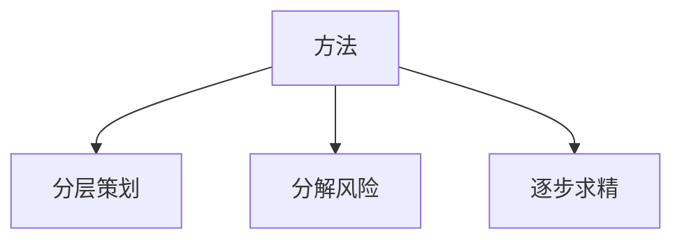
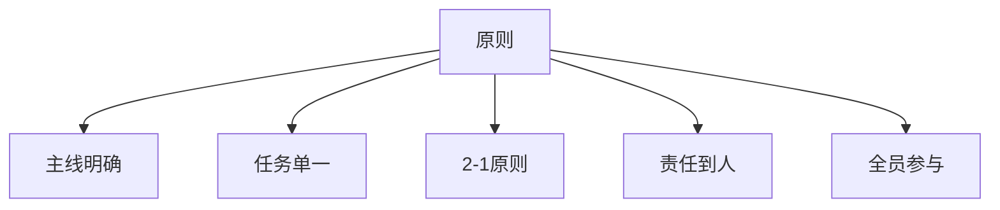

# 1 软件项目开发阶段&开发活动
  **1. 产品策划**
  需求调研 | 产品策划

  **2. 项目立项**
  立项申请

  **3. 项目策划**
  开发过程策划 | 配置管理策划 | 质量保证策划 | 测试活动策划 | 验证确认策划 | 计划评审 | 策划阶段验证

  **4. 需求分析**
  需求分析 | 测试需求分析 | 系统设计 | 需求评审 | 需求阶段验证

  **5. 设计实现**
  概要设计 | 详细设计 | 测试设计 | 设计评审 | 设计阶段验证 | 编码 | 代码交叉检查 | 代码静态测试
  代码评审 | 单元测试(UT) | 功能测试(CT) | 疏通测试 | 开发阶段验证

  **6. 测试**
  需求测试 | 回归测试

  **7. 验证确认**

  **8. 系统维护**

# 2 计划概述
## 2.1 什么是计划?
  * 确定 **要开展活动** 的过程
  * 确定 **每项活动担当者和时间** 的过程
  * 明确 **活动间关系和先后顺序** 的过程
  * 开发活动策划的结果与体现
  * **成员统一奋斗、行动的路线图**

## 2.2 计划的要素
  * **明确** 的任务目标
  * **确定** 的开始时间、完成时间
  * **担当人员或小组**
  * 任务完成后的 **验收标准**
  * 任务的 **前置条件**
  * **任务如何开展**

## 2.3 计划的重要意义
  * 可行性分析的手段之一
  * 项目管理的前提和基础
  * 组织协调的前提
  * 组织实施的准则
  * 控制活动的依据

# 3 制定计划的原则(SMART)
  1. **明确性（Specific）** - 目标具体、清楚
  2. **可衡量性（Measurable）** – 达成标准可考核
  3. **可实现性（Attainable）** – 可行、可操作
  4. **相关性（Relevant）** - 任务先后关系不矛盾
  5. **时限性（Time-bound）** – 明确的时间要求

  **坚持原则、要素完整、分层规划、落实到位！**

# 4 计划制定的过程
  ```mermaid
  graph LR
    A[明确任务目标] --> B[策划实施方案]
    B --> C[工作量评估]
    C --> D[确定组织结构]
    D --> E[人员能力评估]
    E --> F[任务分配]
    F --> G[编制计划]
    G --> H[计划评审]
  ```
## 4.1 如何明确任务目标
  > **做什么**
    >> 解决什么问题
    >> 具体业务内容
    >> 现有状况

  > **客户**
     >> 有哪些客户
     >> 不同用户的要求
     >> 不同用户的特点
     >> 客户间的关系

  > **用途**
    >> 用在哪里及什么行业
    >> 与那些系统有交互
    >> 有哪些约束和指标
    >> 软硬件环境
    >> 安装环境

  > **时间**
    >> 周期要求
    >> 阶段要求
    >> 特殊时间点

  > **交付标准**
    >> 交付什么东西
    >> 要满足什么标准
    >> 是否需要第三方检查

## 4.2 策划实施方案

### 1. 方法


### 2. 原则


### 3. WBS
  **WBS** 是`Work Breakdown Structure`的缩写，指工作分解结构。
  ```mermaid
  graph TD
    A[记录器4.1数据分析及实时监测系统] --> B[产品规划]
    A --> C[系统研发]
    A --> D[安装部署]
    C --> E[需求分析]
    C --> F[设计实现]
    C --> G[需求测试]
    F --> H[系统设计]
    F --> I[软件设计]
    F --> J[硬件设计]
    I --> K[概要设计]
    I --> L[详细设计]
    I --> M[编码调试]
    I --> N[静态测试]
    I --> O[单元测试]
    I --> P[集成测试]
  ```

## 4.3 工作量评估
### 1 经验公式法
以历史项目统计数据分析出 **经验公式**，在后续项目中应用。

### 2 专家评估法
该方法评估时找多位对该类型项目有经验的人员，采用投票、辩论和取平均的方式完成工作量的评估。

### 3 PERT（Program/Project Evaluation and Review Technique）法
基于估计乐观值、悲观值和可能值，然后取其加权平均得出评估值。

### 4 因子法
以过去开发的相同类型的项目为蓝本，在其规模上乘以一个复杂度因子，从而得出评估值。

## 4.4 确定组织结构
### 1 建立组织结构
外部资源 | 小组结构 | 组织结构图 | 决策机制 | 人员职责

## 4.5 人员能力评估
  * 每个人的擅长方向
  * 每个人的技术能力
  * 每个人的工作效率 - 生产性
  * 每个人的性格特点
  * 历史数据

## 4.6 任务分配
  > **人尽其才**
    >>每个人尽量从事所擅长的方面

  > **善于模板化**
    >> 功能内容和方法抽取统一的模板

  > **交叉检查**
    >> 做和检查交叉进行，同时保证进度和质量

  > **扶帮带**
    >> 开发模式上可以考虑由有经验的人带新人

  > **任务连续性**
    >> 每个人的工作最好有连续性

  > **人员小组化**
    >> 对人员分组管理

## 4.7 编制计划
### 1 技巧
任务周期不要太长，最好少于两周
任务划分的不要太细，周期不要小于天
不清楚该怎么开展的任务最好进行前期预研
每项任务要有确定的担当者和责任人
每项任务的要求、周期、标准都需要和担当者协商一致

### 2 方法
  **1. 递进法**
  > **具体计划**
    >> 第一阶段

  > **较具体的计划**
    >> 第二阶段

  > **粗略计划**
    >> 第三阶段

  * **特点**
  1. 各期计划更接近实际，实施性强
  2. 缩短了计划周期，准确性和可操作性强
  3. 各期计划相互衔接，使工作目标明确，一致性强
  4. 能很好的适应未来的变化，计划弹性强
  5. 制定计划的任务量较大，人员要求较高

  **2. 线性规划法**
  ```mermaid
  graph LR
  A[建模] --> B[求解]
  ```
  𝐹=𝑐1∗𝑋1+𝑐2∗𝑋2
  𝑎11∗𝑋1+𝑎12∗𝑋2<𝑏1   𝑚𝑎𝑥{𝐹}
  𝑎21∗𝑋1+𝑎22∗𝑋2<𝑏2   𝑚𝑖𝑛{𝐹}

  **3. 网络进度法**
  ```mermaid
  graph LR
  A((A)) --1--> B((B))
  A -.2.-> C((2))
  B -.3.-> D((D))
  B --4--> E((E))
  C -.5.-> E
  D -.6.-> F((F))
  E --7--> F
  ```
  * **特点**
  1. 明确了各活动的时间 **顺序和相互** 关系，并指出了完成任务的关键环节和路线
  2. 方便对时间、进度与资源进行优化
  3. 可事先评价达到目标的可能性
  4. 识别了困难点及影响，准备好应急措施，降低风险强
  5. 便于组织与控制，易于操作，适用范围广

## 4.8 计划评审

# 5 风险管理
  

# 6 进度管理
  **1. 进度的定义**
  进度是指项目当前 **实际推进状态** 和 **计划状态**之间的关系。

  **2. 进度采集的方法**
  各自汇报、专职检查、自动统计。

  **3. 进度关注点**

  **4. 进度管理的方式**
  进度统计、进度曲线、进度会议。

  **5. 进度滞后时的解决**
  任务重新分配、调换人员、调整计划。

  **6. 保证进度的方法**
  问题及早发现；解决办法全员知晓；难点、框架、模板等提前建立并测试；

# 7 计划变更
  **1. 计划变更的时机**
  目标变化（需求变更）、资源变化、工作量变化、进度问题等。

  **2. 计划变更的一些原则**
  晚变不如早变
  关键任务的进度偏差须及时变更计划
  计划变更必须重新进行评估
  计划变更不能太随意
  进度问题一定要分析原因，而不是简单的延长周期
  适时调整担当者
  计划变更一定要受控

# 8 计划有效性评估
  1. 计划所需 **要素** 是否 **完整**
  2. 任务是否 **明确**、考核标准是否 **清晰**
  3. 任务是否可达成，是否存在较高技术风险
  4. 每项任务是否有明确的 **时间要求**
  5. 任务之间的 **先后关系** 是否 **正确**
  6. 责任人是否唯一
  7. 工作量的评估是否可靠
  8. 是否存在一人同时推进多项任务的情况
  9. 任务的关键路径是否已被识别
  10. 计划是否全员认可
  11. 计划是否包含了时间和质量两方面的内容
  12. 是否便于统计进度

# 9 计划制定中的评估工作
* 工作量的评估
* 成本评估
* 周期的评估
* 经验公式修正
* 关于测试
* 质量的评估

# 10 软件项目工作量的评估
**软件项目的工作量决定于代码规模，因此工作量的评估主要是对代码规模的评估**

# 11 代码规模评估的方法
> **经验公式法**
  >> 功能点法
  >> 页面法
  >> 数据量法

 > **专家法**
  >> 专家评估法
  >> Delphi法

> 其他方法
  >> PERT法

## 功能点法
功能点法也叫FP(Function Point)法，是将用户需求分解为颗粒度适中的功能点，然后预估代码规模的方法。


### 经验系数
* 每功能点=200行（ PC软件）
* 每功能点=400行（嵌入式软件）
* 每功能=5个功能点

## 页面法
页面法是将用户需求分解为一个个交互界面，然后评估代码规模的方法。


### 经验系数
* 每功能=3.5界面
* 每界面=200行

## 数据量法
数据量法是分析系统中处理的输入、输出数据总数，然后评估代码规模的方法。


### 经验系数
* 每项数据=20行

## 专家评估法
也称为专家会议法，指据规定的原则选定一定数量的专家，按照一定的方式组织专家会议，发挥专家集体的智能结构根效应，对预测对象未来的发展趋势及状况，作出判断的方法。


## Delphi法
德尔菲法，既专家问卷调查法。
百度解释为：是采用背对背的通信方式征询专家小组成员的预测意见，经过几轮征询，使专家小组的预测意见趋于集中，最后做出较为准确的预测结论。


## PERT法
PERT: Program Evaluation & Review Technique
计划评估和评审技术，可用于没有经验数据的情况下对代码规摸进行评估。

𝐸𝑣=(𝑆𝑜𝑝𝑡+4×𝑆𝑚+𝑆𝑝𝑒𝑠𝑠)÷ 6
Sopt – 乐观值
Sm – 可能值
Spess – 悲观值

# 12 工作量评估
## 维护类项目
维护类项目按照新增、修改和三部分合计

Ev=𝑁+𝑀×1.5+𝐵×1.25%
N – 新增功能代码规模
M – 修改功能的代码规模
B – 基盘大小，指软件总代码规模

# 13 成本评估
## 生产性
生产性是指人员的工作效率，对于软件人员以单位时间编写代码的行数来度量；对于测试人员，以单位时间完成多少行代码的测试来度量

* PC软件：  2.5~3.5KS/人月
* 网页类：   3~4.5KS/人月
* 嵌入式：   1.5~2.5KS/人月

## 人月数
人月指一个人工作一个月，这里一个月以21.5天计算。
人月数 = 代码规模 ÷ 生产性

## 各阶段比例
这里以研发过程中主要的三个主要阶段来说明。需求分析有许多不确定因素，没有一个合理的比例。


## 研发成本
研发成本以各阶段人月数总和来计算。
研发成本 = 人月数总和 × 人均成本 × 系数

注：这里的系数通常考虑成本风险、技术风险等、规范风险以及其它等因素。

# 14 周期评估
## 确定人力资源
确定人力资源主要是评估团队各成员的能力、工作方向、生产性以及各阶断的平均生产性。
姓名 | 设计 | 编码 | UT/CT | 需求测试 | 备注
--- | --- | --- | --- | --- | ---
张三 | -- |3.4 | 4.0 | -- |
李四 | 5.0 | 4.0 | 4.0 | --|
王五 | -- | -- | -- | 3.5
.... |
平均 | 5.4 | 3.6 | 4.5 | 3.3 |

## 制定阶段计划
代码规摸100KS，平均生产性3.5KS/人月


# 15 经验公式修正
常用开发语言每功能点代码规模统计表-航空装备业

注：C语言推荐值主要用于嵌入式系统、且采用面向过程式开发；其余推荐值指面向PC软件的开发

# 16 关于测试
## 用例规模评估
在项目开始做阶段计划时，测试工作是以代码规摸来评估的。在编制测试计划时，应该以用例规模来评估。
用例数 = 80~120个/每千行
测试用例是以功能项和测试点来划分的，划分粒度一般为一组输入设计为一个用例。

## 测试人员生产性
* 每天编写测试用例数
* 每天执行测试用例数

## 西安测试人员生产性平均指标
* 平均每天编写用例 50~70个
* 平均每天执行用例 45~50个
* 平均每条用例执行 3.1次

# 17 质量评估
## 开发过程度量
* 软件质量评估有以下指标：
* 代码注释率
* 交叉检查率
* 代码评审率
* 问题指摘率
* BUG密度
* 测试用例密度
* 代码覆盖率
